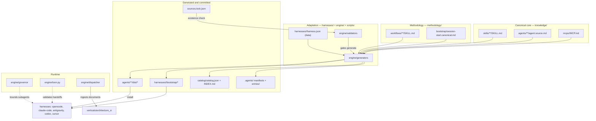

# Coacus

A unified, multi-harness agentic framework for software development,
information security and infrastructure. Coacus holds one portable library of
skills, agents, workflows and MCP declarations, then renders that library into
the native shape each AI coding harness expects. The same asset runs in OpenCode,
Claude Code, Antigravity, Codex and Cursor — and in framework consumers such as
LangChain, AutoGen or CrewAI — without a fork per tool.

License: **AGPL-3.0**. Repository language: **English**
([ADR-0001](docs/adr/ADR-0001-language-policy.md)).

## What it is, and why

Agent tooling accumulates in silos. A skill written for one harness hard-codes
that harness's tool names, a second harness needs a copy, and the two copies
drift. Coacus removes the copy step. It keeps a canonical source for every
artifact and derives each harness representation from it, so a change lands in
one file and the generated output follows.

Three sources feed that library:

- **Methodology** — how work proceeds (planning, debugging, review, verification),
  imported as process workflows.
- **Knowledge** — what the framework knows (199 skills across ten categories, 58
  agents).
- **Vertical applications** — domain pipelines, currently `architecture_si`:
  document ingest then analysis.

The problem it solves is portability of judgement. A team's conventions should
travel with the team, not with the editor.

## Core principle

> **Disk is the truth; generation is the contract.**
> Every canonical artifact has one source. Every per-harness representation is
> generated from it and verified by a drift check
> (`python3 scripts/coacus.py check`). Drift is a build error, not silent debt.

Generated output is committed ([ADR-0014](docs/adr/ADR-0014-committed-generated-artifacts.md)),
and CI runs `check`, never `generate` — regenerating in CI would rewrite the very
files under comparison and hide the drift it is meant to catch.

### The artifact lifecycle

```text
create (templates/authoring)  →  validate  →  register (generate)
     →  discover (single scan)  →  activate (SessionStart bootstrap)
```

1. **Create** from the matching template in `templates/authoring/`.
2. **Validate** the canonical source contract.
3. **Register** with `python3 scripts/coacus.py generate`.
4. **Discover** through the generated `.agents/` manifests, read once per session.
5. **Activate** when a harness injects the one rendered bootstrap it supports.

## How it works

Three layers, plus one closed engine:

- **`knowledge/`** — the canonical WHAT. Skills, agents and MCP declarations,
  harness-agnostic. Bodies name actions, never tool names
  ([ADR-0003](docs/adr/ADR-0003-agnostic-skills-thin-adapters.md)).
- **`methodology/`** — the canonical HOW. Process workflows and the single
  bootstrap wrapper body ([ADR-0016](docs/adr/ADR-0016-bootstrap-render-contract.md)).
- **`harnesses/`** — thin per-harness adapters. Each is a `harness.json` data
  file: bootstrap shape, output paths, tool mapping, install method. Shapes:
  opencode B (in-process plugin), claude-code A (shell hook), antigravity C
  (rule file), codex A, cursor A.
- **`engine/`** — the closed core. Generators, validators, the governor, the
  dispatcher, the TOON validator and the provenance checker. The engine changes
  only when a new concept arrives, not when new data arrives.



Full treatment: [`docs/architecture.md`](docs/architecture.md).

## What is inside

### Corpus

| Asset | Count | Breakdown |
|---|---|---|
| Skills | 199 | `security` 50 (`appsec` 12, `operations` 8, `grc` 8, `iam` 7, `tooling` 5, `platform` 4, `ai` 3, `offensive` 2, `crypto` 1), `domains` 36, `roles` 21, `languages` 18, `mapping` 16, `frameworks` 14, `engineering` 14 (`practices` 10, `patterns` 4), `platforms` 12, `infrastructure` 9, `data` 9 |
| Agents | 58 | `academic-sciences` 16, `software-engineering` 13, `cybersecurity` 8, `specialized-domains` 7, `data-cloud-devops` 6, `research-discovery` 4, `core-orchestration` 4 |
| Workflows | 15 | 14 `superpowers-*` process skills plus the native `using-coacus` entry workflow |
| MCPs | 1 | `context7` |
| Catalog | 214 skill entries | `catalog/catalog.json` + `catalog/INDEX.md`, generated from disk ([ADR-0004](docs/adr/ADR-0004-catalog-generated-from-disk.md)) |
| Provenance | 1163 entries | `sources.lock.json` ([ADR-0015](docs/adr/ADR-0015-provenance-manifest-location.md)) |

### Engine (stdlib only, zero runtime dependencies)

| Module | Job |
|---|---|
| `engine/frontmatter.py` | Tolerant YAML-subset parser for canonical sources. |
| `engine/generators/agent_manifests.py` | `agent.source.md` → `dist/AGENT.md`, `agent.yaml`, `agent.json`, `plugin.json`. |
| `engine/generators/mcp_configs.py` | `MCP.md` → `dist/mcp.json`, `dist/mcp_config.json`. |
| `engine/generators/bootstrap.py` | Canonical wrapper + entry body → one native artifact per harness. |
| `engine/generators/catalog.py` | Disk → `catalog/catalog.json` + `catalog/INDEX.md`, byte-idempotent. |
| `engine/generators/discovery.py` | Disk → `.agents/{skills,mcps,agents}.json` + `entries/`. |
| `engine/generators/docstrings.py` | Source docstrings → `docs/reference/python-api.md`. |
| `engine/validators/` | Source and artifact contracts: agents, skills, mcps, hygiene, evals, language, discovery, completeness. |
| `engine/governor/ledger.py` | Disk ledger (`flock`) bounding concurrent subagents. |
| `engine/toon.py` | Validator for TOON handoff payloads. |
| `engine/dispatcher/` | `@register_converter` registry for ingestion formats. |
| `engine/provenance.py` | Schema and existence checks for `sources.lock.json`. |

### Scripts, tests and evals

Six CLIs (`scripts/`): `coacus.py`, `coacus_install.py`, `coacus_governor.py`,
`coacus_eval.py`, `coacus_vertical.py`, `coacus_import.py`.
`tests/` holds 181 deterministic stdlib `unittest` tests.
`evals/` holds four behavior scenarios behind a static gate and an opt-in live
runner ([`evals/README.md`](evals/README.md)).

## Repository layout

```text
Coacus/
├── knowledge/            # canonical WHAT: skills/, agents/, mcps/, rules/
├── methodology/          # canonical HOW: workflows/, bootstrap/
├── verticals/            # domain applications: architecture_si (ingest, analyze)
├── harnesses/            # per-harness adapters (harness.json + rendered bootstrap/)
├── templates/            # single source of templates: authoring/, domains/, import/
├── engine/               # closed core: generators, validators, governor, dispatcher, toon, provenance
├── scripts/              # thin CLIs: coacus, install, governor, eval, import, vertical
├── catalog/              # GENERATED index (catalog.json, INDEX.md)
├── .agents/              # GENERATED discovery manifests
├── tests/                # 181 deterministic infrastructure tests
├── evals/                # behavior evals: static gate + opt-in live runner
├── docs/                 # documentation + adr/
├── sources.lock.json     # provenance for imported artifacts (ADR-0015)
└── .github/workflows/    # ci.yml, bandit.yml, evals.yml
```

## Premises and conventions

### Premises (ratified at F0)

- **P1 — Sources are read-only.** The importer copies; it never writes back to a
  source repository.
- **P2 — Import and adapt, autonomously.** No symlinks. Imported material is
  copied and adapted into the repository's taxonomy.
- **P3 — Phase-gated approvals.** Work proceeds phase by phase; each phase is
  authorized before it starts.
- **P4 — Provenance per artifact.** Every imported file is recorded in
  `sources.lock.json` ([ADR-0015](docs/adr/ADR-0015-provenance-manifest-location.md)).

### Decisions D1–D12

| # | Decision | ADR |
|---|---|---|
| D1 | Agent manifests come from one source; `model` omitted canonically. | [ADR-0002](docs/adr/ADR-0002-agent-manifests-single-source.md) |
| D2 | Agnostic skills, thin adapters. | [ADR-0003](docs/adr/ADR-0003-agnostic-skills-thin-adapters.md) |
| D3 | Catalog generated from disk. | [ADR-0004](docs/adr/ADR-0004-catalog-generated-from-disk.md) |
| D4 | MCP single source with generated configs. | [ADR-0005](docs/adr/ADR-0005-mcp-triple-definition.md) |
| D5 | Static discovery, single scan per session. | [ADR-0006](docs/adr/ADR-0006-static-discovery-single-scan.md) |
| D6 | Orchestration governor with a disk ledger. | [ADR-0007](docs/adr/ADR-0007-orchestration-governor.md) |
| D7 | TOON protocol for handoffs. | [ADR-0008](docs/adr/ADR-0008-toon-handoff-protocol.md) |
| D8 | SessionStart bootstrap injection. | [ADR-0009](docs/adr/ADR-0009-session-start-bootstrap.md) |
| D9 | Single source for scripts and templates. | [ADR-0010](docs/adr/ADR-0010-single-source-scripts-templates.md) |
| D10 | Two-layer testing: deterministic tests plus behavior evals. | [ADR-0011](docs/adr/ADR-0011-two-layer-testing.md) |
| D11 | Ingestion pipeline with an open-closed dispatcher. | [ADR-0012](docs/adr/ADR-0012-ingestion-dispatcher.md) |
| D12 | Secrets and portability guardrails. | [ADR-0013](docs/adr/ADR-0013-secrets-portability.md) |

Policy ADRs: [ADR-0001](docs/adr/ADR-0001-language-policy.md) (English),
[ADR-0014](docs/adr/ADR-0014-committed-generated-artifacts.md) (generated
artifacts committed), [ADR-0015](docs/adr/ADR-0015-provenance-manifest-location.md)
(provenance at the root),
[ADR-0016](docs/adr/ADR-0016-bootstrap-render-contract.md) (bootstrap render
contract), [ADR-0017](docs/adr/ADR-0017-corpus-import-and-taxonomy.md) (corpus
import and taxonomy).

### Hard conventions

1. **One source per artifact.** Skills: `SKILL.md`. Agents: `agent.source.md`.
   MCPs: `MCP.md`. Everything under `dist/`, `.agents/`, `catalog/` and
   `harnesses/<h>/bootstrap/` is generated. Do not hand-edit it.
2. **No secrets, no absolute paths.** Reference secrets as `{env:VAR}` only.
   Machine-specific paths (`/home/...`, `/Users/...`, `C:\...`) are rejected.
3. **Actions, not tools.** Canonical bodies name actions; per-harness tool
   mappings live in `references/<harness>-tools.md` and `harness.json`.
4. **English only, kebab-case names, third-person trigger-oriented descriptions.**
5. **`model` omitted in canonical sources**; the generated `agent.yaml` uses
   `model: inherit` and the harness resolves the real model.
6. **Governed parallelism.** The concurrency cap is 5, orchestrator included;
   handoffs are TOON payloads.

## Install

Generate first, then install into a harness:

```bash
python3 scripts/coacus.py generate                # render every artifact
python3 scripts/coacus_install.py opencode        # or: claude-code | antigravity | codex | cursor | all
python3 scripts/coacus_install.py opencode --dry-run    # preview targets
python3 scripts/coacus_install.py opencode --uninstall   # remove exactly what was installed
```

The installer is idempotent: it writes a `coacus-install.json` manifest beside
each target. It never rewrites a harness config file wholesale. Each harness has
its own discovery paths, hook shape and verification steps — the per-harness
tutorials, with the current vendor facts and the evidence class for each claim,
are in [`docs/install.md`](docs/install.md).

## Quickstart

Everyday commands. All are verified against the scripts in `scripts/` and run
from the repository root.

```bash
python3 scripts/coacus.py generate      # regenerate dist/, bootstraps, .agents/, catalog/, API reference
python3 scripts/coacus.py check         # fail if generated artifacts are stale
python3 scripts/coacus.py validate      # run source + artifact validators
python3 scripts/coacus.py completeness  # reconcile sources, lock file and catalog
python3 scripts/coacus.py toon payload.toon   # validate a TOON handoff payload
python3 -m unittest discover -s tests   # 181 deterministic tests

python3 scripts/coacus_governor.py status        # running/paused/max/slots_free
python3 scripts/coacus_eval.py validate          # static scenario gate
python3 scripts/coacus_vertical.py formats       # registered ingestion formats
python3 scripts/coacus_import.py plan            # dry-run corpus import actions
```

More detail, including exit codes and governor semantics:
[`docs/usage.md`](docs/usage.md).

## Quality and CI

Three workflows under `.github/workflows/`:

- **`ci`** — runs `validate` → `check` → `completeness` → tests, and never
  `generate`. The `secrets` job runs a pinned, checksum-verified gitleaks scan in
  directory mode against the checked-out state.
- **`bandit`** — Python security scan.
- **`evals`** — scheduled plus manual static scenario validation; the live runner
  is local-only.

The `main` ruleset makes `ci` and `secrets` both required. Current alert count: 0.
The local equivalent of the gate:

```bash
python3 scripts/coacus.py validate
python3 scripts/coacus.py check
python3 scripts/coacus.py completeness
python3 -m unittest discover -s tests
```

## Status

Phases **F0–F8 complete**:

| Phase | Scope |
|---|---|
| **F0** | Framework charter: ratify D1–D12 and lay the skeleton. |
| **F1** | Foundation: engine core — parser, generators, validators, thin CLI, first tests. |
| **F2** | Quality gates: tolerant parser, hardened CI (`ci` + `secrets`), drift check, two-layer testing. |
| **F3** | MCP single-source generation and per-harness SessionStart bootstrap render. |
| **F4** | Execution governance: concurrency/rate-limit governor, TOON validator, discovery manifests. |
| **F5** | Behavior evals: static scenario gate plus opt-in live runner with a pluggable judge. |
| **F6** | Corpus import: import, translate and organize the full corpus into the ten-category taxonomy. |
| **F7** | Final consolidation: documentation set, ADR-0017, changelog, contribution contract. |
| **F8** | Completeness verification: reconcile sources, `sources.lock.json` and the catalog. |

The framework carries the imported corpus (199 skills, 58 agents, 15 workflows,
one MCP), fully translated to English, with generated catalog and discovery,
multi-harness agent manifests, MCP single-source generation, a per-harness
SessionStart bootstrap, the governor and TOON validator, a per-harness installer
and four behavior-eval scenarios. OpenCode live acceptance passed; Claude Code is
structure-verified (the binary was not installed locally) — see
[`docs/install.md`](docs/install.md) and [`evals/README.md`](evals/README.md).
Phase history: [`docs/roadmap.md`](docs/roadmap.md).

## Documentation map

| Document | Read it for |
|---|---|
| [`docs/README.md`](docs/README.md) | Index of the documentation set. |
| [`docs/architecture.md`](docs/architecture.md) | Layers, engine, artifact lifecycle, repository layout. |
| [`docs/usage.md`](docs/usage.md) | Day-to-day commands: generate, validate, install, governor, evals, vertical. |
| [`docs/extending.md`](docs/extending.md) | Add a skill, agent, MCP, harness, workflow, template or ingestion format. |
| [`docs/install.md`](docs/install.md) | Per-harness installation tutorials. |
| [`docs/migration.md`](docs/migration.md) | The F6 corpus import: sources, taxonomy, dedup, provenance, translation. |
| [`docs/roadmap.md`](docs/roadmap.md) | Phase history F0–F8 and what each phase delivered. |
| [`docs/reference/python-api.md`](docs/reference/python-api.md) | Generated Python API reference from source docstrings. Do not edit. |
| [`docs/adr/`](docs/adr/) | Ratified architecture decisions (MADR, English). Read before changing structure. |
| [`CONTRIBUTING.md`](CONTRIBUTING.md) | The contribution contract, commit style and PR flow. |
| [`CHANGELOG.md`](CHANGELOG.md) | Notable changes, grouped by phase. |
| [`AGENTS.md`](AGENTS.md) | Routing and single-scan rules for any agent in this repository. |
| [`evals/README.md`](evals/README.md) | Behavior-eval tiers, scenario schema and the live runner. |

## Extending

Extend by adding data, not core code. A new skill, agent, MCP, harness, workflow,
template or ingestion handler is a new file; `engine/` changes only when a new
concept arrives ([ADR-0003](docs/adr/ADR-0003-agnostic-skills-thin-adapters.md),
[ADR-0012](docs/adr/ADR-0012-ingestion-dispatcher.md)). After every addition, run
`generate`, `validate`, `check` and the tests. Steps per artifact type are in
[`docs/extending.md`](docs/extending.md).

## License

[AGPL-3.0](LICENSE). Contributions are accepted under the same license.
