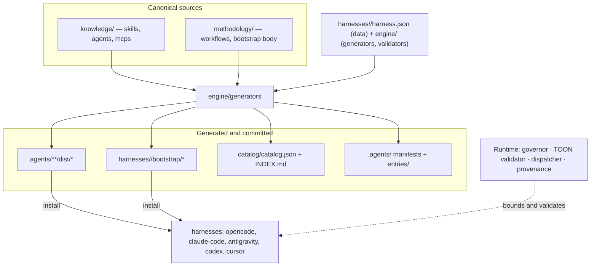

# Coacus

One portable library of skills, agents, workflows and MCP declarations — rendered
into the native shape each AI coding harness expects. Write it once; run it in
OpenCode, Claude Code, Antigravity, Codex and Cursor without a fork per tool.

[](LICENSE)
[](docs/usage.md)
[](docs/roadmap.md)
[](.github/workflows/ci.yml)
[](docs/standards/english-only.md)

## Contents

- [What it is, and why](#what-it-is-and-why)
- [The core principle](#the-core-principle)
- [How it works](#how-it-works)
- [What is inside](#what-is-inside)
- [Harness support](#harness-support)
- [Install](#install)
- [Everyday commands](#everyday-commands)
- [Quality and CI](#quality-and-ci)
- [Standards](#standards)
- [Status](#status)
- [Documentation map](#documentation-map)
- [Extending](#extending)
- [License](#license)

## What it is, and why

Agent tooling accumulates in silos. A skill written for one harness hard-codes
that harness's tool names, a second harness needs a copy, and the two copies
drift. Coacus removes the copy step: it keeps one canonical source for every
artifact and derives each harness representation from it, so a change lands in
one file and the generated output follows.

Three sources feed the library:

- **Knowledge** — what the framework knows: 193 skills across ten categories, 57
  agents, one MCP declaration.
- **Methodology** — how work proceeds: 15 process workflows for planning,
  debugging, review and verification.
- **Verticals** — domain pipelines, currently `architecture_si`: document ingest
  then analysis.

The problem it solves is portability of judgement. A team's conventions should
travel with the team, not with the editor.

## The core principle

> **Disk is the truth; generation is the contract.**

Every canonical artifact has exactly one source. Every per-harness representation
is generated from it and verified by a drift check. A generated file that does not
match a fresh regeneration is a build error, not silent debt.

```text
create (templates/authoring)  →  validate (source contracts)
     →  register (generate)   →  discover (single scan)
     →  activate (SessionStart bootstrap, one format per harness)
```

Generated output is committed, and CI runs `check`, never `generate`:
regenerating in CI would rewrite the very files under comparison and hide the
drift it is meant to catch. Full text:
[generated-artifacts](docs/standards/generated-artifacts.md).

## How it works

Three layers, plus one closed engine:

- **`knowledge/`** — the canonical WHAT. Skills, agents and MCP declarations,
  harness-agnostic. Bodies name actions, never tool names
  ([skill-authoring](docs/standards/skill-authoring.md)).
- **`methodology/`** — the canonical HOW. The 15 process workflows and the single
  bootstrap wrapper body ([session-start-bootstrap](docs/standards/session-start-bootstrap.md)).
- **`harnesses/`** — thin per-harness adapters. Each is a `harness.json` data
  file: bootstrap shape, output paths, tool mapping, install method. Shapes: `A`
  shell hook, `B` in-process, `C` instructions file.
- **`engine/`** — the closed core. Generators, validators, the governor, the
  dispatcher, the TOON validator and the provenance checker. The engine changes
  only when a new concept arrives, not when new data does.



Full treatment: [`docs/architecture.md`](docs/architecture.md).

## What is inside

### Corpus

| Asset | Count | Breakdown |
|---|---|---|
| Skills | 199 | `security` 50, `domains` 36, `roles` 21, `languages` 18, `mapping` 16, `frameworks` 14, `engineering` 14, `platforms` 12, `infrastructure` 9, `data` 9 |
| Agents | 58 | `academic-sciences` 16, `software-engineering` 13, `cybersecurity` 8, `specialized-domains` 7, `data-cloud-devops` 6, `research-discovery` 4, `core-orchestration` 4 |
| Workflows | 15 | 14 `superpowers-*` process skills plus the native `using-coacus` entry workflow |
| MCPs | 1 | `context7` |
| Catalog | 208 skill entries | `catalog/catalog.json` + `catalog/INDEX.md`, generated from disk |
| Provenance | 1136 entries | `sources.lock.json` ([provenance](docs/standards/provenance.md)) |

### Engine (stdlib only, zero runtime dependencies)

| Module | Job |
|---|---|
| `engine/frontmatter.py` | Tolerant YAML-subset parser for canonical sources. |
| `engine/generators/agent_manifests.py` | `agent.source.md` → `dist/AGENT.md`, `agent.yaml`, `agent.json`, `plugin.json`. |
| `engine/generators/mcp_configs.py` | `MCP.md` → `dist/mcp.json`, `dist/mcp_config.json`. |
| `engine/generators/bootstrap.py` | Canonical wrapper + entry body → one native artifact per harness. |
| `engine/generators/catalog.py` | Disk → `catalog/catalog.json` + `catalog/INDEX.md`, byte-idempotent. |
| `engine/generators/discovery.py` | Disk → `.agents/{skills,mcps,agents}.json` + `entries/`. |
| `engine/generators/docstrings.py` | Source docstrings → `docs/reference/python-api.md`. |
| `engine/validators/` | Source and artifact contracts: agents, skills, mcps, hygiene, evals, language, discovery, completeness. |
| `engine/governor/ledger.py` | Disk ledger (`flock`) bounding concurrent subagents. |
| `engine/toon.py` | Validator for TOON handoff payloads. |
| `engine/dispatcher/` | `@register_converter` registry for ingestion formats. |
| `engine/provenance.py` | Schema and existence checks for `sources.lock.json`. |

### Scripts, tests and evals

Six CLIs in `scripts/`: `coacus.py`, `coacus_install.py`, `coacus_governor.py`,
`coacus_eval.py`, `coacus_vertical.py`, `coacus_import.py`. The `tests/` tree
holds 227 deterministic stdlib `unittest` tests. `evals/` holds four behavior
scenarios behind a static gate and an opt-in live runner
([`evals/README.md`](evals/README.md)).

## Harness support

Every harness installs the same corpus through `scripts/coacus_install.py`, and
each one gets exactly one rendered bootstrap in its own native format.

| Harness | Shape | Bootstrap mechanism | Install |
|---|---|---|---|
| **opencode** | B — in-process plugin | `config` + `experimental.chat.messages.transform` hooks inject the bootstrap in-process; a second plugin enforces the governor gate | `python3 scripts/coacus_install.py opencode` |
| **claude-code** | A — shell hook | `SessionStart` → `hookSpecificOutput.additionalContext` | `python3 scripts/coacus_install.py claude-code` |
| **antigravity** | C — rule file | `coacus-rule.md` with `activation: always_on`, packaged by `plugin.json` | `python3 scripts/coacus_install.py antigravity` |
| **codex** | A — shell hook | `SessionStart` → `hookSpecificOutput.additionalContext` | `python3 scripts/coacus_install.py codex` |
| **cursor** | A — shell hook | `sessionStart` → top-level `additional_context` | `python3 scripts/coacus_install.py cursor` |

Per-harness tutorials, vendor facts and the evidence class behind each claim:
[`docs/install.md`](docs/install.md).

## Install

```bash
python3 scripts/coacus.py generate          # render every artifact first
python3 scripts/coacus_install.py opencode  # or: claude-code | antigravity | codex | cursor | all
python3 scripts/coacus_install.py opencode --dry-run   # preview targets
python3 scripts/coacus_install.py codex --only security,engineering   # partial install
python3 scripts/coacus_install.py codex --agents 'qa-*'   # filter agents only
python3 scripts/coacus_install.py --list    # available categories and skills
python3 scripts/coacus_install.py opencode --verify   # read-only: compare with the repo
```

The installer is idempotent: it writes a `coacus-install.json` manifest beside
each target, never rewrites a harness config file wholesale, and removes exactly
what it installed with `--uninstall`. Every harness installs skills **and** agents.
Install the whole corpus, or a subset with `--only` (top-level category or any
nested segment, applied to skills and agents), `--skills` (skill name glob) and
`--agents` (agent name glob) — useful when a harness caps the session-start
skills budget.

### Dependencies

- **Required:** [Python 3.14](https://www.python.org/) (the CI target). The core
  tooling uses the standard library only.
- **Recommended:** the [`context7`](https://context7.com/) MCP server — hosted,
  keyless (`https://mcp.context7.com/mcp`), and declared under
  [`knowledge/mcps/context7/`](knowledge/mcps/context7/MCP.md). It supplies
  up-to-date library and framework documentation, which the corpus skills assume
  when they need current API references. Optional: the framework and its scripts
  run without it.

## Everyday commands

All commands were verified against the scripts in `scripts/` and run from the
repository root.

```bash
python3 scripts/coacus.py generate      # regenerate dist/, bootstraps, .agents/, catalog/, API reference
python3 scripts/coacus.py check         # fail if generated artifacts are stale
python3 scripts/coacus.py validate      # run source + artifact validators
python3 scripts/coacus.py completeness  # reconcile sources, lock file and catalog
python3 scripts/coacus.py toon payload.toon   # validate a TOON handoff payload
python3 -m unittest discover -s tests   # 227 deterministic tests

python3 scripts/coacus_governor.py status    # running/paused/max/slots_free
python3 scripts/coacus_eval.py validate      # static scenario gate
python3 scripts/coacus_vertical.py formats   # registered ingestion formats
python3 scripts/coacus_import.py plan        # dry-run corpus import actions
```

Exit codes and governor semantics: [`docs/usage.md`](docs/usage.md).

## Quality and CI

Three workflows under `.github/workflows/`:

- **`ci`** — runs `validate` → `check` → `completeness` → tests, and never
  `generate`. The `secrets` job runs a pinned, checksum-verified gitleaks scan in
  directory mode against the checked-out state.
- **`bandit`** — Python security scan.
- **`evals`** — scheduled plus manual static scenario validation; the live runner
  is local-only.

The `main` ruleset makes `ci` and `secrets` both required. Current alert count: 0.

The local equivalent of the gate:

```bash
python3 scripts/coacus.py validate
python3 scripts/coacus.py check
python3 scripts/coacus.py completeness
python3 -m unittest discover -s tests
```

## Standards

Each standard is normative and lives in [`docs/standards/`](docs/standards/) —
read the relevant one before changing that area of the repository.

| Standard | Governs |
|---|---|
| [principles](docs/standards/principles.md) | The core principle and the four project principles. |
| [english-only](docs/standards/english-only.md) | Repository language: everything is English. |
| [skill-authoring](docs/standards/skill-authoring.md) | Skills name actions, never harness tools; descriptions, kebab-case, references. |
| [agent-manifests](docs/standards/agent-manifests.md) | Agents are one source rendered into the multi-harness manifests. |
| [generated-artifacts](docs/standards/generated-artifacts.md) | Catalog generated from disk; generated output committed and drift-checked. |
| [mcp-definition](docs/standards/mcp-definition.md) | MCP single source and generated configs. |
| [discovery](docs/standards/discovery.md) | Static discovery manifests and single-scan per session. |
| [orchestration-governance](docs/standards/orchestration-governance.md) | Concurrency cap, disk ledger, rate-limit handling. |
| [toon-protocol](docs/standards/toon-protocol.md) | The TOON handoff format between agents. |
| [session-start-bootstrap](docs/standards/session-start-bootstrap.md) | Bootstrap injection and the per-harness render contract. |
| [single-source](docs/standards/single-source.md) | One source for scripts and templates. |
| [testing](docs/standards/testing.md) | Two-layer testing: deterministic tests plus behavior evals. |
| [knowledge-ingestion](docs/standards/knowledge-ingestion.md) | The open-closed ingestion dispatcher. |
| [secrets-portability](docs/standards/secrets-portability.md) | No plaintext secrets, no absolute paths. |
| [provenance](docs/standards/provenance.md) | The provenance manifest at the repository root. |
| [corpus-and-taxonomy](docs/standards/corpus-and-taxonomy.md) | The imported corpus and its ten-category taxonomy. |

## Status

Phases **F0–F8 complete**; the repository is finished.

| Phase | Scope |
|---|---|
| **F0** | Framework charter: settle the architecture standards and lay the repository skeleton. |
| **F1** | Foundation: engine core — parser, generators, validators, thin CLI, first tests. |
| **F2** | Quality gates: tolerant parser, hardened CI (`ci` + `secrets`), drift check, two-layer testing. |
| **F3** | MCP single-source generation and per-harness SessionStart bootstrap render. |
| **F4** | Execution governance: concurrency/rate-limit governor, TOON validator, discovery manifests. |
| **F5** | Behavior evals: static scenario gate plus opt-in live runner with a pluggable judge. |
| **F6** | Corpus import: import, translate and organize the full corpus into the ten-category taxonomy. |
| **F7** | Final consolidation: documentation set, corpus-and-taxonomy, changelog, contribution contract. |
| **F8** | Completeness verification: reconcile sources, `sources.lock.json` and the catalog. |

The framework ships the imported corpus (193 skills, 57 agents, 15 workflows, one
MCP), fully translated to English, with a generated catalog and discovery,
multi-harness agent manifests, MCP single-source generation, a per-harness
SessionStart bootstrap, the governor and TOON validator, a per-harness installer
and four behavior-eval scenarios. OpenCode live acceptance passed; Claude Code is
structure-verified because its binary was not installed locally — see
[`docs/install.md`](docs/install.md) and [`evals/README.md`](evals/README.md).
Phase history: [`docs/roadmap.md`](docs/roadmap.md).

## Documentation map

| Document | Read it for |
|---|---|
| [`docs/README.md`](docs/README.md) | Index of the documentation set. |
| [`docs/architecture.md`](docs/architecture.md) | Layers, engine, artifact lifecycle, repository layout. |
| [`docs/usage.md`](docs/usage.md) | Day-to-day commands: generate, validate, install, governor, evals, vertical. |
| [`docs/extending.md`](docs/extending.md) | Add a skill, agent, MCP, harness, workflow, template or ingestion format. |
| [`docs/install.md`](docs/install.md) | Per-harness installation tutorials. |
| [`docs/migration.md`](docs/migration.md) | The F6 corpus import: sources, taxonomy, dedup, provenance, translation. |
| [`docs/roadmap.md`](docs/roadmap.md) | Phase history F0–F8 and what each phase delivered. |
| [`docs/reference/python-api.md`](docs/reference/python-api.md) | Generated Python API reference from source docstrings. Do not edit. |
| [`docs/standards/`](docs/standards/) | The 16 normative standards. Read before changing that area. |
| [`CONTRIBUTING.md`](CONTRIBUTING.md) | The contribution contract, commit style and PR flow. |
| [`CHANGELOG.md`](CHANGELOG.md) | Notable changes, grouped by phase. |
| [`THIRD-PARTY-NOTICES.md`](THIRD-PARTY-NOTICES.md) | Licenses of imported components (MIT / GPL-3.0). |
| [`AGENTS.md`](AGENTS.md) | Routing and single-scan rules for any agent in this repository. |
| [`evals/README.md`](evals/README.md) | Behavior-eval tiers, scenario schema and the live runner. |
| [`catalog/INDEX.md`](catalog/INDEX.md) | Generated human index of every skill, agent and MCP. |

## Extending

Extend by adding data, not core code. A new skill, agent, MCP, harness, workflow,
template or ingestion handler is a new file following the matching template in
`templates/authoring/`; `engine/` changes only when a new concept arrives
([skill-authoring](docs/standards/skill-authoring.md),
[knowledge-ingestion](docs/standards/knowledge-ingestion.md)). After every
addition, run `generate`, `validate`, `check` and the tests. Steps per artifact
type are in [`docs/extending.md`](docs/extending.md).

## License

[AGPL-3.0](LICENSE). Contributions are accepted under the same license.
