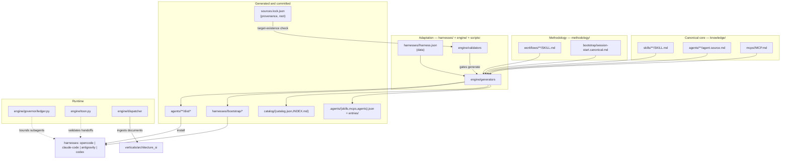

# Architecture

Coacus is a multi-harness agentic framework. It stores knowledge once in
canonical sources, generates every per-harness representation from those
sources, and verifies the generated output against a fresh regeneration. This
document describes the whole system: the layers, the engine, the artifact
lifecycle and the layout.

The governing principle is one sentence: **disk is the truth; generation is the
contract.** Every canonical artifact has exactly one source, every derived
artifact is produced by the engine, and drift between source and output is a
build failure — not silent debt ([generated-artifacts](standards/generated-artifacts.md)).

## Three layers

### 1. Canonical core — `knowledge/`

What the framework knows. This layer is harness-agnostic and holds only sources:

- `knowledge/skills/<category>[/<subcategory>]/<skill>/SKILL.md` — 199 skills.
- `knowledge/agents/<category>/<agent>/agent.source.md` — 58 agents.
- `knowledge/mcps/<mcp>/MCP.md` — MCP server declarations (one source, generated
  configs, [mcp-definition](standards/mcp-definition.md)).
- `knowledge/rules/` — reserved for repository rules.

Skills prescribe **actions and intentions, never harness tool names**
([skill-authoring](standards/skill-authoring.md)). Per-harness tool
mappings live outside the body, in `references/<harness>-tools.md`, and in each
harness's `tool_mapping`.

### 2. Adaptation layer — `harnesses/`, `engine/`, `scripts/`

How knowledge becomes runnable in a specific harness.

- `harnesses/<h>/harness.json` is **data**: bootstrap shape, output paths,
  detection env vars, tool mapping, tool denylist, install method. A new harness
  is a new data file; a new bootstrap shape is an engine change
  ([session-start-bootstrap](standards/session-start-bootstrap.md)).
- `engine/` is the **closed core**. Generators render artifacts, validators
  enforce contracts, and the governor, dispatcher, TOON validator and provenance
  manifest are the remaining runtime pieces. The engine changes only when a new
  *concept* arrives (new representation target, new validation class, new
  bootstrap shape) — the open-closed point.
- `scripts/` is the thin CLI over the engine. It contains no business logic.

### 3. Methodology layer — `methodology/`

How work proceeds inside a Coacus repository.

- `methodology/workflows/<skill>/SKILL.md` — 15 process skills: 14 imported
  from Superpowers (namespaced `superpowers-*`) plus the native entry workflow
  `using-coacus`.
- `methodology/bootstrap/session-start.canonical.md` — the single wrapper body
  injected at SessionStart, with `{entry_skill_body}` and `{tool_mapping}`
  slots. The entry body comes from `using-coacus/SKILL.md`, so the bootstrap and
  the skill cannot diverge ([session-start-bootstrap](standards/session-start-bootstrap.md)).

## The engine

| Module | Responsibility |
|---|---|
| `engine/frontmatter.py` | Tolerant YAML-subset parser for canonical sources (stdlib only, [testing](standards/testing.md)). |
| `engine/generators/agent_manifests.py` | `agent.source.md` → `dist/AGENT.md`, `agent.yaml`, `agent.json`, `plugin.json`, `.agents/entries/<name>.json` ([agent-manifests](standards/agent-manifests.md)). |
| `engine/generators/mcp_configs.py` | `MCP.md` frontmatter → `dist/mcp.json`, `dist/mcp_config.json` ([mcp-definition](standards/mcp-definition.md)). |
| `engine/generators/bootstrap.py` | Canonical wrapper + entry body → one native bootstrap artifact per harness ([session-start-bootstrap](standards/session-start-bootstrap.md)). |
| `engine/generators/catalog.py` | Disk → `catalog/catalog.json` + `catalog/INDEX.md`; timestamp-free and byte-idempotent ([generated-artifacts](standards/generated-artifacts.md)). |
| `engine/generators/discovery.py` | Disk → `.agents/{skills,mcps,agents}.json` for single-scan discovery ([discovery](standards/discovery.md)). |
| `engine/validators/` | Source and artifact contracts: `agents`, `skills`, `mcps`, `hygiene`, `evals`, `language`, `discovery`, `completeness`. |
| `engine/governor/ledger.py` | Disk ledger (`flock`) bounding concurrent subagents and parking rate-limited callers ([orchestration-governance](standards/orchestration-governance.md)). |
| `engine/toon.py` | Validator for TOON handoff payloads ([toon-protocol](standards/toon-protocol.md)). |
| `engine/dispatcher/` | `@register_converter` registry for ingestion formats; handlers register themselves ([knowledge-ingestion](standards/knowledge-ingestion.md)). |
| `engine/provenance.py` | Schema and existence checks for `sources.lock.json` ([provenance](standards/provenance.md)). |

`engine/validators/completeness.py` is the F8 read-only audit that reconciles
the source repositories, the imported corpus, `sources.lock.json` and the
catalog. It degrades gracefully when the source repos are absent.

## Artifact lifecycle

Every artifact moves through five stages. The lifecycle is the operating
contract, not a description of intent.

```text
create (templates/authoring)   →   validate (source contracts)
   →   register (generate)         →   discover (single scan)
   →   activate (SessionStart bootstrap)
```

1. **Create** — copy the matching template from `templates/authoring/` and fill
   it in.
2. **Validate** — `python3 scripts/coacus.py validate`. Source errors block
   generation; artifact errors check the generated outputs.
3. **Register** — `python3 scripts/coacus.py generate`. Renders `dist/`,
   `harnesses/<h>/bootstrap/`, `.agents/` and `catalog/`.
4. **Discover** — the generated `.agents/` manifests are read once per session.
   Re-scanning directories per turn is prohibited.
5. **Activate** — each harness injects exactly one rendered bootstrap at
   SessionStart, in its own native format.

Generated output is committed and drift-checked ([generated-artifacts](standards/generated-artifacts.md)).
CI never runs `generate`; it runs `check`, which fails on any un-regenerated
diff.

## Layer and flow diagram



## Repository layout

```text
Coacus/
├── knowledge/            # canonical WHAT: skills/, agents/, mcps/, rules/
├── methodology/          # canonical HOW: workflows/, bootstrap/
├── verticals/            # domain applications: architecture_si (ingest → analyze)
├── harnesses/            # per-harness adapters (harness.json + rendered bootstrap/)
├── templates/            # single source of templates (authoring/, domains/, import/)
├── engine/               # closed core: generators, validators, governor, dispatcher, toon, provenance
├── scripts/              # thin CLIs: coacus, install, governor, eval, import, vertical
├── catalog/              # GENERATED index (catalog.json, INDEX.md)
├── .agents/              # GENERATED discovery manifests
├── tests/                # deterministic infrastructure tests (stdlib unittest)
├── evals/                # LLM behavior evals (static gate + opt-in live runner)
├── docs/                 # this documentation + adr/
├── sources.lock.json     # provenance for imported artifacts (provenance)
└── .github/workflows/    # ci.yml, bandit.yml, evals.yml
```

## Hard invariants

- **One source per artifact.** Skills: `SKILL.md`. Agents: `agent.source.md`.
  MCPs: `MCP.md`. Everything under `dist/`, `.agents/`, `catalog/` and
  `harnesses/<h>/bootstrap/` is generated.
- **Language is English** ([english-only](standards/english-only.md)).
- **No plaintext secrets, no machine-specific absolute paths** ([secrets-portability](standards/secrets-portability.md)).
- **No ungoverned parallel work.** The concurrency cap is 5, orchestrator
  included ([orchestration-governance](standards/orchestration-governance.md)); handoffs are
  TOON payloads ([toon-protocol](standards/toon-protocol.md)).
- **`model` is omitted in canonical sources** and resolved per harness
  ([agent-manifests](standards/agent-manifests.md)).

## Standards map

| Standard | Subject |
|---|---|
| [english-only](standards/english-only.md) | Repository language is English. |
| [agent-manifests](standards/agent-manifests.md) | Agent manifests generated from one source (D1). |
| [skill-authoring](standards/skill-authoring.md) | Agnostic skills, thin adapters (D2). |
| [generated-artifacts](standards/generated-artifacts.md) | Catalog generated from disk (D3). |
| [mcp-definition](standards/mcp-definition.md) | MCP single source with generation (D4). |
| [discovery](standards/discovery.md) | Static discovery, single scan (D5). |
| [orchestration-governance](standards/orchestration-governance.md) | Orchestration governor with disk ledger (D6). |
| [toon-protocol](standards/toon-protocol.md) | TOON protocol for handoffs (D7). |
| [session-start-bootstrap](standards/session-start-bootstrap.md) | SessionStart bootstrap injection (D8). |
| [single-source](standards/single-source.md) | Single source for scripts and templates (D9). |
| [testing](standards/testing.md) | Two-layer testing strategy (D10). |
| [knowledge-ingestion](standards/knowledge-ingestion.md) | Ingestion pipeline with OCP dispatcher (D11). |
| [secrets-portability](standards/secrets-portability.md) | Secrets and portability guardrails (D12). |
| [generated-artifacts](standards/generated-artifacts.md) | Generated artifacts are committed. |
| [provenance](standards/provenance.md) | Provenance manifest at the repository root. |
| [session-start-bootstrap](standards/session-start-bootstrap.md) | Bootstrap rendered from one canonical body. |
| [corpus-and-taxonomy](standards/corpus-and-taxonomy.md) | Corpus import with a data-driven manifest and 10-category taxonomy. |
