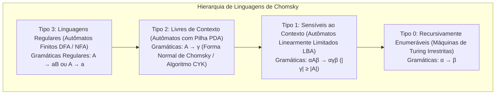
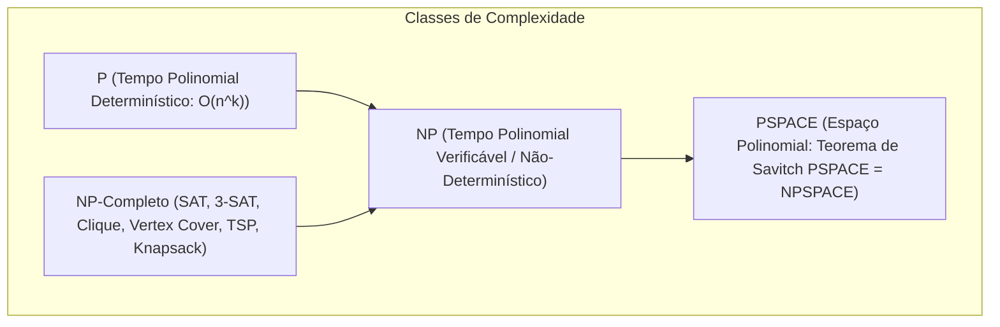

# Advanced Algorithms, Data Structures, and Computation Theory

This skill establishes the mathematical foundations, formal limits of computability, rigorous asymptotic analysis, and the design of high-performance data structures and algorithms, unifying the classic treatises of **CLRS** (*Introduction to Algorithms*), **Michael Sipser** (*Introduction to the Theory of Computation*), and **Donald Knuth** (*TAOCP*).

---

## 🏛️ 1. Chomsky Hierarchy, Automata, and Formal Languages



### 1.1 Finite Automata and the Pumping Lemma
- **DFA**: A 5-tuple $(Q, \Sigma, \delta, q_0, F)$ with a deterministic transition function $\delta: Q \times \Sigma \to Q$.
- **Pumping Lemma for Regular Languages**: For every regular language $L$, there exists $p \ge 1$ such that $\forall s \in L$ with $|s| \ge p$, $s = xyz$ with $|xy| \le p$, $|y| > 0$, and $x y^i z \in L, \forall i \ge 0$.

### 1.2 Turing Machines, Decidability, and Rice's Theorem
- **Halting Problem ($A_{TM}$)**: Undecidable by contradiction through Cantor's diagonalization argument.
- **Rice's Theorem**: Any non-trivial semantic property (one not satisfied by any language or satisfied by all) of the languages recognized by Turing machines is undecidable.

---

## ⚡ 2. Computational Complexity Theory (P vs NP vs PSPACE)



- **Cook-Levin Theorem**: The SAT problem (Boolean Satisfiability) is NP-Complete.
- **Karp Reduction ($A \le_P B$)**: $A$ reduces in polynomial time to $B$. If $B \in P$, then $A \in P$. If $A$ is NP-Hard, then $B$ is NP-Hard.

---

## 📊 3. Asymptotic Analysis and the Master Theorem (CLRS)

### 3.1 Master Theorem for Divide and Conquer ($T(n) = aT(n/b) + f(n)$)
Critical exponent $c_{\text{crit}} = \log_b a$:
1. **Case 1**: If $f(n) = \mathcal{O}(n^c)$ with $c < c_{\text{crit}}$, then $T(n) = \Theta(n^{\log_b a})$.
2. **Case 2**: If $f(n) = \Theta(n^{c_{\text{crit}}} \log^k n)$ with $k \ge 0$, then $T(n) = \Theta(n^{\log_b a} \log^{k+1} n)$.
3. **Case 3**: If $f(n) = \Omega(n^c)$ with $c > c_{\text{crit}}$ and $a f(n/b) \le k f(n)$ for $k < 1$, then $T(n) = \Theta(f(n))$.

---

## 🌲 4. Balanced Data Structures and Spatial Indexing

| Structure | Insertion | Search | Deletion | Invariant & Application |
| :--- | :---: | :---: | :---: | :--- |
| **AVL Tree** | $\mathcal{O}(\log n)$ | $\mathcal{O}(\log n)$ | $\mathcal{O}(\log n)$ | Balance factor $|h_L - h_R| \le 1$. Single and double rotations. |
| **Red-Black Tree** | $\mathcal{O}(\log n)$ | $\mathcal{O}(\log n)$ | $\mathcal{O}(\log n)$ | Black root, children of a red node are black. Standard in `std::map`. |
| **B/B+ Tree** | $\mathcal{O}(\log_B n)$ | $\mathcal{O}(\log_B n)$ | $\mathcal{O}(\log_B n)$ | Block indexing in file systems and databases. |
| **Segment Tree** | $\mathcal{O}(\log n)$ | $\mathcal{O}(\log n)$ | $\mathcal{O}(\log n)$ | Range queries (Range Sum/Min) with *Lazy Propagation*. |
| **Fenwick Tree (BIT)** | $\mathcal{O}(\log n)$ | $\mathcal{O}(\log n)$ | - | Prefix sums in $\mathcal{O}(n)$ space using bit manipulation (`x & -x`). |
| **Disjoint Set Union (DSU)** | $\mathcal{O}(\alpha(n))$ | $\mathcal{O}(\alpha(n))$ | - | Union by Rank + Path Compression. Nearly constant time ($\alpha(n) \le 4$). |

---

## 🕸️ 5. Graph Algorithms and Combinatorial Optimization

```python
import heapq
from typing import TypeVar, Callable, List, Optional, Dict, Tuple

T = TypeVar('T')

def a_star(
    initial: T,
    goal_test: Callable[[T], bool],
    successors: Callable[[T], List[Tuple[T, float]]],
    heuristic: Callable[[T], float]
) -> Optional[List[T]]:
    """Algoritmo de Busca Heurística A* com Heurística Admissível e Consistente."""
    frontier: List[Tuple[float, float, T]] = []
    heapq.heappush(frontier, (heuristic(initial), 0.0, initial))
    came_from: Dict[T, Optional[T]] = {initial: None}
    cost_so_far: Dict[T, float] = {initial: 0.0}

    while frontier:
        _, current_cost, current = heapq.heappop(frontier)
        if goal_test(current):
            path: List[T] = [current]
            while came_from[current] is not None:
                current = came_from[current]
                path.append(current)
            path.reverse()
            return path

        for neighbor, edge_cost in successors(current):
            new_cost = current_cost + edge_cost
            if neighbor not in cost_so_far or new_cost < cost_so_far[neighbor]:
                cost_so_far[neighbor] = new_cost
                priority = new_cost + heuristic(neighbor)
                heapq.heappush(frontier, (priority, new_cost, neighbor))
                came_from[neighbor] = current
    return None
```
