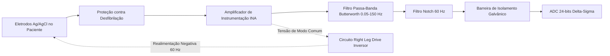

# Biomedical Engineering, Instrumentation, Physiological Signals, and Medical Imaging

This skill establishes the theoretical principles, electronic signal-conditioning circuits, medical physics of ionizing and non-ionizing radiation, and health informatics standards building on the classic works of **John G. Webster** (*Medical Instrumentation*) and **Jerrold T. Bushberg** (*The Essential Physics of Medical Imaging*).

---

## 🫀 1. Biopotential Instrumentation and Signal Conditioning

### 1.1 Instrumentation Amplifier (INA) with Right Leg Drive (RLD) Circuit
For signals from microvolts to millivolts (ECG: $\approx 1\text{ mV}$, EEG: $\approx 50\ \mu\text{V}$, EMG: $\approx 1-5\text{ mV}$):
$$V_{out} = \left( 1 + \frac{2 R_1}{R_{gain}} \right) \left( \frac{R_3}{R_2} \right) (V_2 - V_1)$$

- **Right Leg Drive (RLD) Circuit**: Captures the common-mode voltage $V_{cm} = \frac{V_1 + V_2}{2}$, inverts its phase through an auxiliary operational amplifier, and reinjects an opposing current into the patient's body (RL electrode), raising the effective Common-Mode Rejection Ratio to $\text{CMRR} > 100\text{ dB}$ and suppressing 60 Hz mains noise.
- **Galvanic Isolation and Electrical Safety (IEC 60601-1)**:
  - Use of optocouplers or galvanic isolation transformers ($> 4\text{ kV}$).
  - Patient leakage current limits: $< 10\ \mu\text{A}$ (Type CF - direct cardiac contact) and $< 100\ \mu\text{A}$ (Type BF).

---

## 🩻 2. Medical Imaging Physics and Tomographic Reconstruction

### 2.1 Computed Tomography (CT) and the Radon Transform
The linear attenuation of X-rays in a collimated beam follows the Beer-Lambert law:
$$I = I_0 \exp\left( -\int_L \mu(x,y) \, ds \right)$$
The tomographic projection $p(\theta, r)$ is the **Radon Transform** of the attenuation distribution $\mu(x,y)$:
$$p(\theta, r) = \mathcal{R}\{\mu(x,y)\} = \int_{-\infty}^\infty \int_{-\infty}^\infty \mu(x,y) \delta(x\cos\theta + y\sin\theta - r) \, dx \, dy$$

- **Fourier Slice Theorem**: The 1D Fourier transform of a projection at angle $\theta$ is identical to a radial slice through the origin of the 2D Fourier transform of the object $\mu(x,y)$:
  $$\mathcal{F}_{1D}\{p(\theta, r)\} = \mathcal{F}_{2D}\{\mu(x,y)\}(u = \omega\cos\theta, v = \omega\sin\theta)$$
- **Filtered Backprojection (FBP)**: Application of the ramp filter (*Ram-Lak Filter* $|\omega|$) in the frequency domain before spatial backprojection to eliminate the $1/r$ blurring.

### 2.2 Nuclear Magnetic Resonance (MRI)
- **Bloch Equations and Relaxation**:
  $$\frac{d\vec{M}}{dt} = \vec{M} \times \gamma \vec{B} - \frac{M_x \hat{i} + M_y \hat{j}}{T_2} - \frac{(M_z - M_0)\hat{k}}{T_1}$$
  where $T_1$ is the longitudinal (spin-lattice) relaxation time and $T_2$ is the transverse (spin-spin) relaxation time.
- **Spatial Encoding and $k$-Space**: The linear magnetic gradients $G_x$ (frequency readout) and $G_y$ (phase encoding) map the transverse magnetization directly into $k$-space:
  $$k_x(t) = \frac{\gamma}{2\pi} \int_0^t G_x(\tau)\, d\tau, \quad k_y(t) = \frac{\gamma}{2\pi} \int_0^t G_y(\tau)\, d\tau$$
  The final anatomical image is obtained by applying the 2D Inverse Fourier Transform ($\text{iFFT}$) over the $k$-space matrix.

### 2.3 Ultrasound and Nuclear Medicine
- **Doppler Ultrasound**: Frequency shift $\Delta f = \frac{2 f_0 v \cos\theta}{c}$ for quantifying blood flow velocity in arteries and cardiac valves.
- **Positron Emission Tomography (PET)**: Temporal coincidence detection of collinear 511 keV gamma photon pairs generated by positron-electron annihilation ($e^+ + e^- \rightarrow 2\gamma$).

---

## 🏥 3. Health Informatics and Interoperability (DICOM & HL7/FHIR)

- **DICOM (Digital Imaging and Communications in Medicine)**: A binary IOD standard containing a rich tag header (Patient ID `(0010,0020)`, Modality `(0008,0060)`, Pixel Data `(7FE0,0010)`).
- **HL7 FHIR (Fast Healthcare Interoperability Resources)**: RESTful resources in JSON/XML (e.g., `Patient`, `Observation`, `DiagnosticReport`, `ImagingStudy`) integrated with OAuth 2.0 / OpenID Connect authentication under the **SMART on FHIR** profile.
