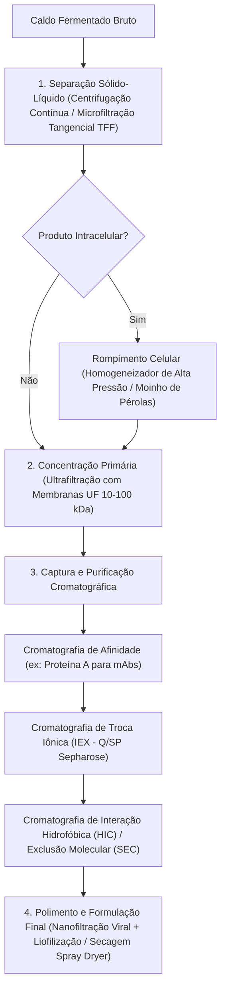

# Biotechnology and Bioprocess Engineering (Doran & Shuler)

This skill establishes the kinetic, mathematical, and operational foundations for large-scale cultivation of microorganisms, plant, and mammalian cells, bioreactor sizing and automation, downstream recovery and purification, and compliance with biosafety and biopharmaceutical quality regulations.

---

## 🦠 1. Microbial Kinetics and Cell Growth Modeling

### 1.1 Monod Model and Growth Phases
The specific cell growth rate $\mu$ ($h^{-1}$) as a function of the limiting substrate concentration $S$ ($g/L$):

$$\mu = \mu_{max} \frac{S}{K_s + S}$$

where $\mu_{max}$ is the maximum growth rate and $K_s$ is the substrate affinity constant (the concentration at which $\mu = \frac{\mu_{max}}{2}$).

- **Biomass Variation ($X$) and Substrate Consumption ($S$) in Batch**:
  $$\frac{dX}{dt} = \mu X - k_d X$$
  $$\frac{dS}{dt} = -\frac{1}{Y_{X/S}} \frac{dX}{dt} - m_s X$$
  where $Y_{X/S} = \frac{\Delta X}{-\Delta S}$ is the biomass yield factor and $m_s$ is the cell maintenance coefficient ($g_{subs}/g_{bio} \cdot h$).

### 1.2 Product Formation Kinetics (Luedeking-Piret)
The product formation rate $q_p = \frac{1}{X}\frac{dP}{dt}$ correlates with growth and maintenance:

$$q_p = \alpha \mu + \beta \implies \frac{dP}{dt} = \alpha \frac{dX}{dt} + \beta X$$

- **Product Classification**:
  1. **Growth-Associated ($\beta \approx 0$)**: E.g., ethanol, lactic acid.
  2. **Non-Growth-Associated ($\alpha \approx 0$)**: E.g., secondary antibiotics, idiolytic metabolites in the stationary phase.
  3. **Mixed / Partially Associated ($\alpha > 0, \beta > 0$)**: E.g., citric acid, induced enzymes.

---

## ⚗️ 2. Bioreactor Typology, Hydrodynamics, and Sizing

```
Classificação de Biorreatores Industriais:
├── Tanque Agitado Mecanicamente (STR - Stirred Tank Reactor):
│   ├── Impelidores Rushton (fluxo radial - alta dispersão de gás)
│   ├── Impelidores Hidrofólio/Pitch-Blade (fluxo axial - baixo cisalhamento)
│   └── Defletores (baffles) para supressão de vórtices
├── Pneumáticos (Pneumatically Agitated):
│   ├── Airlift (com circulação interna por tubo concêntrico ou externa)
│   └── Coluna de Bolhas (Bubble Column)
├── Leito Fixo e Leito Fluidizado: Células e enzimas imobilizadas
└── Biorreatores Descartáveis (Single-Use Bioreactors - SUBs):
    ├── Bolsas poliméricas multicamadas (Bags de PE/EVOH)
    ├── Biorreatores de ondas (Wave/Rocking Bioreactors)
    └── Biorreatores agitados de uso único (STR descartável até 2.000 L)
```

### 2.1 Volumetric Oxygen Transfer Coefficient ($k_L a$)
Oxygen supply is the fundamental bottleneck in aerobic bioprocesses:

$$OTR = k_L a (C^* - C_L)$$

where $OTR$ is the Oxygen Transfer Rate ($mmol \, O_2 / L \cdot h$), $k_L a$ is the overall volumetric coefficient ($h^{-1}$), $C^*$ is the oxygen solubility at saturation, and $C_L$ is the dissolved oxygen in the medium.

- **Dynamic Balance for Experimental Determination of $k_L a$ (Dynamic Gassing-in / Degassing Method)**:
  $$\frac{dC_L}{dt} = k_L a (C^* - C_L) - OUR$$
  where $OUR = q_{O2} X$ is the cellular Oxygen Uptake Rate.

### 2.2 Empirical Power and Scale Correlation (Van't Riet)
For aerated stirred vessels in aqueous medium:

$$k_L a = C \left(\frac{P_g}{V}\right)^\alpha (v_s)^\beta$$

where $\frac{P_g}{V}$ is the power dissipated per unit volume under aeration ($W/m^3$) and $v_s$ is the superficial gas velocity ($m/s$).

---

## 🧪 3. Downstream Unit Operations of Purification



### 3.1 Tangential Flow Filtration (TFF) Theory
The permeate flux $J$ ($L/m^2 \cdot h$) through the ultrafiltration membrane under concentration polarization:

$$J = k \ln\left( \frac{C_m - C_p}{C_b - C_p} \right)$$

where $k$ is the mass transfer coefficient, $C_m$ is the concentration at the membrane surface, $C_b$ is the concentration in the bulk fluid, and $C_p$ is the concentration in the permeate.

---

## 🧬 4. Molecular Biology, Enzymology, and Recombinant DNA

### 4.1 Michaelis-Menten Enzyme Kinetics and Inhibition
Initial enzyme reaction velocity $v_0$:

$$v_0 = \frac{V_{max} [S]}{K_m + [S]}$$

- **Lineweaver-Burk Linear Transformation (Double Reciprocal)**:
  $$\frac{1}{v_0} = \frac{K_m}{V_{max}} \frac{1}{[S]} + \frac{1}{V_{max}}$$
- **Competitive Inhibition**: $K_{m,app} = K_m \left(1 + \frac{[I]}{K_i}\right)$, $V_{max}$ unchanged.
- **Non-Competitive Inhibition**: $V_{max,app} = \frac{V_{max}}{1 + [I]/K_i}$, $K_m$ unchanged.

### 4.2 Recombinant DNA Technology and Expression
- **Plasmid Vector Design**: Strong, regulatable promoters (T7, tac, pGAP for *Pichia pastoris*), selection markers (antibiotic resistance), multiple cloning sites (MCS), and purification tags (6xHis His-tag, GST, FLAG).
- **Host Expression Systems**:
  - *Escherichia coli*: High yield, no complex glycosylation, inclusion body formation.
  - *Pichia pastoris / Saccharomyces cerevisiae*: Initial eukaryotic glycosylation, efficient secretion.
  - CHO cells (Chinese Hamster Ovary): Gold standard for human biopharmaceuticals and monoclonal antibodies with authentic complex human glycosylation.

---

## 🛡️ 5. Good Practices, Biosafety, and Regulatory Framework

| Biosafety Level | Biological Agents | Containment Barriers & Requirements |
| :--- | :--- | :--- |
| **NB-1** | Well-characterized microorganisms that do not cause disease in healthy adult humans (e.g., *E. coli* K12, *S. cerevisiae*). | Open bench, daily decontamination, lab coat and gloves. |
| **NB-2** | Agents associated with human disease of moderate severity, risk of inoculation and ingestion (e.g., *Staphylococcus aureus*, HBV). | Class II A2/B2 Biological Safety Cabinet, accessible autoclave, access control. |
| **NB-3** | Indigenous or exotic agents with respiratory transmission potential that can cause serious/lethal disease (e.g., *Mycobacterium tuberculosis*, SARS-CoV-2). | Continuous negative differential pressure, exhaust air with double HEPA filtration, interlocked-door airlocks. |
| **NB-4** | Agents of high individual and community risk, with no available treatment or vaccine (e.g., Ebola, Marburg viruses). | Pressurized suits with self-contained air supply, maximum absolute isolation containment. |

- **Legal Framework in Brazil**:
  - **CTNBio (National Technical Commission on Biosafety)**: Federal Law No. 11,105/2005 (GMO Biosafety Law) and the Biosafety Quality Certificate (CQB).
  - **ANVISA**: RDC No. 658/2022 (General GMP Guidelines for Medicines), RDC No. 166/2017 (Validation of Analytical Methods), and RDC No. 55/2010 (Registration of Biological Products).
  - **Inmetro / NIT-DICLA-035**: Accreditation of assays under Good Laboratory Practice (GLP/OECD) Principles.
