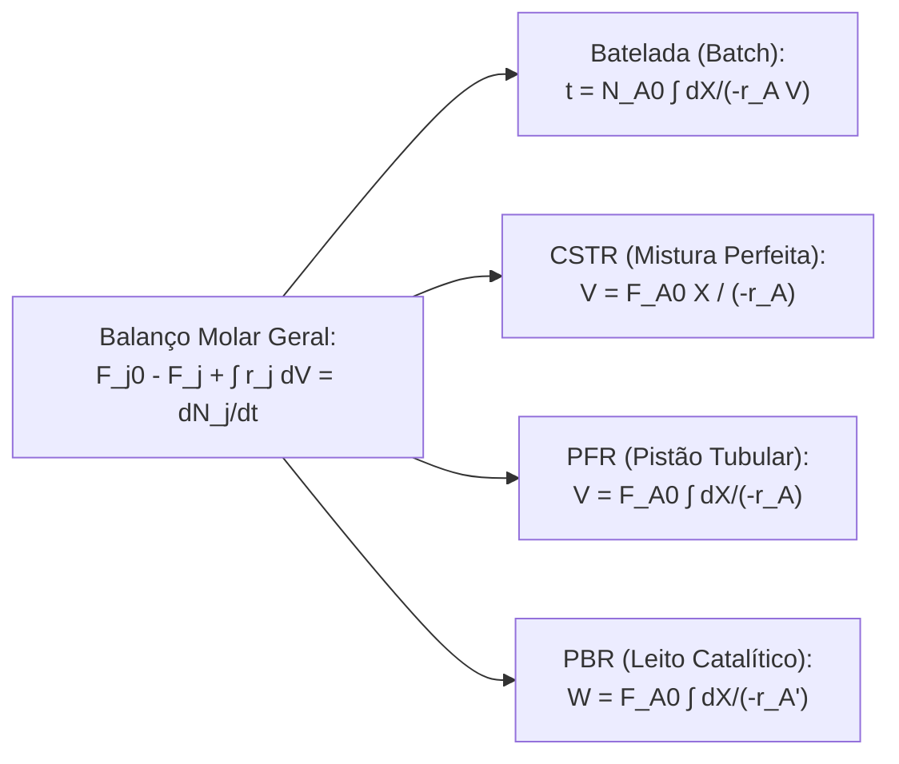

# Chemical Engineering, Reactors, Transport Phenomena, and CFD

This skill establishes the rigorous differential and integral balances of mass, momentum, and energy applied to industrial reactor sizing, chemical separation processes, and numerical simulation of fluid, heat, and mass transport building on the works of **H. Scott Fogler**, **Bird, Stewart & Lightfoot**, and **John D. Anderson**.

---

## 🧪 1. Design Equations for Ideal Chemical Reactors (Fogler)

| Reactor | Operation Type | Differential Design Equation | Integrated Equation |
| :--- | :--- | :--- | :--- |
| **Batch** | Transient, uniform mixing | $N_{A0}\frac{dX}{dt} = -r_A V$ | $t = N_{A0} \int_0^X \frac{dX}{-r_A V}$ |
| **CSTR** | Steady state, homogeneous | $F_{A0} - F_A + r_A V = 0$ | $V = \frac{F_{A0} X}{-r_A(X_{saida})}$ |
| **PFR** | Steady-state tubular | $\frac{dF_A}{dV} = r_A \iff F_{A0}\frac{dX}{dV} = -r_A$ | $V = F_{A0} \int_0^X \frac{dX}{-r_A}$ |
| **PBR** | Fixed bed with mass $W$ | $F_{A0}\frac{dX}{dW} = -r_A'$ | $W = F_{A0} \int_0^X \frac{dX}{-r_A'}$ |

### 1.1 Heterogeneous Catalysis, Thiele Modulus ($\phi$), and Effectiveness ($\eta$)
- **Thiele Modulus for a Spherical Catalyst Pellet**:
  $$\phi_1 = R \sqrt{\frac{k}{D_e}}$$
- **Internal Effectiveness Factor ($\eta$)**:
  $$\eta = \frac{\text{Actual Rate with Diffusional Limitation}}{\text{Rate at the Surface}} = \frac{3}{\phi_1^2} (\phi_1 \coth\phi_1 - 1)$$
  - If $\phi_1 \ll 1 \implies \eta \approx 1$ (Chemical reaction control).
  - If $\phi_1 \gg 1 \implies \eta \approx \frac{3}{\phi_1}$ (Strong intraparticle diffusional limitation).

---

## 🌡️ 2. Non-Isothermal Reactors and Thermal Stability

- **Differential Energy Balance in a PFR**:
  $$\frac{dT}{dV} = \frac{U a (T_a - T) + (-r_A)(-\Delta H_{Rx}^\circ)}{\sum F_i C_{pi}}$$
- **Multiple Steady States in an Exothermic CSTR**:
  The intersection of the heat generated curve $Q_g(T) = (-r_A V)(-\Delta H_{Rx})$ with the heat removed line $Q_r(T) = (\sum F_{i0} C_{pi} + U A)(T - T_c)$ can give rise to 3 steady-state operating points (two stable and one unstable ignition/extinction point).

---

## 🌊 3. Transport Phenomena (Bird, Stewart & Lightfoot)

### 3.1 Fundamental Navier-Stokes (Momentum) Equations
For an incompressible Newtonian fluid with constant dynamic viscosity $\mu$:
$$\begin{aligned}
\nabla \cdot \mathbf{v} &= 0 \quad &\text{(Mass Conservation/Continuity)} \\
\rho \left( \frac{\partial \mathbf{v}}{\partial t} + \mathbf{v} \cdot \nabla \mathbf{v} \right) &= -\nabla p + \mu \nabla^2 \mathbf{v} + \rho \mathbf{g} \quad &\text{(Momentum Conservation)}
\end{aligned}$$

### 3.2 Heat Transfer (Energy)
General energy conservation equation with thermal generation $\dot{q}$:
$$\rho C_p \left( \frac{\partial T}{\partial t} + \mathbf{v} \cdot \nabla T \right) = k \nabla^2 T + \dot{q} + \mu \Phi$$
where $k$ is the thermal conductivity and $\Phi$ is the viscous dissipation function.

### 3.3 Mass Transfer and Fick's Laws
- **Fick's 1st Law (Steady-State Molecular Diffusion)**:
  $$\mathbf{J}_A = -D_{AB} \nabla C_A$$
- **Convective-Diffusive Chemical Species Transport Equation with Reaction**:
  $$\frac{\partial C_A}{\partial t} + \mathbf{v} \cdot \nabla C_A = D_{AB} \nabla^2 C_A + r_A$$

---

## 💻 4. Computational Fluid Dynamics (CFD - Anderson)

- **Finite Volume Method (FVM)**: Integration of the differential equations over discrete control volumes $\Omega_P$ of a structured or unstructured computational mesh.
- **SIMPLE Algorithm (Semi-Implicit Method for Pressure-Linked Equations)**:
  1. Solve the discretized momentum equation using an initial estimate of the pressure field $p^*$.
  2. Compute the pressure correction $p'$ through the discretized continuity equation.
  3. Correct the face velocities and the pressure field ($p = p^* + \alpha_p p'$).
  4. Solve the energy ($T$) and species ($C_A$) transport equations.
  5. Iterate until the normalized momentum and mass residuals reach a tolerance $< 10^{-5}$.
