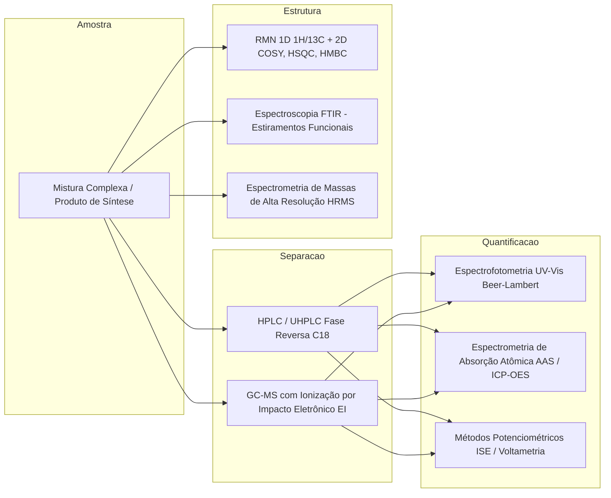

# Chemical Synthesis, Physical Chemistry, and Instrumental Analysis (Clayden & Skoog)

This skill establishes the rigorous theoretical foundations, organic and inorganic synthesis mechanisms, thermodynamics and kinetics of reaction systems, molecular spectroscopy, and instrumental metrological validation.

---

## ⚗️ 1. Advanced Organic Mechanisms and Retrosynthesis

```
Reatividade e Mecanismos Centrais em Química Orgânica:
├── Substituições e Eliminações Alifáticas:
│   ├── SN2: Ataque dorsal estereoespecífico com inversão de Walden, solventes polares apróticos
│   ├── SN1: Intermediário carbocátion planar com racemização, rearranjos de Wagner-Meerwein
│   └── E2 / E1: Regra de Zaitsev (alceno mais estável) vs Regra de Hofmann (impedimento estéreo)
├── Substituição Eletrofílica Aromática (SEAr):
│   ├── Complexo de Wheland / Íon Arenônio
│   ├── Ativadores orto/para-dirigentes (efeito mesomérico +M: -OH, -NH2, -OCH3)
│   └── Desativadores meta-dirigentes (efeito indutivo/mesomérico -I/-M: -NO2, -CN, -COR)
├── Química de Enolatos e Condensações Carbonílicas:
│   ├── Condensação Aldólica e Desidratação crotônica
│   ├── Condensação de Claisen e Dieckmann (ésteres)
│   └── Adição 1,4-Conjugada de Michael e Anelação de Robinson
└── Acoplamentos Cruzados Catalisados por Metais de Transição (Paládio [Pd(0)/Pd(II)]):
    ├── Ciclo Catalítico: Adição Oxidativa → Transmetalação → Isomerização cis-trans → Eliminação Redutiva
    ├── Reação de Suzuki-Miyaura: Ar-X + Ar'-B(OH)2 em meio básico
    ├── Reação de Heck: Ar-X + Alceno na presença de amina terciária
    └── Reação de Sonogashira: Ar-X + Alcino terminal com cocatalisador de Cu(I)
```

---

## 💎 2. Inorganic Chemistry, Coordination Theory, and Organometallics

### 2.1 Crystal Field Theory (CFT) and Ligand Field
The splitting of $d$ orbitals under ligand field symmetry:
- **Octahedral Field ($O_h$)**: Splitting into lower-energy $t_{2g}$ orbitals ($d_{xy}, d_{xz}, d_{yz}$) and higher-energy $e_g$ orbitals ($d_{z^2}, d_{x^2-y^2}$) with splitting energy $\Delta_o = 10 \, Dq$.
- **Crystal Field Stabilization Energy (CFSE)**:
  $$CFSE = \left( -0.4 n_{t2g} + 0.6 n_{eg} \right) \Delta_o + m P$$
  where $P$ is the electron pairing energy (Strong Field $\Delta_o > P \implies$ Low Spin; Weak Field $\Delta_o < P \implies$ High Spin).
- **Jahn-Teller Theorem**: Any non-linear molecule in a degenerate electronic state will undergo a spontaneous geometric distortion (axial elongation/compression $D_{4h}$) to break the degeneracy and lower the overall energy (e.g., $Cu^{2+}$ $d^9$ and high-spin $Cr^{2+}$ $d^4$ complexes).

### 2.2 The 18-Electron Rule in Organometallic Complexes
The thermodynamic stability of transition-metal organometallic complexes rests on filling their 9 valence orbitals (one $s$, three $p$, five $d$):

$$N_{valencia} = N_{metal} + \sum n_{ligands} - q_{complex} = 18$$

---

## 🌡️ 3. Physical Chemistry: Thermodynamics, Kinetics, and Electrochemistry

### 3.1 Vapor-Liquid Equilibrium and the Antoine Equation
For calculating the vapor pressure $P^{sat}$ ($mmHg$) of pure substances at temperature $T$ ($^\circ C$):

$$\log_{10}(P^{sat}) = A - \frac{B}{T + C}$$

- **Modified Raoult's Law with Activity Coefficients ($\gamma_i$)**:
  $$y_i P = x_i \gamma_i P_i^{sat}(T)$$
  where pronounced positive deviations generate minimum-boiling azeotropes (e.g., Ethanol-Water at $95.6\%$ by mass).

### 3.2 Electrochemistry and Debye-Hückel-Onsager Conductometry
- **Nernst Equation for Electrode Potential**:
  $$E = E^\circ - \frac{RT}{nF} \ln Q = E^\circ - \frac{0.05916}{n} \log_{10}\left( \frac{\prod a_{products}^{\nu_p}}{\prod a_{reactants}^{\nu_r}} \right)$$
- **Onsager Molar Conductivity Limit Equation**:
  $$\Lambda_m = \Lambda_m^\circ - (A + B \Lambda_m^\circ) \sqrt{C}$$

---

## 🔬 4. Instrumental Analytical Chemistry and Structural Elucidation



### 4.1 Nuclear Magnetic Resonance ($^1H$ and $^{13}C$ NMR)
- **Larmor Frequency**: $\nu_0 = \frac{\gamma B_0}{2\pi}$.
- **Chemical Shift ($\delta$ in ppm)**: $\delta = \frac{\nu_{sample} - \nu_{TMS}}{\nu_{operation}} \times 10^6$.
- **2D Correlations**:
  - **COSY ($^1H$-$^1H$)**: Vicinal ($^3J_{HH}$) and geminal ($^2J_{HH}$) scalar couplings.
  - **HSQC / HMQC ($^1H$-$^{13}C$)**: Direct C-H connectivities through one bond ($^1J_{CH}$).
  - **HMBC ($^1H$-$^{13}C$)**: Long-range heteronuclear connectivities ($^2J_{CH}$ and $^3J_{CH}$) essential for elucidating quaternary carbonyls and aromatic rings.

### 4.2 Quantitative Chromatographic Theory
- **Peak Resolution ($R_s$)**:
  $$R_s = \frac{2 (t_{R2} - t_{R1})}{W_1 + W_2} = \frac{\sqrt{N}}{4} \left( \frac{\alpha - 1}{\alpha} \right) \left( \frac{k_2}{1 + k_2} \right)$$
- **Van Deemter Equation for Theoretical Plate Height ($H = L/N$)**:
  $$H = A + \frac{B}{u} + C \cdot u$$
  where $A$ is multi-path (Eddy) diffusion, $B$ is longitudinal molecular diffusion, and $C$ is the mass transfer resistance in the mobile/stationary phase.

---

## ⚖️ 5. ISO/IEC 17025 Metrology, GHS Safety, and Chemical Legislation

| Framework / Standard | Core Requirement | Practical Application |
| :--- | :--- | :--- |
| **ABNT NBR ISO/IEC 17025:2017** | Technical competence of testing laboratories | Analytical method validation (Linearity $R^2 \ge 0.995$, Precision/Repeatability RSD $< 2\%$, Limit of Detection LoD and Quantification LoQ, Metrological Traceability to the SI, and Expanded Uncertainty Calculation $U = k \cdot u_c$). |
| **ABNT NBR 14725 / GHS** | Globally Harmonized System | Preparation of the SDS (Safety Data Sheet with 16 sections) and Preventive Labeling with physical, health, and environmental hazard pictograms. |
| **Federal Law No. 2,800/1956 / CFQ** | Professional Regulation | Exclusive attributions of the chemist (RN 36/1974), legal technical responsibility (AFT - Technical Function Annotation), and Federal Police control of chemical precursors (MJSP Ordinance 240/2019). |
