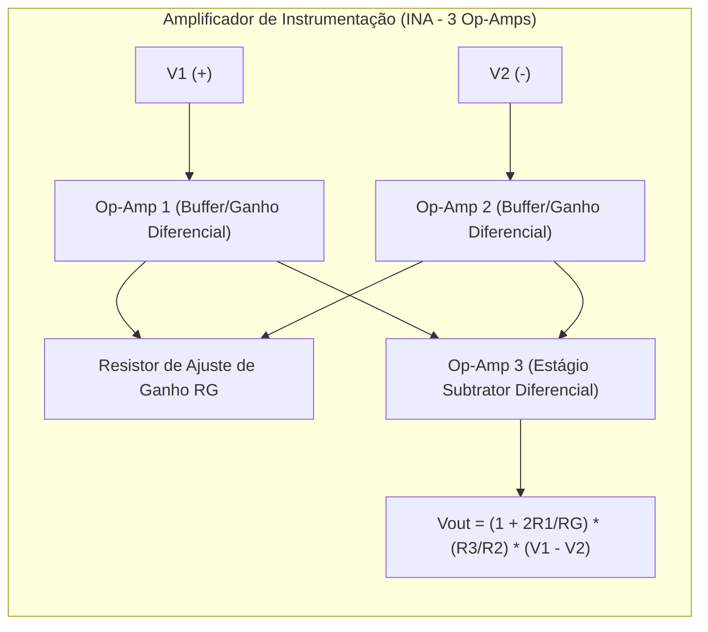

# Electrical Circuit Analysis and Microelectronics (Sedra & Alexander-Sadiku)

This skill establishes the analytical engineering of linear electrical networks in direct current (DC) and alternating current (AC), transient regimes, frequency response, and small- and large-signal modeling in semiconductors and operational amplifiers.

---

## ⚡ 1. Network Theorems and Steady-State AC Analysis

### 1.1 Fundamental Network Theorems
- **Kirchhoff's Laws**: $\sum_{k} I_k = 0$ (KCL at nodes) and $\sum_{k} V_k = 0$ (KVL around loops).
- **Thévenin and Norton Theorems**:
  $$V_{th} = V_{oc}, \quad I_n = I_{sc}, \quad \mathbf{Z}_{th} = \frac{\mathbf{V}_{oc}}{\mathbf{I}_{sc}}$$
- **Maximum Power Transfer Theorem in AC**:
  Maximum active power is delivered to the load when the load impedance is the complex conjugate of the Thévenin equivalent impedance:
  $$\mathbf{Z}_L = \mathbf{Z}_{th}^* = R_{th} - j X_{th} \implies P_{max} = \frac{|V_{th}|^2}{4 R_{th}}$$

### 1.2 Phasors and the Power Triangle
For phasor voltage $\mathbf{V} = V_{rms} \angle \theta_v$ and current $\mathbf{I} = I_{rms} \angle \theta_i$:
- **Complex Power**: $\mathbf{S} = \mathbf{V} \mathbf{I}^* = P + j Q = |\mathbf{S}| \angle \theta$ ($[\text{VA}]$).
- **Active (Real) Power**: $P = V_{rms} I_{rms} \cos(\theta_v - \theta_i)$ ($[\text{W}]$).
- **Reactive Power**: $Q = V_{rms} I_{rms} \sin(\theta_v - \theta_i)$ ($[\text{var}]$).
- **Power Factor**: $PF = \cos(\theta_v - \theta_i) = \frac{P}{|\mathbf{S}|}$.

---

## ⏱️ 2. Transients in First- and Second-Order Circuits (RL, RC, and RLC)

### 2.1 First-Order Circuits (RC and RL)
The complete response to a unit step with initial condition $x(0)$ and steady state $x(\infty)$:
$$x(t) = x(\infty) + [x(0) - x(\infty)] e^{-t/\tau}, \quad \tau_{RC} = R C, \; \tau_{RL} = \frac{L}{R}$$

### 2.2 Second-Order RLC Circuits
Differential equation: $\frac{d^2 x}{dt^2} + 2\zeta\omega_0 \frac{dx}{dt} + \omega_0^2 x = f(t)$, with $\omega_0 = \frac{1}{\sqrt{LC}}$ and $\alpha = \zeta\omega_0 = \frac{R}{2L}$ (series RLC):
1. **Overdamped ($\zeta > 1 \iff \alpha > \omega_0$)**: $x(t) = A_1 e^{s_1 t} + A_2 e^{s_2 t}$.
2. **Critically Damped ($\zeta = 1 \iff \alpha = \omega_0$)**: $x(t) = (A_1 + A_2 t) e^{-\alpha t}$ (fastest return to equilibrium without oscillation).
3. **Underdamped ($\zeta < 1 \iff \alpha < \omega_0$)**: $x(t) = e^{-\alpha t} (A_1 \cos\omega_d t + A_2 \sin\omega_d t)$ with $\omega_d = \sqrt{\omega_0^2 - \alpha^2}$.

---

## 🔬 3. Semiconductor Device Modeling (BJT and MOSFET)

### 3.1 MOSFET Field-Effect Transistor (N-Channel)
- **Triode / Linear Region ($V_{DS} < V_{GS} - V_{th}$)**:
  $$I_D = \mu_n C_{ox} \frac{W}{L} \left[ (V_{GS} - V_{th}) V_{DS} - \frac{1}{2} V_{DS}^2 \right]$$
- **Saturation Region ($V_{DS} \ge V_{GS} - V_{th} = V_{OV}$)**:
  $$I_D = \frac{1}{2} \mu_n C_{ox} \frac{W}{L} (V_{GS} - V_{th})^2 (1 + \lambda V_{DS})$$
- **Small-Signal Parameters (Hybrid-$\pi$ Model)**:
  $$g_m = \left. \frac{\partial I_D}{\partial V_{GS}} \right|_{Q} = \frac{2 I_D}{V_{OV}} = \sqrt{2 \mu_n C_{ox} \frac{W}{L} I_D}, \quad r_o = \frac{1}{\lambda I_D} \approx \frac{V_A}{I_D}$$

### 3.2 Bipolar Junction Transistor (BJT)
- **Collector Current in Forward Active**: $I_C = I_S e^{V_{BE}/V_T} (1 + V_{CE}/V_A)$, with thermal voltage $V_T = \frac{k_B T}{q} \approx 25.8\text{ mV}$ at $300\text{ K}$.
- **Small Signal**: $g_m = \frac{I_C}{V_T}$, $r_\pi = \frac{\beta}{g_m} = \frac{V_T}{I_B}$, $r_e = \frac{\alpha}{g_m} \approx \frac{V_T}{I_E}$, $r_o = \frac{V_A}{I_C}$.

---

## 🎛️ 4. Operational Amplifiers and Active Filters

### 4.1 Second-Order Sallen-Key Low-Pass Active Filter
Transfer function:
$$H(s) = \frac{V_{out}(s)}{V_{in}(s)} = \frac{K \omega_0^2}{s^2 + \frac{\omega_0}{Q} s + \omega_0^2}$$
where $\omega_0 = \frac{1}{\sqrt{R_1 R_2 C_1 C_2}}$ and the quality factor $Q$ determines the response:
- **Butterworth ($Q = \frac{1}{\sqrt{2}} \approx 0.707$)**: Maximally flat response in the passband with no ripple.
- **Chebyshev ($Q > 0.707$)**: Sharper transition in the stopband at the cost of passband ripple.
