# Compiler Engineering and Language Processors (Dragon Book)

This skill establishes the complete architecture of pipelines that translate high-level source code into intermediate representations and optimized machine code, covering the lexical/syntactic front end, semantic analysis, the SSA middle end, and the back end for code generation and register allocation.

---

## 🔄 1. Complete Compilation Pipeline

```mermaid
flowchart LR
    A["Código Fonte"] --> B["Análise Léxica (Scanner / Flex)"]
    B -->|Tokens| C["Análise Sintática (Parser / Bison)"]
    C -->|AST| D["Análise Semântica (Type Checker)"]
    D -->|Decorated AST| E["Geração de Código Intermediário"]
    E -->|LLVM IR / SSA| F["Otimizador de Código (LLVM Opt Passes)"]
    F -->|Otimizado IR| G["Alocação de Registradores & Geração de Código"]
    G --> H["Código Objeto / Assembly Nativo (x86_64 / ARM / RISC-V)"]
```



---

## 🔡 2. Lexical Analysis: From Regular Expressions to Finite Automata

### 2.1 Thompson Construction (Regex $\to$ NFA-$\varepsilon$)
Converts regular operators ($a|b$, $ab$, $a^*$) into non-deterministic finite automata with $\varepsilon$-transitions linear in the size of the expression.

### 2.2 Subset Construction Algorithm (NFA $\to$ DFA)
- **$\varepsilon$-closure ($\varepsilon\text{-closure}(S)$)**: The set of states reachable from $S$ by empty $\varepsilon$-transitions only.
- **Transition $\delta_{DFA}(T, a) = \varepsilon\text{-closure}(\text{move}(T, a))$**: Maps DFA states to disjoint sets of NFA states.
- **DFA Minimization (Hopcroft's Algorithm)**: Partitions states into distinguishable equivalences with complexity $\mathcal{O}(k |S| \log |S|)$.

---

## 🌲 3. Syntax Analysis: Formal Grammars and Top-Down / Bottom-Up Parsers

### 3.1 FIRST and FOLLOW Sets
Given a grammar $G = (V, \Sigma, R, S)$:
- $\text{FIRST}(\alpha)$: The set of terminals that begin strings derived from $\alpha$.
- $\text{FOLLOW}(A)$: The set of terminals that can appear immediately to the right of the variable $A$ in some sentential form derived from the root $S$.

### 3.2 LL(1) vs LR(1) / LALR(1) Parsing Table
| Parser Family | Direction and Derivation | Common Conflicts | Expressive Power |
| :--- | :--- | :--- | :--- |
| **LL(1) (Top-Down)** | Left-to-right, Leftmost Derivation | FIRST/FIRST and FIRST/FOLLOW conflicts (requires left factoring and elimination of left recursion). | Lowest (does not handle direct left recursion). |
| **LR(0) / SLR(1)** | Left-to-right, Reverse Rightmost Derivation (*Shift-Reduce*) | Shift-Reduce and Reduce-Reduce conflicts when FOLLOW does not discriminate the state. | Intermediate. |
| **LR(1)** | Shift-Reduce with canonical 1-symbol lookahead | State explosion in the canonical table. | Maximum for deterministic context-free grammars. |
| **LALR(1) (Bison/Yacc)** | Merges LR(1) states with the same *core* | May introduce Reduce-Reduce conflicts, but preserves SLR(1) compactness. | Industry standard for production compilers. |

---

## 🏷️ 4. Semantic Analysis and Type Checking

- **Symbol Tables in a Stack of Lexical Scopes**: Support for shadowing, closures, and identifier resolution by block lifetime (`Scope::enter()`, `Scope::exit()`).
- **Type System and Hindley-Milner Inference (Algorithm W)**: Type unification via substitutions of type variables with cycle detection (*occurs check*).

---

## ⚡ 5. Middle-End: Static Single Assignment (SSA Form) and Cytron

In SSA form, each variable is assigned exactly once, and $\phi$ functions (*phi-nodes*) are inserted at dominance frontiers:

### 5.1 Dominance Tree and Dominance Frontier ($DF$)
- A node $d$ dominates $n$ ($d \, \text{dom} \, n$) if every path from the entry node to $n$ passes through $d$.
- The dominance frontier $DF(X)$ contains nodes $Y$ where $X$ dominates a predecessor of $Y$, but $X$ does not strictly dominate $Y$.
- **Cytron Algorithm**: $\phi$-nodes for the variable $v$ are inserted at the transitive closure of the dominance frontiers of the blocks containing assignments to $v$:
  $$DF^+(Def(v))$$

```llvm
; Representação LLVM IR em SSA canônico
define i32 @fatorial(i32 %n) {
entry:
  %cmp = icmp sle i32 %n, 1
  br i1 %cmp, label %base, label %recurse

base:
  br label %exit

recurse:
  %n.sub = sub nsw i32 %n, 1
  %call = call i32 @fatorial(i32 %n.sub)
  %res.rec = mul nsw i32 %n, %call
  br label %exit

exit:
  %retval = phi i32 [ 1, %base ], [ %res.rec, %recurse ]
  ret i32 %retval
}
```

---

## 🚀 6. Code Optimizations and Back-End

### 6.1 Catalog of SSA Optimizations (LLVM Passes)
1. **Mem2Reg**: Promotes stack allocations (`alloca`) to pure SSA registers via dominance analysis.
2. **GVN (Global Value Numbering) & CSE**: Identifies and eliminates equivalent redundant computations through value numbers.
3. **LICM (Loop Invariant Code Motion)**: Moves loop-independent instructions to the pre-header.
4. **DCE (Dead Code Elimination)**: A backward sweep that eliminates instructions whose results are not read by any live instruction.
5. **Function Inlining**: Replaces direct calls with the expanded function body when the heuristic cost outweighs the call overhead.

### 6.2 Graph-Coloring Register Allocation (Chaitin-Briggs)
- **Interference Graph**: Vertices are temporary variables; edges connect temporaries that are simultaneously live (overlapping *live ranges*).
- **Coloring Algorithm with $K$ Registers**:
  1. **Simplify**: Remove nodes with degree $< K$ and push them onto a stack.
  2. **Spill**: If all nodes have degree $\ge K$, choose a spill candidate based on memory cost / loop nesting.
  3. **Select**: Pop the nodes and assign physical registers of a compatible color with no collisions with neighbors.
