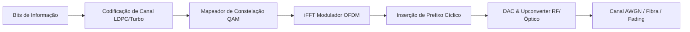

# Digital Communications, Information Theory, Optical and Wireless Networks

This skill establishes the theoretical, mathematical, and engineering foundations for transmitting information over guided (optical fibers) and unguided (radio frequency, satellites, and 5G/6G cellular networks) channels, grounded in the works of **John G. Proakis** (*Digital Communications*), **Gerd Keiser** (*Optical Fiber Communications*), and **Andrea Goldsmith** (*Wireless Communications*).

---

## 📡 1. Information Theory, Sampling, and Digital Modulations

### 1.1 Nyquist-Shannon Theorem and Shannon-Hartley Channel Capacity
- **Nyquist Rate**: To avoid aliasing when sampling a signal of bandwidth $B$, the minimum sampling frequency is $f_s \ge 2B$.
- **Channel Capacity in AWGN**:
  $$C = B \log_2\left(1 + \frac{S}{N}\right) = B \log_2\left(1 + \frac{P}{N_0 B}\right) \quad [\text{bits/s}]$$
  In the infinite-bandwidth limit ($B \rightarrow \infty$):
  $$C_{\infty} = \frac{P}{N_0 \ln 2} \approx 1.44 \frac{P}{N_0}$$

### 1.2 Passband Modulations and Bit Error Probability (BER)
- **BPSK / QPSK**:
  $$P_{b,\text{BPSK}} = Q\left(\sqrt{\frac{2E_b}{N_0}}\right), \quad \text{where } Q(x) = \frac{1}{\sqrt{2\pi}} \int_x^\infty e^{-u^2/2} du$$
- **$M$-QAM ($M = 16, 64, 256, 1024$)**: Quadrature modulation with high spectral efficiency ($\eta = \log_2 M\text{ bps/Hz}$).
- **OFDM (Orthogonal Frequency Division Multiplexing)**: Dividing a high-rate channel into $N$ narrowband orthogonal subcarriers with a Guard Interval (*Cyclic Prefix*) to eliminate Inter-Symbol Interference (ISI).

### 1.3 Forward Error Correction (FEC) Codes
- **Linear & Hamming Block Codes**: Detection of $d_{min}-1$ errors and correction of $\lfloor (d_{min}-1)/2 \rfloor$ errors.
- **Reed-Solomon (RS)**: Ideal non-binary codes for burst errors in storage media and satellite links.
- **LDPC (Low-Density Parity-Check) and Turbo Codes**: Codes with iterative decoding algorithms (*Belief Propagation*) that operate within fractions of a dB of the Shannon Limit. Standard in 5G NR and DVB-S2X.

---

## 💡 2. Optical Communications and WDM/DWDM Systems

### 2.1 Propagation and Single-Mode Condition in Fibers
Numerical Aperture ($NA$) and normalized frequency parameter ($V$-number):
$$NA = \sqrt{n_1^2 - n_2^2} = \sin \theta_{max}, \quad V = \frac{2\pi a}{\lambda_0} \sqrt{n_1^2 - n_2^2}$$
The fiber operates in a single transverse mode ($\text{LP}_{01}$) if $V < 2.405$.

### 2.2 Attenuation and Dispersion
- **Attenuation**: $P(z) = P(0) \cdot 10^{-\frac{\alpha z}{10}}$, with a historic minimum of $\alpha \approx 0.18\text{ dB/km}$ at $\lambda = 1550\text{ nm}$ (C-Band window).
- **EDFA Amplification**: Erbium-doped fiber optic amplifiers operating with 980 nm or 1480 nm laser pumping, simultaneously amplifying hundreds of DWDM channels without electronic conversion.

---

## 🛰️ 3. Radio Frequency (RF), Antennas, Satellite Links, and 5G NR Networks

### 3.1 Friis Equation and Antenna Parameters
- **Received Power in Free Space**:
  $$P_r = P_t + G_t + G_r - 20 \log_{10}\left(\frac{4\pi d}{\lambda}\right) - L_{\text{losses}} \quad [\text{dBm}]$$
- **Reflection Coefficient ($\Gamma$) and Return Loss ($S_{11}$)**:
  $$\Gamma = \frac{Z_L - Z_0}{Z_L + Z_0}, \quad S_{11} = 20 \log_{10} |\Gamma|, \quad \text{VSWR} = \frac{1 + |\Gamma|}{1 - |\Gamma|}$$

### 3.2 Satellite Orbits and 5G Mobile Networks
- **Orbital Classification**: LEO ($160-2,000\text{ km}$, latency $20-40\text{ ms}$, Starlink), MEO ($2,000-35,786\text{ km}$, GPS/Galileo), and GEO ($35,786\text{ km}$, synchronous).
- **Massive MIMO & Digital Beamforming (5G NR)**: $64\text{T}64\text{R}$ arrays that synthesize narrow, directional electromagnetic beams focused on the user in real time, increasing cell capacity through spatial division (MU-MIMO).
