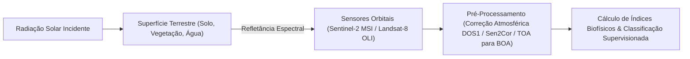

# Geosciences, Remote Sensing, and Spatial Analysis (Lillesand & Longley)

This skill establishes the engineering of geospatial data processing, the physics of electromagnetic radiation applied to remote sensing, relief and watershed modeling, spatial geostatistics, and compliance with legal frameworks for territorial and environmental planning.

---

## 🛰️ 1. Remote Sensing and Satellite Spectral Indices



### 1.1 Spectral Signatures and Normalized Difference Biophysical Indices
- **NDVI (Normalized Difference Vegetation Index)**: Vigor of photosynthetically active biomass:
  $$NDVI = \frac{\rho_{NIR} - \rho_{Red}}{\rho_{NIR} + \rho_{Red}}$$
- **EVI (Enhanced Vegetation Index)**: Optimized for high biomass densities with soil and atmospheric aerosol correction:
  $$EVI = 2.5 \times \frac{\rho_{NIR} - \rho_{Red}}{\rho_{NIR} + 6 \rho_{Red} - 7.5 \rho_{Blue} + 1}$$
- **NDWI (Normalized Difference Water Index - Gao / McFeeters)**:
  $$NDWI_{McFeeters} = \frac{\rho_{Green} - \rho_{NIR}}{\rho_{Green} + \rho_{NIR}}, \quad NDWI_{Gao} = \frac{\rho_{NIR} - \rho_{SWIR}}{\rho_{NIR} + \rho_{SWIR}}$$
- **NBR (Normalized Burn Ratio)**: Mapping of fire scars and burn severity:
  $$NBR = \frac{\rho_{NIR} - \rho_{SWIR2}}{\rho_{NIR} + \rho_{SWIR2}}$$

### 1.2 Digital Land Use and Land Cover (LULC) Classification
- **Machine Learning Supervised**: Training Random Forest and Support Vector Machine (SVM) classifiers on band and spectral index sets in cloud environments (Google Earth Engine).
- **Confusion Matrix and Validation**: Kappa Index ($\hat{K}$) and Overall Accuracy:
  $$\hat{K} = \frac{N \sum_{i=1}^k x_{ii} - \sum_{i=1}^k (x_{i+} x_{+i})}{N^2 - \sum_{i=1}^k (x_{i+} x_{+i})}$$

---

## 🗺️ 2. Digital Cartography, Geodesy, and Spatial Analysis (GIS)

### 2.1 Coordinate Systems and Geodesy
- **Geodetic Model**: Distinction between the Geoid (equipotential surface of the gravity field) and the Ellipsoid of Revolution (mathematical model).
- **Official Geodetic Datum in Brazil**: **SIRGAS2000** (Geocentric Reference System for the Americas, GRS80 Ellipsoid), compatible with **WGS84**.
- **Universal Transverse Mercator (UTM) Projection**: Conformal projection in 60 zones of $6^\circ$ longitude with central scale factor $k_0 = 0.9996$, central meridian with false easting $X_0 = 500,000\text{ m}$ and false northing $Y_0 = 10,000,000\text{ m}$ (southern hemisphere).

### 2.2 Geospatial Analysis with PostGIS and GeoPandas
```sql
-- Exemplo: Consulta espacial com buffer e interseção em PostGIS
SELECT 
    l.id_imovel,
    ST_Area(ST_Intersection(l.geom, a.geom)) / 10000.0 AS area_sobreposta_ha
FROM 
    imoveis_rurais_car l
JOIN 
    areas_preservacao_permanente a 
ON 
    ST_Intersects(l.geom, a.geom)
WHERE 
    l.municipio = 'Ribeirão Preto';
```

---

## 🏔️ 3. Geomorphology, Pedology, and Hydrological Modeling

### 3.1 Digital Terrain Modeling (DTM / DEM)
- **Topographic Wetness Index (TWI)**:
  $$TWI = \ln\left( \frac{\alpha}{\tan\beta} \right)$$
  where $\alpha$ is the specific upslope contributing area per unit contour ($m^2/m$) and $\beta$ is the local slope in radians.
- **Strahler Stream Ordering**: Automatic delineation of drainage networks where two streams of order $u$ converge to form an order $u+1$.

### 3.2 Pedology and Soil Classification in Brazil (SiBCS - Embrapa)
- **Order of Diagnostic Soils**:
  - *Latossolos*: Latosolic B horizon (Bw), advanced weathering, deep, well-drained, and alic/dystrophic.
  - *Argissolos*: Textural B horizon (Bt), strong textural gradient with susceptibility to sheet erosion and gullies.
  - *Neossolos*: Shallow, poorly developed soils over parent rock (A horizon over R or C).

---

## 📋 4. Territorial Management, Environmental Forensics, and Legal Frameworks

| Instrument / Legislation | Legal Framework | Technical Application by the Geographer |
| :--- | :--- | :--- |
| **Brazilian Forest Code** | Federal Law No. 12,651/2012 | Georeferenced delineation of Permanent Preservation Areas (PPAs of watercourses, hilltops, and slopes $> 45^\circ$) and Legal Reserve (LR - $80\%$ Amazon, $35\%$ Cerrado in the Legal Amazon, $20\%$ other regions) via CAR/SICAR. |
| **City Statute** | Federal Law No. 10,257/2001 | Preparation of Participatory Master Plans, Urban Zoning (ZEIS), Progressive Property Tax over Time, and Onerous Grant of the Right to Build. |
| **Geological Hazard Zoning** | CPRM / IPT / Civil Defense Methodology | Mapping of hazard and vulnerability to planar/rotational landslides, debris flows, and gradual/sudden floods. |
| **Environmental Licensing** | CONAMA Resolutions 001/86 and 237/97 | Coordination of Environmental Impact Studies and Environmental Impact Reports (EIA/RIMA) and Degraded Area Recovery Plans (PRAD). |
