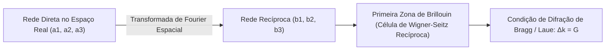

# Solid State Physics, Semiconductors, Nanomaterials, and Microfabrication

This skill establishes the quantum foundations of crystalline condensed matter, semiconductor physics, nanoscale 2D materials, and cleanroom semiconductor lithography/fabrication processes, grounded in **Charles Kittel**, **Donald Neamen**, **Poole & Owens**, and **Marc Madou**.

---

## 💎 1. Crystal Structure, Reciprocal Lattice, and Diffraction

### 1.1 Reciprocal Lattice Vectors and Bragg's Law
$$\mathbf{b}_1 = 2\pi \frac{\mathbf{a}_2 \times \mathbf{a}_3}{\mathbf{a}_1 \cdot (\mathbf{a}_2 \times \mathbf{a}_3)}, \quad \mathbf{b}_2 = 2\pi \frac{\mathbf{a}_3 \times \mathbf{a}_1}{\mathbf{a}_1 \cdot (\mathbf{a}_2 \times \mathbf{a}_3)}, \quad \mathbf{b}_3 = 2\pi \frac{\mathbf{a}_1 \times \mathbf{a}_2}{\mathbf{a}_1 \cdot (\mathbf{a}_2 \times \mathbf{a}_3)}$$
- **Bragg's Law**: $2d_{hkl} \sin\theta = n \lambda$, with interplanar distance $d_{hkl} = \frac{2\pi}{|\mathbf{G}_{hkl}|}$ for the reciprocal vector $\mathbf{G}_{hkl} = h\mathbf{b}_1 + k\mathbf{b}_2 + l\mathbf{b}_3$.

### 1.2 Lattice Vibrations and the Debye Model ($T^3$)
Heat capacity of the crystal lattice at low temperatures ($T \ll \Theta_D$):
$$C_v = \frac{12\pi^4}{5} N k_B \left( \frac{T}{\Theta_D} \right)^3, \quad \text{where } \Theta_D = \frac{\hbar \omega_D}{k_B}$$

---

## ⚡ 2. Band Theory and Semiconductor Physics (Neamen)

### 2.1 Bloch's Theorem and Effective Mass
- **Bloch Wave Functions**: $\psi_{\mathbf{k}}(\mathbf{r}) = e^{i\mathbf{k}\cdot\mathbf{r}} u_{\mathbf{k}}(\mathbf{r})$.
- **Effective Mass Tensor**:
  $$(m^*_{ij})^{-1} = \frac{1}{\hbar^2} \frac{\partial^2 E(\mathbf{k})}{\partial k_i \partial k_j}$$

### 2.2 Carriers in Equilibrium and Transport Equations (Drift-Diffusion)
- **Mass Action Law**: $n \cdot p = n_i^2 = N_c N_v \exp\left(-\frac{E_g}{k_B T}\right)$.
- **Total Conduction Current Density**:
  $$\begin{aligned}
  \mathbf{J}_n &= q n \mu_n \mathbf{E} + q D_n \nabla n \\
  \mathbf{J}_p &= q p \mu_p \mathbf{E} - q D_p \nabla p
  \end{aligned}$$
  Einstein relation for thermal diffusion: $\frac{D_n}{\mu_n} = \frac{D_p}{\mu_p} = \frac{k_B T}{q}$.

---

## 🔬 3. Nanomaterials and Quantum Confinement Effects

### 3.1 Quantum Dots and the Brus Model
Increase of the effective bandgap due to 3D quantum confinement in a spherical nanocrystal of radius $R$:
$$\Delta E_g(R) = \frac{\hbar^2 \pi^2}{2 R^2} \left( \frac{1}{m_e^*} + \frac{1}{m_h^*} \right) - \frac{1.786 e^2}{4\pi \epsilon_r \epsilon_0 R}$$

### 3.2 2D Materials and Carbon Nanotubes
- **Graphene**: Massless conic linear dispersion relation around the Dirac points $K$ and $K'$: $E(\mathbf{k}) = \pm \hbar v_F |\mathbf{k}|$ with Fermi velocity $v_F \approx 10^6\text{ m/s}$.
- **Carbon Nanotubes (CNTs)**: Chiral vector $\mathbf{C}_h = n\mathbf{a}_1 + m\mathbf{a}_2$. The nanotube is metallic if $(n - m) \equiv 0 \pmod 3$, and semiconducting otherwise.

---

## 🏭 4. Cleanroom Microfabrication Processes (Madou)

1. **Advanced Photolithography (DUV $\lambda = 193\text{ nm}$ and EUV $\lambda = 13.5\text{ nm}$)**:
   - Rayleigh Resolution: $CD = k_1 \frac{\lambda}{NA}$.
   - Depth of Focus: $DOF = k_2 \frac{\lambda}{NA^2}$.
2. **Thin Film Deposition**:
   - **CVD (Chemical Vapor Deposition)**: Vapor-phase chemical deposition for oxides and polysilicon.
   - **ALD (Atomic Layer Deposition)**: Self-limiting saturated monolayer growth for High-$k$ dielectrics ($\text{HfO}_2$).
3. **Plasma Etching (Reactive Ion Etching - RIE)**:
   - Anisotropy with ion beams and halogenated gases ($\text{CF}_4, \text{SF}_6, \text{Cl}_2$) for creating STI isolation trenches and FinFET/GAA gates.
4. **Metrology and Characterization**:
   - **XRD**: X-ray Diffraction for crystal lattice parameters.
   - **SEM / TEM**: Scanning and Transmission Electron Microscopy for atomic-scale inspection.
   - **AFM (Atomic Force Microscopy)**: Atomic Force Microscopy for 3D nanometric surface profilometry.
