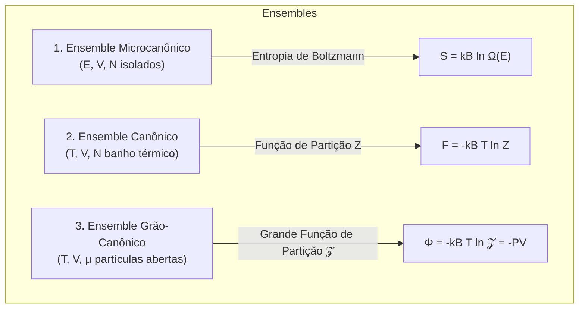

# Thermodynamics and Statistical Mechanics (Pathria & Callen)

This skill establishes the rigorous microscopic and macroscopic bridge between the phenomenological laws of thermodynamics, the statistical mechanics of ensembles, and the degenerate quantum gases of fermions and bosons.

---

## 🔥 1. Laws of Thermodynamics and Thermodynamic Potentials

### 1.1 Fundamental Laws
- **First Law**: $dU = \delta Q - \delta W + \mu dN$.
- **Second Law**: $dS \ge \frac{\delta Q}{T}$ (for reversible processes, $dS = \frac{\delta Q_{rev}}{T}$).
  - Carnot Cycle Efficiency: $\eta = 1 - \frac{T_C}{T_H}$.
- **Third Law (Nernst Theorem)**: $S \to 0$ as $T \to 0\text{ K}$ for pure crystalline systems.

### 1.2 Thermodynamic Potentials and Maxwell Relations
| Potential | Legendre Transform | Fundamental Differential | Associated Maxwell Relation |
| :--- | :--- | :--- | :--- |
| **Internal Energy ($U$)** | $U(S, V, N)$ | $dU = T dS - P dV + \mu dN$ | $\left(\frac{\partial T}{\partial V}\right)_S = -\left(\frac{\partial P}{\partial S}\right)_V$ |
| **Enthalpy ($H$)** | $H = U + PV$ | $dH = T dS + V dP + \mu dN$ | $\left(\frac{\partial T}{\partial P}\right)_S = \left(\frac{\partial V}{\partial S}\right)_P$ |
| **Helmholtz Free Energy ($F$)** | $F = U - TS$ | $dF = -S dT - P dV + \mu dN$ | $\left(\frac{\partial S}{\partial V}\right)_T = \left(\frac{\partial P}{\partial T}\right)_V$ |
| **Gibbs Free Energy ($G$)** | $G = H - TS$ | $dG = -S dT + V dP + \mu dN$ | $\left(\frac{\partial S}{\partial P}\right)_T = -\left(\frac{\partial V}{\partial T}\right)_P$ |

---

## 📊 2. Statistical Mechanics Ensembles (Pathria)

### 2.1 Canonical Ensemble
- **Canonical Partition Function**: $Z = \sum_{i} e^{-\beta E_i}$ where $\beta = \frac{1}{k_B T}$.
- **Average Internal Energy**: $U = \langle E \rangle = -\frac{\partial \ln Z}{\partial \beta} = k_B T^2 \frac{\partial \ln Z}{\partial T}$.
- **Energy Fluctuations and Heat Capacity**: $\sigma_E^2 = \langle E^2 \rangle - \langle E \rangle^2 = k_B T^2 C_v$.

---

## ⚛️ 3. Quantum Statistics and Degenerate Gases

The average occupation number of a single-particle quantum state of energy $\epsilon_i$:

$$\langle n_i \rangle = \frac{1}{e^{\beta(\epsilon_i - \mu)} + a}$$
- $a = 0$: **Classical Maxwell-Boltzmann Statistics** (dilute limit $n \lambda_{th}^3 \ll 1$).
- $a = +1$: **Fermi-Dirac Quantum Statistics** (half-integer spin fermions with the Pauli Exclusion Principle).
- $a = -1$: **Bose-Einstein Quantum Statistics** (integer spin bosons with condensation).

### 3.1 Degenerate Electron Gas (Fermi-Dirac)
- **Fermi Energy ($T = 0\text{ K}$)**:
  $$E_F = \frac{\hbar^2}{2m} (3\pi^2 n)^{2/3}, \quad k_F = (3\pi^2 n)^{1/3}$$
- **Sommerfeld Electronic Heat Capacity**: $C_{v,el} = \frac{\pi^2}{2} N k_B \left( \frac{T}{T_F} \right) = \gamma T$ (linear dependence on temperature).

### 3.2 Bose-Einstein Condensation (BEC) and Black-Body Radiation
- **Critical Condensation Temperature ($T_c$)**: Below $T_c$, a macroscopic fraction of bosons occupies the zero-energy ground state:
  $$T_c = \frac{2\pi \hbar^2}{m k_B} \left( \frac{n}{\zeta(3/2)} \right)^{2/3} \approx 3.31 \frac{\hbar^2 n^{2/3}}{m k_B}$$
- **Planck's Law for Photon Radiation ($\mu = 0$)**:
  $$u(\nu, T) = \frac{8\pi h \nu^3}{c^3} \frac{1}{e^{h\nu/k_B T} - 1}$$
