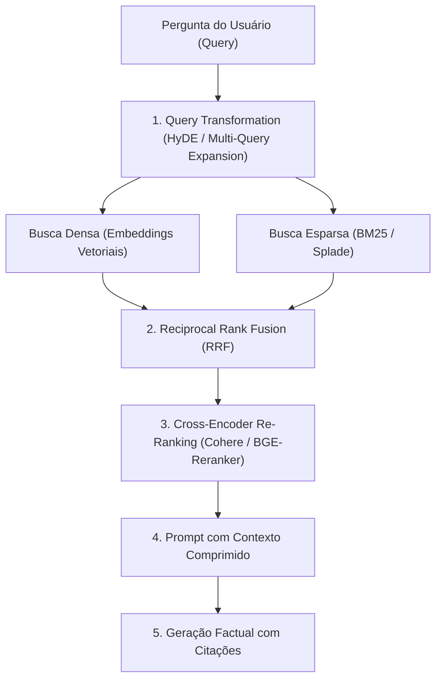

# LLM Application Engineering and Advanced RAG (Alammar)

This skill establishes the software engineering architecture for building robust, low-latency systems based on **Large Language Models (LLMs)**, hybrid **Retrieval-Augmented Generation (RAG)**, parameterized fine-tuning, and agent orchestration.

---

## 🧠 1. Transformer Architecture and Attention Mechanism

### 1.1 Scaled Dot-Product Attention and Multi-Head Attention (MHA)
For query ($\mathbf{Q}$), key ($\mathbf{K}$), and value ($\mathbf{V}$) matrices of dimension $d_k$:

$$\text{Attention}(\mathbf{Q}, \mathbf{K}, \mathbf{V}) = \text{softmax}\left( \frac{\mathbf{Q} \mathbf{K}^T}{\sqrt{d_k}} + \mathbf{M} \right) \mathbf{V}$$
where $\mathbf{M}$ is the causal mask for autoregressive models.

- **Rotary Position Embedding (RoPE)**: Encodes relative position by injecting orthogonal rotation matrices directly into the query and key vectors $\mathbf{q}_m = \mathbf{R}_{\Theta, m}^d \mathbf{W}_q \mathbf{x}_m$.
- **KV-Cache Optimization**: Stores the $\mathbf{K}$ and $\mathbf{V}$ projections of previous tokens in VRAM to reduce autoregressive inference time from $\mathcal{O}(N^2)$ to $\mathcal{O}(N)$.

---

## 🔍 2. Advanced RAG Pipeline and Hybrid Retrieval



### 2.1 Reciprocal Rank Fusion (RRF)
Combines the results of dense vector search ($R_{dense}$) and sparse keyword search ($R_{BM25}$):

$$RRF(d) = \sum_{m \in \{dense, BM25\}} \frac{1}{k + r_m(d)}$$
where $k \approx 60$ is a smoothing constant and $r_m(d)$ is the document's rank position in ranking $m$.

### 2.2 Advanced RAG Strategies
- **HyDE (Hypothetical Document Embeddings)**: First generates a hypothetical answer with the LLM and uses the embedding of that answer to retrieve real documents from the vector database.
- **Parent-Child Chunking**: Splits documents into smaller chunks for precise vector search, but delivers the larger parent paragraph/section as context to the LLM.
- **GraphRAG**: Combines vector databases with structured knowledge graphs to answer questions that require global synthesis over the entire corpus.

---

## ⚡ 3. Efficient Fine-Tuning (PEFT, LoRA, and QLoRA)

To adapt a $d$-dimensional LLM with a frozen weight matrix $\mathbf{W}_0 \in \mathbb{R}^{d \times k}$:

$$\mathbf{W} = \mathbf{W}_0 + \Delta \mathbf{W} = \mathbf{W}_0 + \frac{\alpha}{r} \mathbf{B} \mathbf{A}$$
where $\mathbf{B} \in \mathbb{R}^{d \times r}$ and $\mathbf{A} \in \mathbb{R}^{r \times k}$ with rank $r \ll \min(d, k)$ (e.g., $r \in [8, 64]$) and $\alpha$ is the scaling hyperparameter.

- **QLoRA (Quantized Low-Rank Adaptation)**: Quantizes $\mathbf{W}_0$ into 4-bit NormalFloat (NF4) format with Double Quantization (DQ) and Paged Optimizers, enabling fine-tuning of 70B-parameter models on a single consumer GPU (24GB VRAM).

---

## 🤖 4. Agent Patterns and Orchestration

- **ReAct Pattern (Reasoning + Acting)**:
  ```
  Loop de Execução:
  Thought: Raciocínio sobre o próximo passo necessário.
  Action: Nome da ferramenta externa a invocar (Tool / API / SQL / Python).
  Action Input: Argumentos serializados em JSON.
  Observation: Saída retornada pela execução da ferramenta.
  ... (repete até conclusão)
  Final Answer: Resposta sintetizada com base nas observações.
  ```
- **Direct Preference Optimization (DPO)**:
  Directly optimizes the policy $\pi_\theta$ without needing to train a separate reward model:
  $$\mathcal{L}_{DPO}(\pi_\theta; \pi_{ref}) = -\mathbb{E}_{(x, y_w, y_l)} \left[ \ln \sigma \left( \beta \ln \frac{\pi_\theta(y_w|x)}{\pi_{ref}(y_w|x)} - \beta \ln \frac{\pi_\theta(y_l|x)}{\pi_{ref}(y_l|x)} \right) \right]$$

---

## 📊 5. Automated Evaluation Metrics (RAGAS Framework)

1. **Faithfulness**: Proportion of claims in the LLM answer that can be directly inferred from the provided context (hallucination prevention).
2. **Answer Relevance**: How pertinent the answer is to the user's original question, penalizing incomplete or redundant answers.
3. **Context Precision**: Assesses whether the most relevant retrieved chunks appear in the top positions of the ranking.
4. **Context Recall**: Proportion of sentences in the reference answer (ground truth) that were captured by the retrieved chunks.
