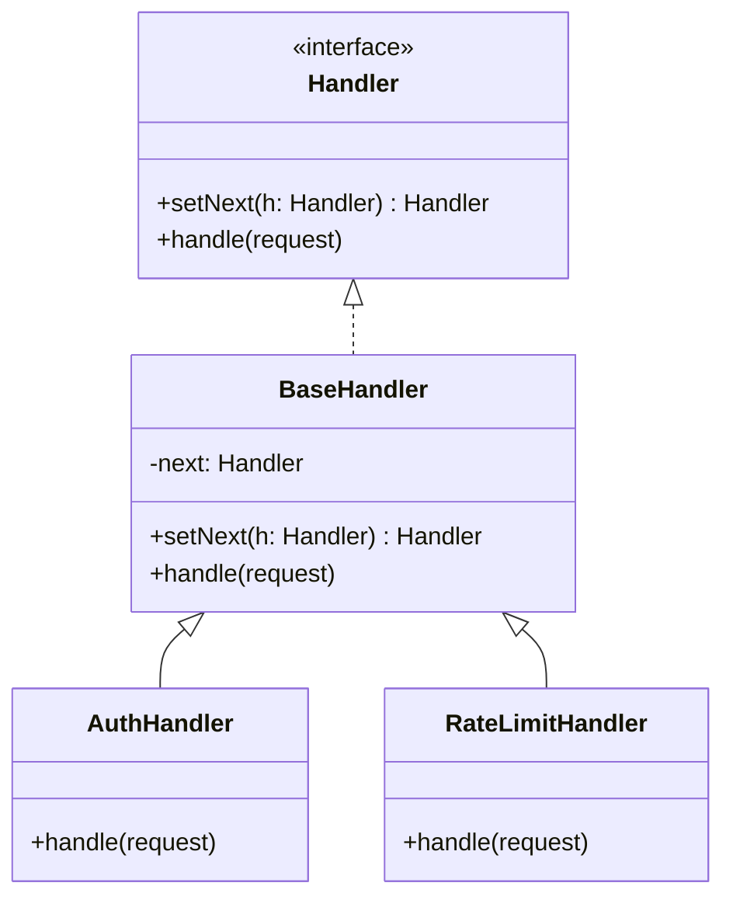
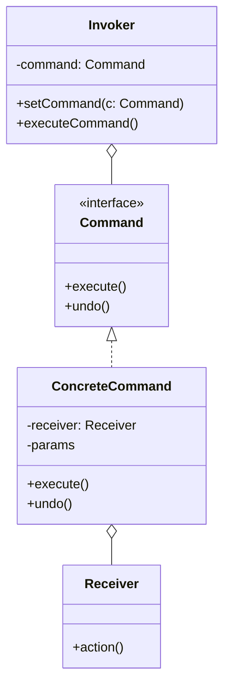
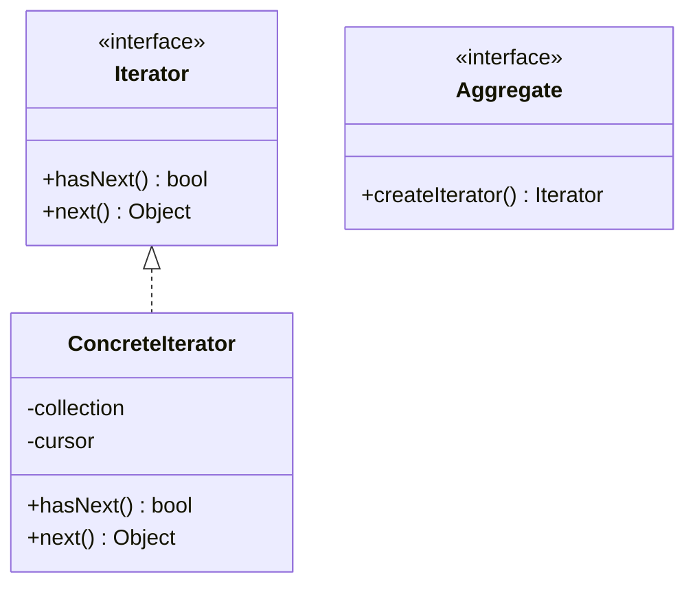
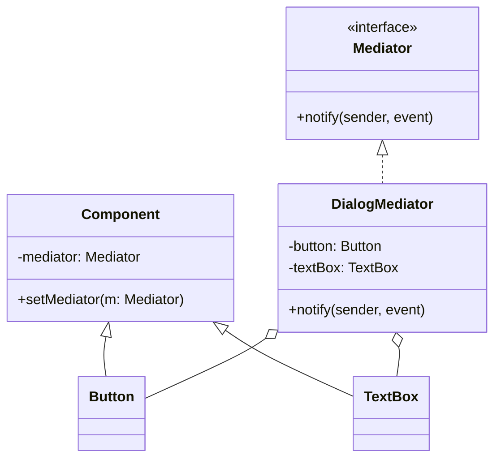
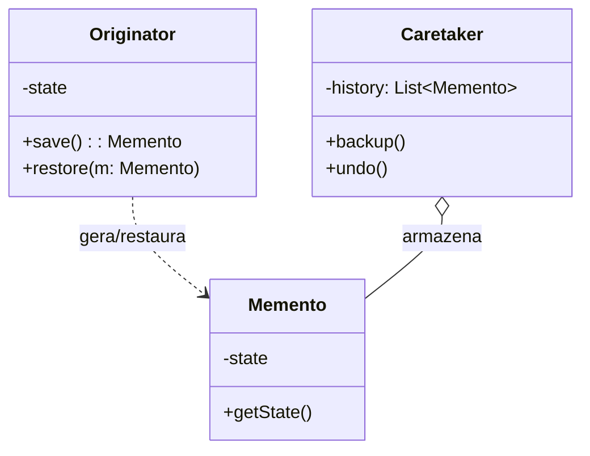
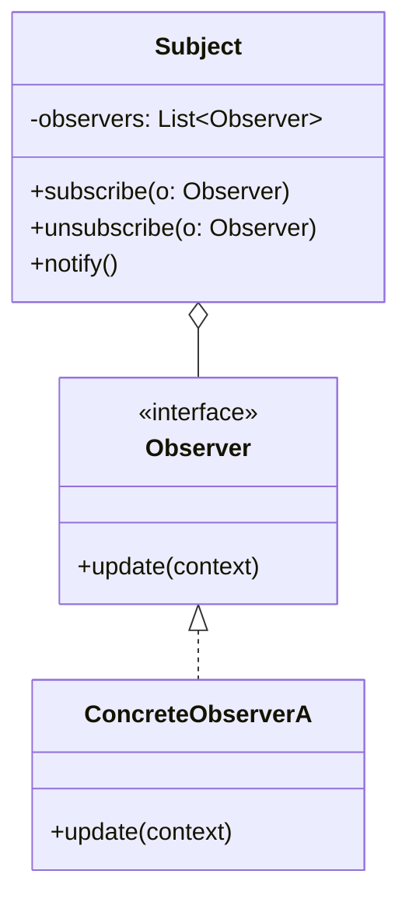
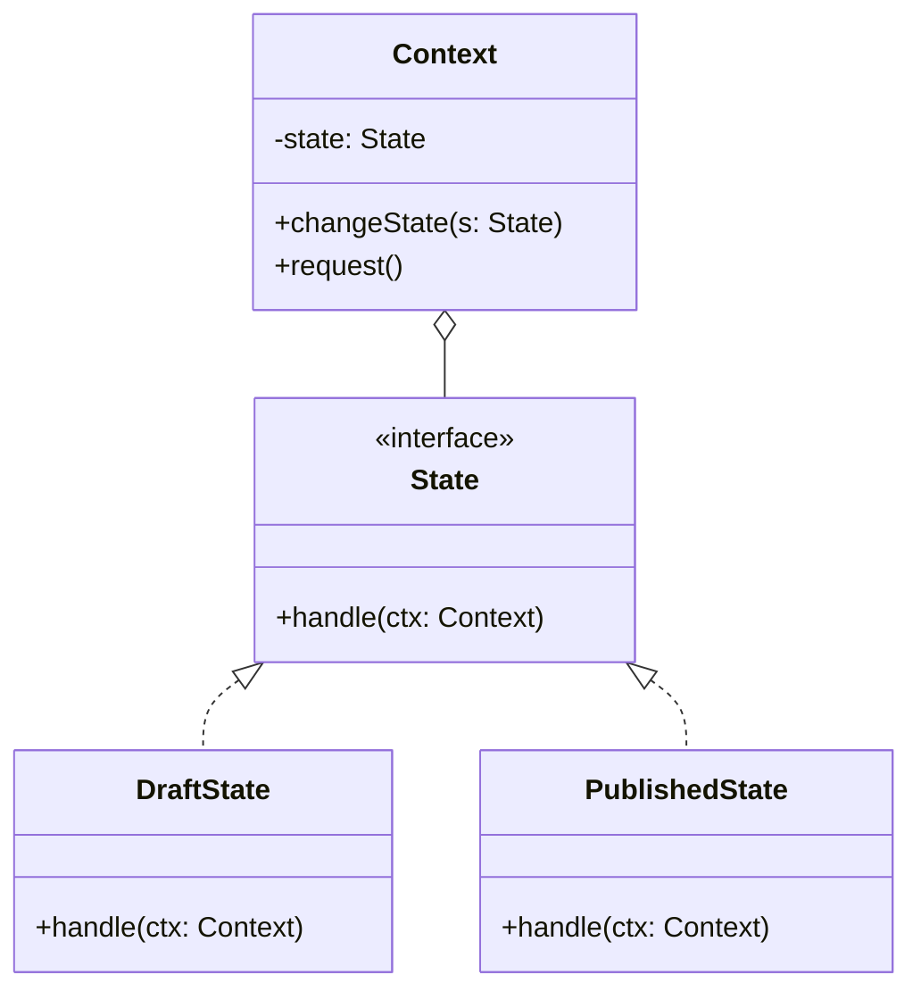
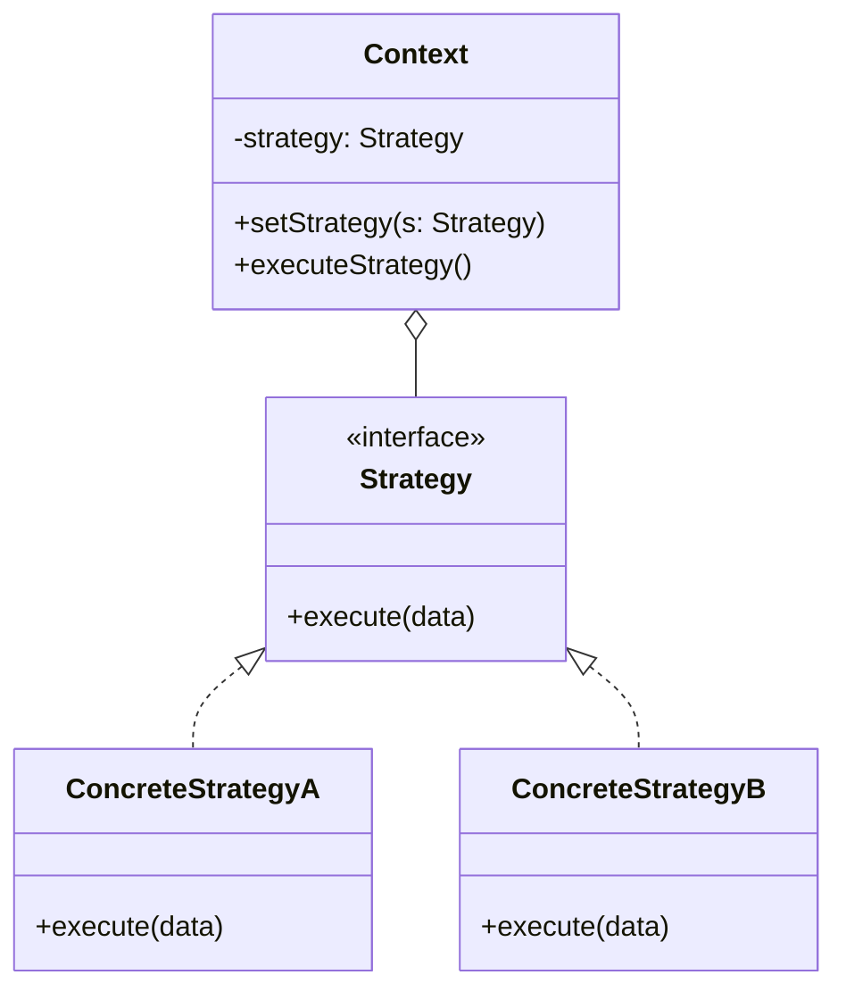
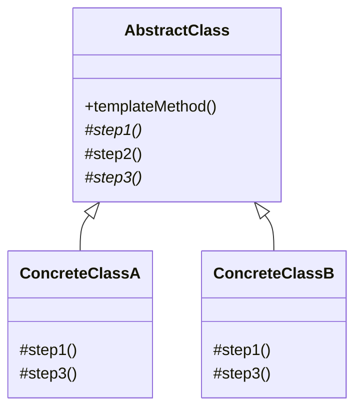
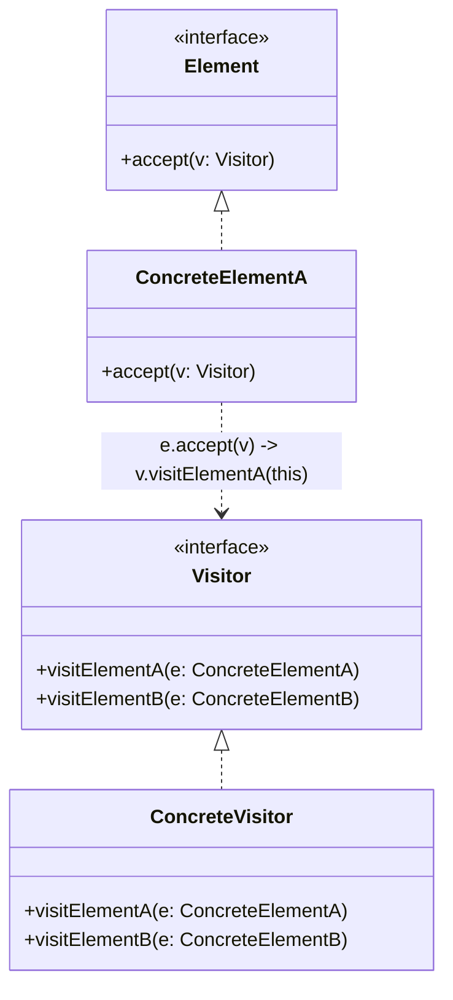

# Behavioral Design Patterns (GoF Behavioral Patterns)

Behavioral patterns deal with algorithms and the assignment of responsibilities between objects. They describe not only patterns of objects or classes but also the patterns of communication between them, decoupling the sender of a request from its receiver.

---

## ⛓️ 1. Chain of Responsibility
Lets requests pass along a chain of handlers. On receiving a request, each handler decides whether to process it or pass it to the next handler in the chain (for example, HTTP middleware pipelines or authentication filters).

---

## 🕹️ 2. Command
Turns a request into a standalone object that carries all information about the request. This transformation lets you parameterize methods with different requests, queue operations, keep a history, and support *Undo/Redo* operations.

---

## 🔁 3. Iterator
Traverses the elements of an aggregate collection (list, tree, graph) without exposing its underlying representation or internal data structure.

---

## 🎛️ 4. Mediator
Reduces chaotic dependencies between communicating objects. The pattern restricts direct communication between objects and forces them to collaborate only through a central mediator object (for example, UI form components or an event broker in microservices).

---

## 💾 5. Memento (Snapshot)
Captures and saves an object's internal state without violating encapsulation, so the object can later be restored to that state.

---

## 📡 6. Observer (Pub-Sub)
Defines a subscription mechanism to notify multiple observer objects about any events or state changes that occur in the subject object they are observing.

---

## 🔄 7. State
Lets an object change its behavior when its internal state changes. The object will appear to change class, replacing giant conditionals (`if/switch`) with polymorphic state classes.

---

## 🎯 8. Strategy
Defines a family of interchangeable algorithms, encapsulates each one in a separate class, and makes the objects interchangeable at runtime (for example, different payment methods, compression strategies, or routing algorithms).

---

## 📐 9. Template Method
Defines the skeleton of an algorithm in a superclass, but lets subclasses override specific steps of the algorithm without changing its overall structure (Inversion of Control / the Hollywood Principle: *"Don't call us, we'll call you"*).

---

## 🚶 10. Visitor
Separates algorithms from the objects they operate on (Double Dispatch), allowing new operations to be added to complex object structures (such as AST syntax trees) without modifying those objects' classes.

---

## 🅨 11. C++ Behavioral Idioms (Pikus)

- **Policy-Based Design** — Strategy reborn as a *type*: policies are classes with template members, static functions or constant-value classes, composed by **composition (preferred)** or private inheritance (empty-base optimization). Policies may be rebindable (`using value_type = T;`) and constrained with concepts to *disable* (never add) interface members. Drawbacks: long positional policy lists and code bloat.
- **NVI (Non-Virtual Interface) as Template Method**: a public non-virtual method calls a private virtual. Pitfalls are the fragile base class and composability limits; **never apply NVI to destructors**.
- **Visitors in modern C++**: keep the double-dispatch skeleton (`virtual void accept(PetVisitor&)` + `virtual void visit(Cat*)`) and extend it with **Acyclic Visitor** (break the visitor/visitable cycle via cross-casting), generic/lambda visitors, compile-time visitors, and recursive visits that map onto serialization.
- **ScopeGuard**: `MakeGuard` plus a `commit()` relies on lifetime extension of a temporary bound to a `const` reference (hence `commit()` is `const` and `commit_` is `mutable`); variants are generic, exception-driven, and type-erased.
- **Concurrency patterns**: "no sharing is best"; waiting via `condition_variable::wait` and `std::atomic_flag::wait`; a lock-free **publishing protocol** with `memory_order_acquire`/`release`; the **Active Object** (a `std::thread` is itself a type-erased active object wrapping a `Job`/`std::function<void()>`), plus **Reactor**, **Proactor** and **Monitor**.
- **Iterator** is the standard library's home turf — prefer ranges and adaptors (`views::filter`/`transform`) over hand-written iterators; **Observer** maps onto callback/`std::function` registries, mindful of lifetime and reentrancy.

## ⚖️ Comparative Matrix of Behavioral Patterns

| Pattern | Primary Focus | Mechanism |
| :--- | :--- | :--- |
| **Chain of Responsibility** | Sequential request processing | Recursive pointer passing to the next handler |
| **Command** | Encapsulation of a request as an object | Object with `execute()` and `undo()` methods |
| **Iterator** | Sequential traversal of collections | Cursor object with `hasNext()` and `next()` |
| **Mediator** | Centralization of many-to-many communication | Mediator hub decoupling communicating nodes |
| **Memento** | Restoration of state snapshots | Opaque state object for the Caretaker |
| **Observer** | One-to-N event notification | Subscriber list with an `update()` method |
| **State** | Behavior variation by machine state | Delegation to the active state object |
| **Strategy** | Interchangeable alternative algorithms | Strategy-interface composition |
| **Template Method** | Invariant algorithm skeleton | Inheritance with abstract methods/hooks |
| **Visitor** | New operations over composite structures | Double dispatch `accept(visitor)` |
