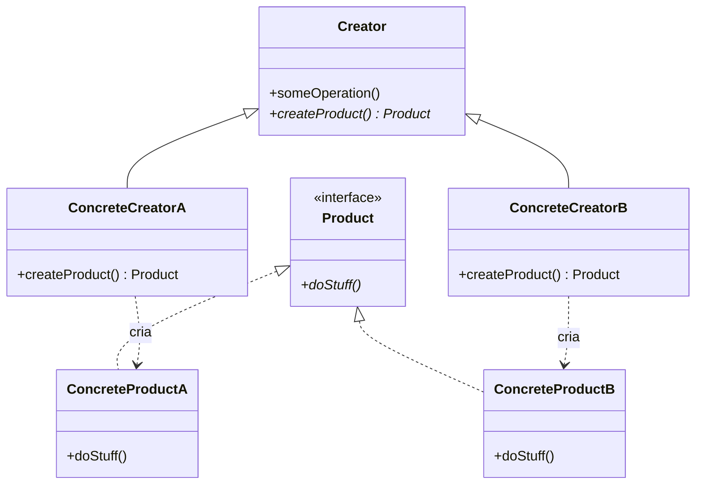
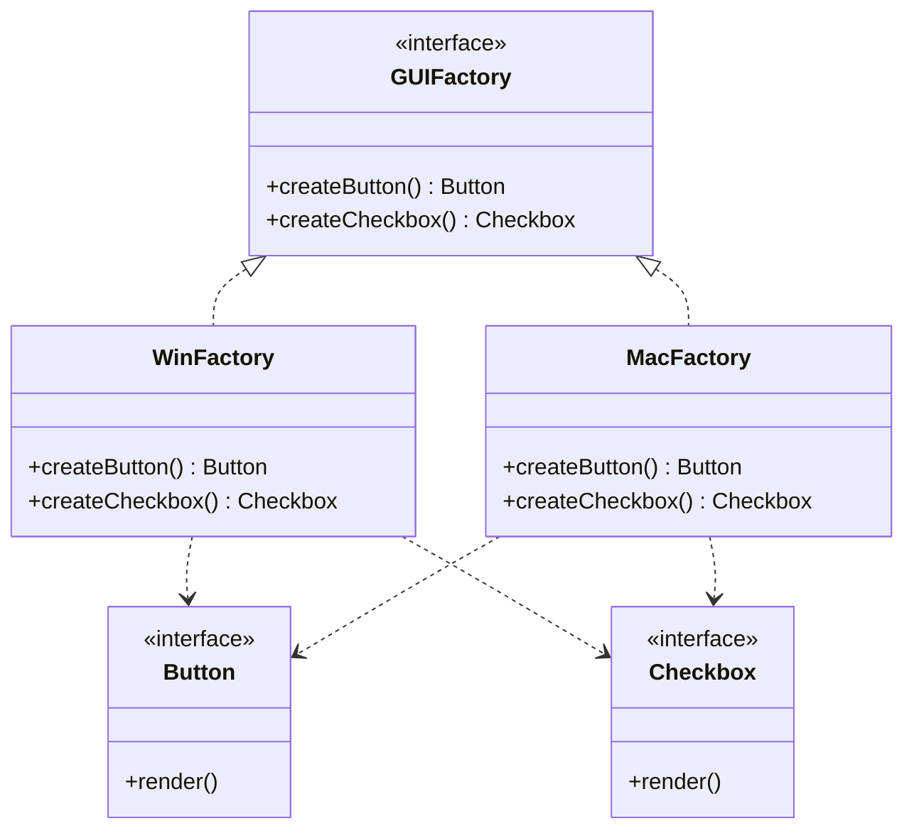
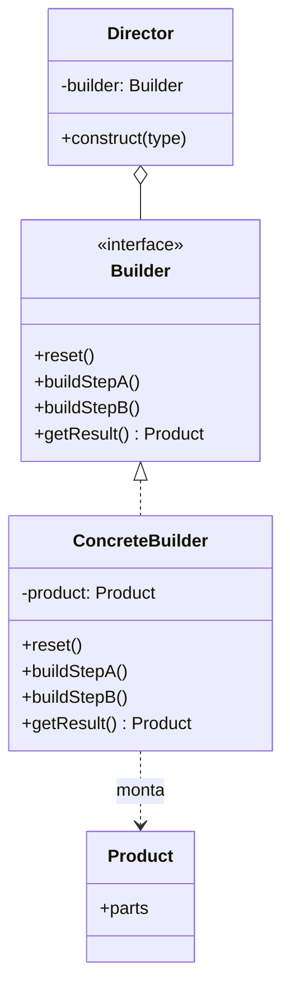
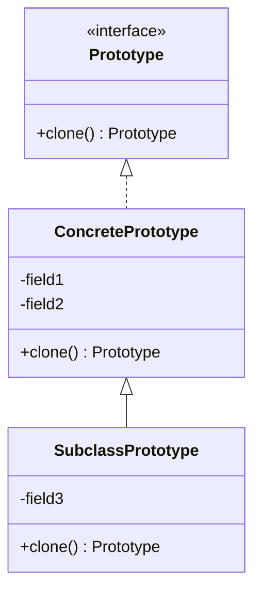
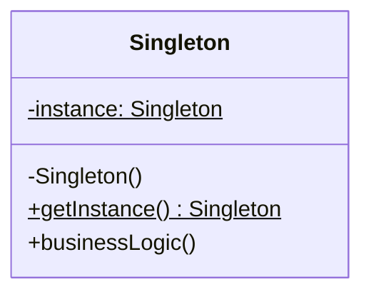

# Creational Design Patterns (GoF Creational Patterns)

Creational patterns abstract the instantiation process, making a system independent of how its objects are created, composed, and represented. They encapsulate knowledge about which concrete classes are used and hide how instances are created and combined.

---

## 🏭 1. Factory Method

### 1.1 Intent and Motivation
Defines an interface for creating an object, but lets subclasses decide which class to instantiate. Factory Method lets you defer instantiation to subclasses.



### 1.2 Applicability
- When a class cannot anticipate the class of objects it must create.
- When a class wants its subclasses to specify the objects they create.
- When classes delegate responsibility to one of several helper subclasses.

---

## 🏢 2. Abstract Factory

### 2.1 Intent and Motivation
Provides an interface for creating families of related or dependent objects without specifying their concrete classes (for example, UI themes for Mac, Windows, and Linux).



### 2.2 Applicability
- A system must be independent of how its products are created, composed, and represented.
- A system must be configured with one of multiple product families.
- A family of related objects was designed to be used together and you must enforce that constraint.

---

## 🔨 3. Builder

### 3.1 Intent and Motivation
Separates the construction of a complex object from its representation, so the same construction process can create different representations step by step.



### 3.2 Applicability
- To escape a "telescoping constructor" with many optional parameters.
- When the algorithm for creating a complex object must be independent of the parts that make up the object and of how they are assembled.

---

## 🧬 4. Prototype

### 4.1 Intent and Motivation
Copies existing objects without making your code depend on their concrete classes, delegating the cloning process to the objects themselves.



### 4.2 Applicability
- When the classes to instantiate are specified at runtime.
- To avoid building a factory hierarchy parallel to the product hierarchy.
- When instances of a class can have only one of a few different state combinations.

---

## 🔒 5. Singleton

### 5.1 Intent and Motivation
Ensures a class has only a single instance throughout the application's lifecycle and provides a global access point to it.



### 5.2 Thread-Safe Implementation (Double-Checked Locking)
```python
import threading

class DatabaseConnection:
    _instance = None
    _lock = threading.Lock()

    def __new__(cls, *args, **kwargs):
        if not cls._instance:
            with cls._lock:
                if not cls._instance:
                    cls._instance = super().__new__(cls)
        return cls._instance
```

---

## ⚖️ Comparative Matrix of Creational Patterns

| Pattern | Complexity | Central Purpose | When to Choose |
| :--- | :---: | :--- | :--- |
| **Factory Method** | Low | Delegates instantiation to subclasses | Polymorphic creation of a single product |
| **Abstract Factory** | Medium-High | Creates complete families of compatible products | UI suites, cross-platform drivers |
| **Builder** | Medium | Builds objects step by step | Complex objects with many steps/settings |
| **Prototype** | Low-Medium | Clones existing objects with a deep copy | High instantiation cost or dynamic states |
| **Singleton** | Low | Single access point to a shared resource | Thread pools, caches, connection managers |
