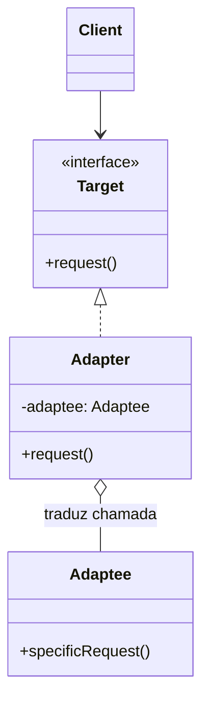
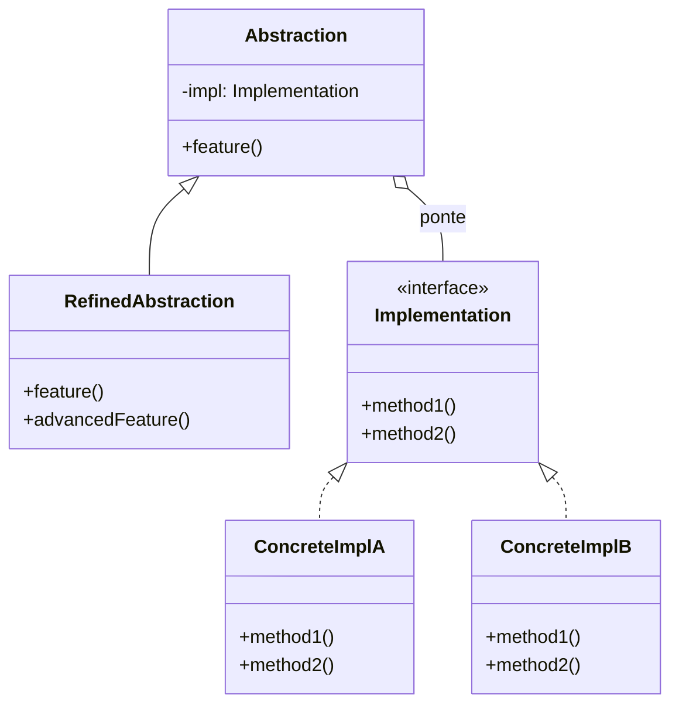
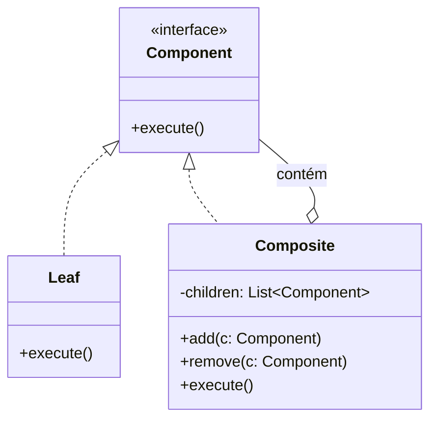
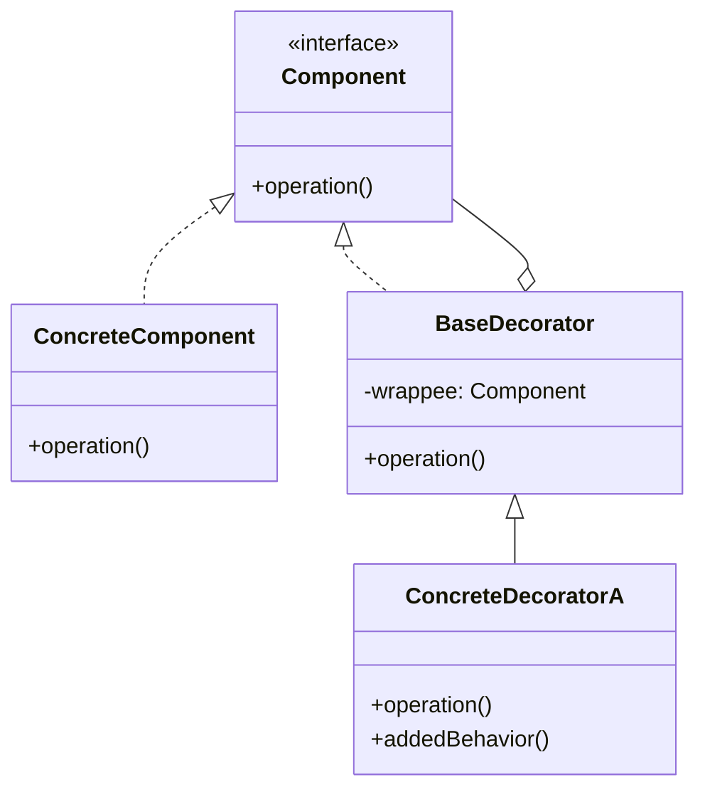
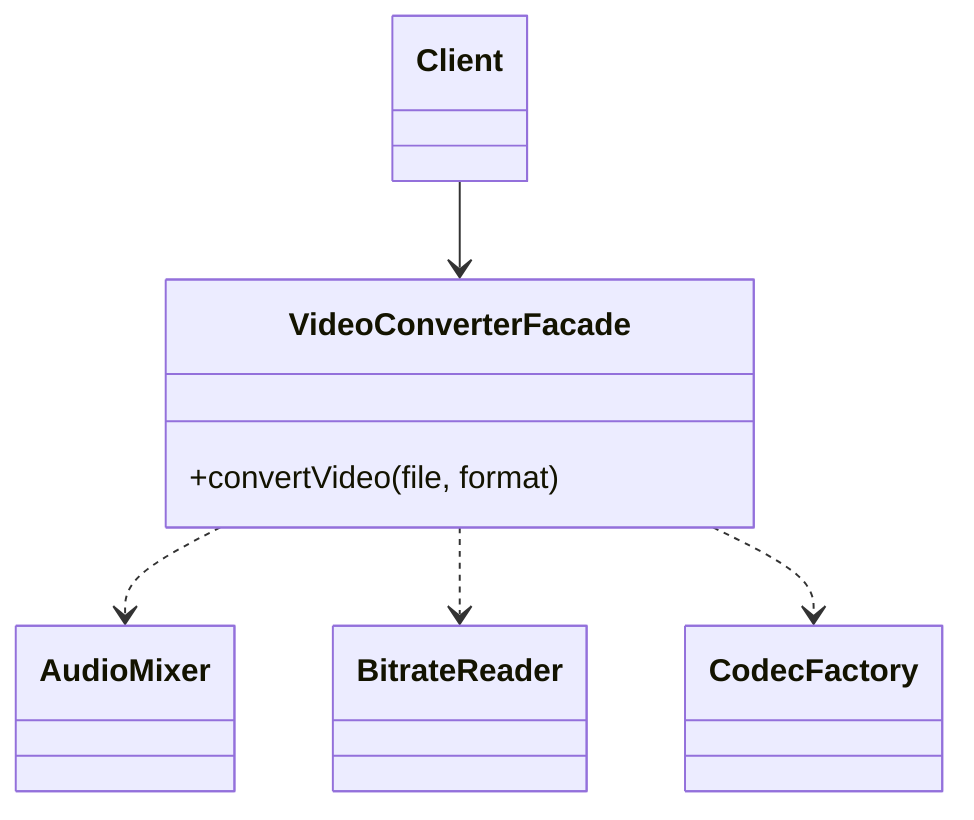
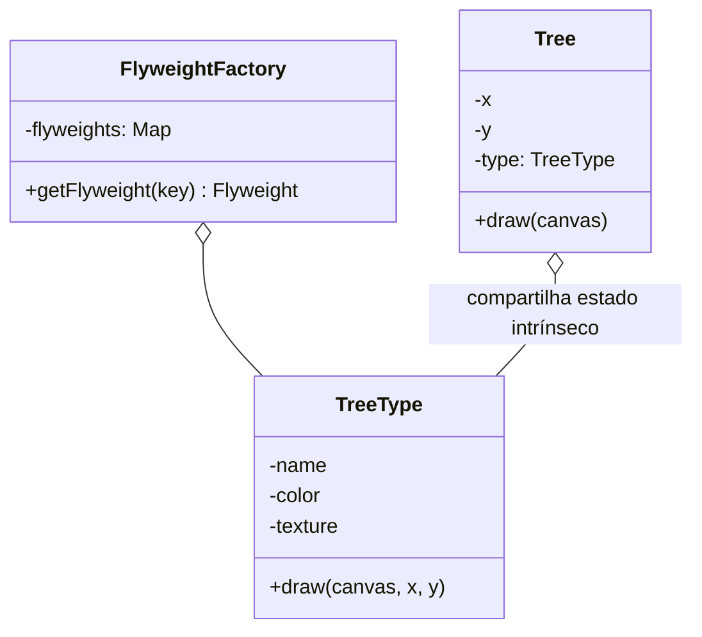
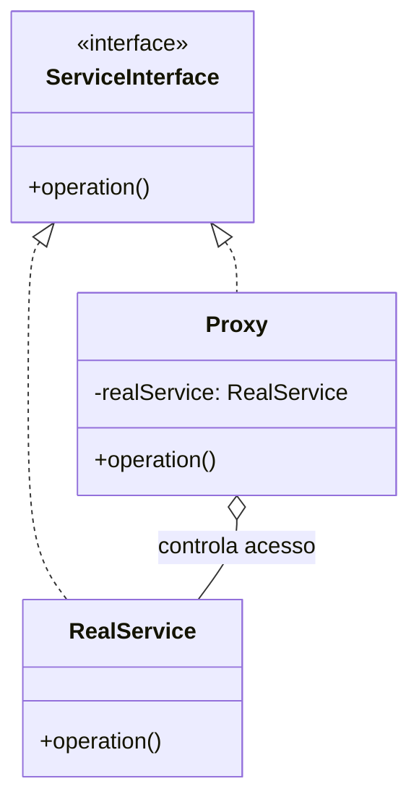

# Structural Design Patterns (GoF Structural Patterns)

Structural patterns explain how to compose classes and objects into larger structures while keeping those structures flexible and efficient. Object composition offers far more runtime flexibility than static class inheritance.

---

## 🔌 1. Adapter

### 1.1 Intent and Motivation
Converts a class's interface into another interface that clients expect. It lets classes with incompatible interfaces work together.

---

## 🌉 2. Bridge

### 2.1 Intent and Motivation
Decouples an abstraction from its implementation, allowing both to vary independently through separate hierarchies linked by composition.

---

## 🌳 3. Composite

### 3.1 Intent and Motivation
Composes objects into tree structures to represent part-whole hierarchies. It lets clients treat individual objects and compositions of objects uniformly.

---

## 🎀 4. Decorator (Wrapper)

### 4.1 Intent and Motivation
Attaches additional responsibilities to an object dynamically. Decorators provide a flexible alternative to subclassing for extending functionality.

---

## 🏛️ 5. Facade

### 5.1 Intent and Motivation
Provides a simplified, high-level interface to a complex subsystem made up of multiple classes, making the subsystem easier to use and decoupling clients from internal details.

---

## 🪶 6. Flyweight

### 6.1 Intent and Motivation
Fits a huge number of objects into RAM by sharing common state (intrinsic state) across multiple objects instead of keeping all the data in every instance (extrinsic state).

---

## 🛡️ 7. Proxy

### 7.1 Intent and Motivation
Provides a substitute or placeholder for another object to control access to it. Common types: Remote Proxy, Virtual Proxy (Lazy Loading), Protection Proxy (Access Control), and Cache/Log Proxy.

---

## ⚖️ Comparative Matrix of Structural Patterns

| Pattern | Problem Solved | Structural Strategy |
| :--- | :--- | :--- |
| **Adapter** | Incompatible interfaces between legacy/third-party systems | Wraps an existing object, translating calls |
| **Bridge** | Combinatorial subclass explosion in 2 orthogonal dimensions | Separates Abstraction and Implementation via a reference |
| **Composite** | Recursive handling of hierarchical (tree) structures | Treats leaves and composite nodes with the same interface |
| **Decorator** | Dynamic addition of responsibilities without inheritance | Wraps the real object, delegating and adding behavior |
| **Facade** | Complexity of subsystem initialization/orchestration | Simplified entry point for multiple components |
| **Flyweight** | High memory use with millions of similar objects | Separates intrinsic (shared) from extrinsic state |
| **Proxy** | Direct access to a heavy, remote, or protected object | Intercepts requests, applying lazy load, auth, or cache |
