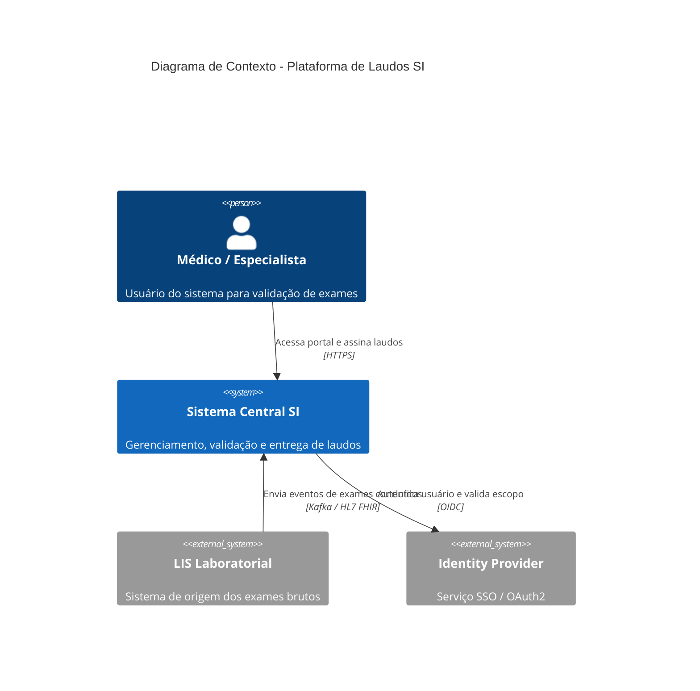
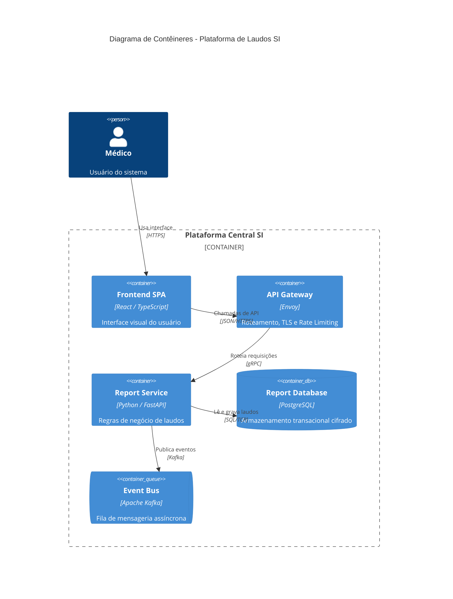

# C4 Model Standards for Documentation

Definitions of the C4 Model's four levels of abstraction and how to express them in Mermaid.

## Level 1: System Context Diagram

## Level 2: Container Diagram

