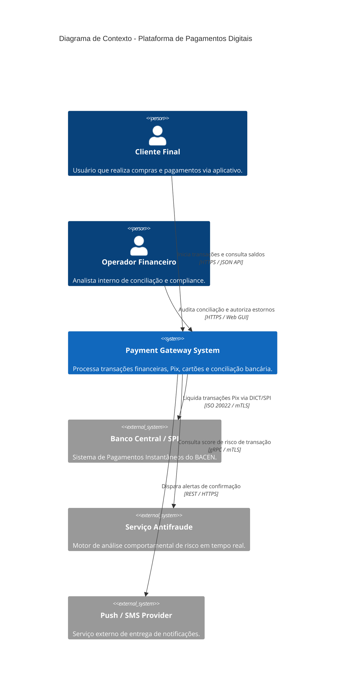
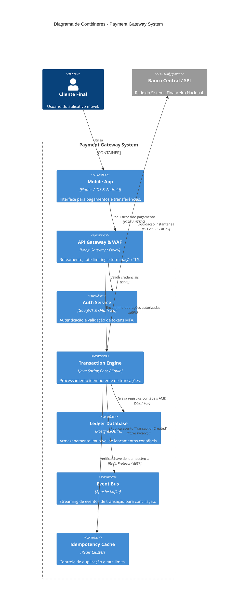

# C4 Model for Software Architecture Visualization

This skill establishes the formal standards for modeling, hierarchical abstraction, and visual representation of software architectures based on Simon Brown's **C4 Model** (*The C4 model for visualising software architecture*).

---

## 📌 The 4 Abstraction Levels of the C4 Model

The C4 Model organizes software-system visualization into four hierarchical levels of progressive zoom:

```
┌─────────────────────────────────────────────────────────────┐
│  Nível 1: Diagrama de Contexto de Sistema (System Context)  │
│  (Pessoas e Sistemas de Software ao redor do ecossistema)   │
└──────────────────────────────┬──────────────────────────────┘
                               │ Zoom In
┌──────────────────────────────▼──────────────────────────────┐
│  Nível 2: Diagrama de Contêineres (Containers)              │
│  (Aplicações, Bancos de Dados, Microserviços, Gateways)     │
└──────────────────────────────┬──────────────────────────────┘
                               │ Zoom In
┌──────────────────────────────▼──────────────────────────────┐
│  Nível 3: Diagrama de Componentes (Components)              │
│  (Controladores, Serviços, Repositórios, Módulos internos)  │
└──────────────────────────────┬──────────────────────────────┘
                               │ Zoom In (Opcional)
┌──────────────────────────────▼──────────────────────────────┐
│  Nível 4: Diagrama de Código (Code / Classes)               │
│  (Diagramas de Classes UML, AST, Padrões de Projeto GoF)    │
└─────────────────────────────────────────────────────────────┘
```

---

## 📐 Detailed Guidelines per Level

### 1. Level 1: System Context
- **Goal**: Provide a 30,000-foot view of the software system's scope.
- **Audience**: Business stakeholders, product managers, new developers, and the architecture team.
- **Represented Elements**:
  - **People (Users/Personas)**: Human actors who interact directly with the system.
  - **Software System (Focus)**: The system being designed or documented.
  - **External Software Systems**: Payment providers, corporate authentication (SSO), SaaS services, government APIs.
  - **Relationships**: Directional, with a clear description of purpose and high-level protocol (for example, `Envia requisições de pagamento via HTTPS/JSON`).

### 2. Level 2: Containers (Runtime Containers)
- **Container Definition**: Any separately executable or deployable unit that stores data or runs code (for example, a React SPA, a Spring/Node backend API, a Go worker, a PostgreSQL database, a RabbitMQ/Kafka queue, or an S3 bucket).
- **Goal**: Show the high-level shape of the software architecture and how responsibilities are distributed.
  - Frontend applications (web, mobile).
  - API gateways and reverse proxies.
  - Microservices and modular monoliths.
  - Databases (SQL, NoSQL, in-memory cache).
  - Explicit technologies and protocols (for example, `Go, REST/gRPC`, `PostgreSQL 16, TCP 5432`).

### 3. Level 3: Components (Internal Components)
- **Component Definition**: A grouping of related code encapsulated behind a clean interface (for example, Controller, Service Layer, Repository, Event Producer).
- **Goal**: Decompose a single container to detail how its internal components collaborate.
- **Guideline**: Draw component diagrams only for critical or complex containers that justify the detail.

### 4. Level 4: Code (Code / Classes)
- **Goal**: Show implementation detail at the code level (UML class diagrams, interfaces, inheritance).
- **Guideline**: In most projects, this level is generated dynamically by reverse-engineering and AST tooling via [`skills/mapping/code-architecture-mapping/SKILL.md`](../../../mapping/code-architecture-mapping/SKILL.md) or [`skills/mapping/uml-diagram-generation/SKILL.md`](../../../mapping/uml-diagram-generation/SKILL.md).

---

## 🛠️ Syntax Patterns: Mermaid.js & C4-PlantUML

### Example: Context Diagram (Level 1) in Mermaid.js C4


### Example: Container Diagram (Level 2) in Mermaid.js C4


---

## 📋 Quality Checklist for C4 Diagrams

1. **Clearly Identified Elements**:
   - Every element has a `Name`, `Type/Role`, `Primary Technology` (for Levels 2 and 3), and a `Clear Statement of Purpose`.
2. **Explicit Relationships**:
   - Every connection line must carry a present-tense verb (for example, `Consulta`, `Grava`, `Publica evento`) and the transport protocol (`HTTPS`, `gRPC`, `AMQP`, `SQL/TCP`).
3. **System Focus and Boundaries**:
   - Use boundary delimiters (`System_Boundary`, `Container_Boundary`) to separate clearly what belongs to the system scope from what is external.
4. **Alignment with Documentation**:
   - Integrate C4 diagrams into Software Architecture Documents (SADs) and Architectural Decision Records (ADRs).
