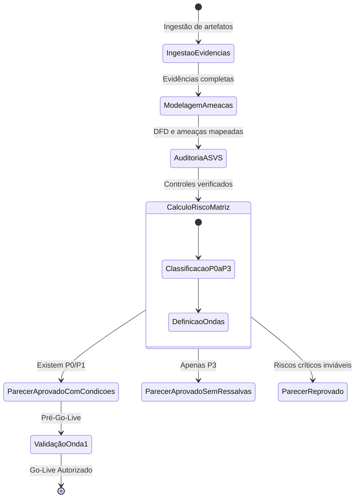

# Exemplos de Diagramas Práticos em Mermaid

## 1. Diagrama de Estados do Ciclo de Vida de um Parecer Técnico

```mermaid
stateDiagram-v2
    [*] --> IngestaoEvidencias: Ingestão de artefatos
    IngestaoEvidencias --> ModelagemAmeacas: Evidências completas
    ModelagemAmeacas --> AuditoriaASVS: DFD e ameaças mapeadas
    AuditoriaASVS --> CalculoRiscoMatriz: Controles verificados
    
    state CalculoRiscoMatriz {
        [*] --> ClassificacaoP0aP3
        ClassificacaoP0aP3 --> DefinicaoOndas
    }

    CalculoRiscoMatriz --> ParecerAprovadoComCondicoes: Existem P0/P1
    CalculoRiscoMatriz --> ParecerAprovadoSemRessalvas: Apenas P3
    CalculoRiscoMatriz --> ParecerReprovado: Riscos críticos inviáveis
    
    ParecerAprovadoComCondicoes --> ValidaçãoOnda1: Pré-Go-Live
    ValidaçãoOnda1 --> [*]: Go-Live Autorizado
```
