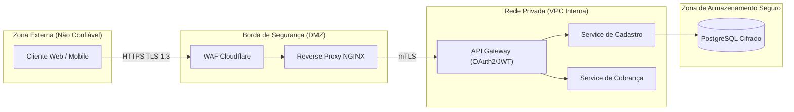
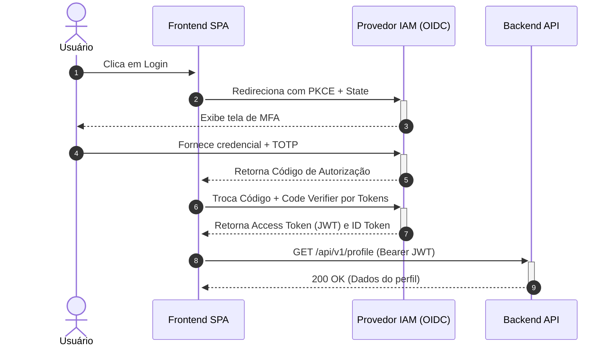

# Complete Mermaid.js Syntax Guide for Architecture and Documentation

Detailed syntax for every diagram type used in software and security documentation.

## 1. Flowchart with Trust Boundaries

## 2. Secure Authentication Sequence Diagram

