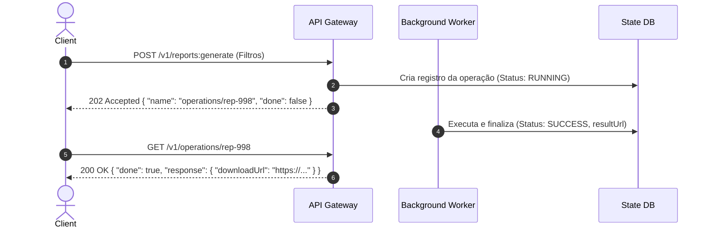

# RESTful API Design, HTTP Protocol, and Contract Patterns

This skill provides the canonical guidelines for **HTTP Protocol (HTTP/1.1, HTTP/2, HTTP/3 over QUIC)** architecture, **RESTful API** modeling under **OpenAPI 3.2**, and the application of **API Design Patterns** (based on JJ Geewax and *Continuous API Management*).

> **OpenAPI 3.2**: Since version **3.2.0** (and 3.2.1), OpenAPI supports the
> **`QUERY`** method natively through the fixed **`query`** field (Operation Object)
> of the Path Item Object, as defined by [RFC 10008](https://www.rfc-editor.org/rfc/rfc10008),
> in addition to the standard **`additionalOperations`** field for arbitrary methods (e.g., `LINK`).
> OAS 3.1 did **not** have this field — it was added in 3.2. Therefore, contracts
> that describe the `QUERY` verb must declare `openapi: 3.2.0` (or higher). Generation
> and validation tools must support 3.2 for full fidelity to `QUERY`.

---

## 🌐 1. Semantics of HTTP Verbs and Methods (RFC 9110 & RFC 10008)

| Method | Request Body | Response Body | Safe? | Idempotent? | Cacheable? | IETF Standard |
| :--- | :---: | :---: | :---: | :---: | :---: | :--- |
| **GET** | No | Yes | Yes | Yes | Yes | RFC 9110 |
| **QUERY** | **Yes** | **Yes** | **Yes** | **Yes** | **Yes** | **RFC 10008** |
| **POST** | Yes | Yes | No | No | Conditional | RFC 9110 |
| **PUT** | Yes | Yes | No | Yes | No | RFC 9110 |
| **PATCH** | Yes | Yes | No | No | Conditional | RFC 5789 / 9110 |
| **DELETE** | Optional | Yes | No | Yes | No | RFC 9110 |
| **HEAD** | No | No | Yes | Yes | Yes | RFC 9110 |
| **OPTIONS** | Optional | Yes | Yes | Yes | No | RFC 9110 |

> **The `QUERY` Method (RFC 10008)**: Enables safe/idempotent queries and searches with a complex JSON payload without violating `GET` semantics and without `POST` side effects. The cache key must include the URI plus a hash of the request body.
>
> **`QUERY` in OpenAPI 3.2**: In OAS **3.2.0+**, declare the operation in the fixed
> `query` field of the Path Item Object:
> ```yaml
> openapi: 3.2.0
> paths:
>   /v1/history:
>     query:
>       summary: Busca complexa de gastos
>       requestBody:
>         content:
>           application/json:
>             schema: { $ref: '#/components/schemas/HistoryQuery' }
>       responses:
>         '200':
>           description: Resultados
> ```
> For arbitrary methods not covered by the fixed fields, use `additionalOperations`
> (key = uppercase HTTP method, e.g., `LINK`). Older tools/generators
> (OAS 3.1) fall back to standard verbs; document QUERY in prose when the
> generator does not support 3.2.

---

## 🎯 2. Hierarchical Modeling and Custom Methods

### 2.1 URI Structure
- **Collection**: `/v1/orders`
- **Resource**: `/v1/orders/{orderId}`
- **Sub-Resource**: `/v1/orders/{orderId}/items/{itemId}`
- **Custom Actions**: Use the `:` suffix for non-CRUD actions:
  - `POST /v1/orders/{orderId}:cancel`
  - `POST /v1/documents/{documentId}:publish`
  - `POST /v1/payments:batchCharge`

---

## 🔁 3. Advanced Operation Patterns

### 3.1 Long-Running Operations (LRO)
For asynchronous processes (> 500 ms):


### 3.2 Idempotency in Mutations (`Idempotency-Key`)
- The client sends the `Idempotency-Key: <UUIDv4>` header.
- The server stores the key in Redis/DB with a TTL (e.g., 24 h). If it repeats, the server returns the original cached response without reprocessing.

---

## 🛠️ 4. Standardized Error Handling (RFC 7807 - Problem Details)

Use `Content-Type: application/problem+json`:
```json
{
  "type": "https://api.dominio.com/errors/insufficient-funds",
  "title": "Saldo insuficiente para transferência",
  "status": 422,
  "detail": "A conta 1029 possui R$ 50,00 disponíveis, mas a operação exigiu R$ 120,00.",
  "instance": "/v1/accounts/1029/transfers/tx-4432",
  "invalid_params": [
    {
      "name": "amount",
      "reason": "O montante excede o limite disponível"
    }
  ]
}
```

---

## 🔍 5. Deterministic Cursor Pagination and Rate Limiting

### 5.1 Cursor Pagination
```http
GET /v1/events?limit=50&starting_after=evt_98374 HTTP/1.1
```
```json
{
  "data": [...],
  "has_more": true,
  "next_cursor": "evt_98424"
}
```

### 5.2 Rate Limiting Headers (IETF Draft)
- `RateLimit-Limit: 1000, 1000;window=60`
- `RateLimit-Remaining: 980`
- `RateLimit-Reset: 15`
- Response for quota overflow: `429 Too Many Requests` with the `Retry-After: 15` header.

---

## 🛡️ 6. HTTP Caching and Security Headers

- **Conditional Validation**: `ETag: "hash321"`, `If-None-Match: "hash321"` $\rightarrow$ `304 Not Modified`.
- **Cache-Control**: `public, max-age=3600, stale-while-revalidate=60`.
- **Mandatory Security Headers**:
  - `Strict-Transport-Security: max-age=63072000; includeSubDomains; preload`
  - `Content-Security-Policy: default-src 'self'`
  - `X-Content-Type-Options: nosniff`
  - `X-Frame-Options: DENY`
