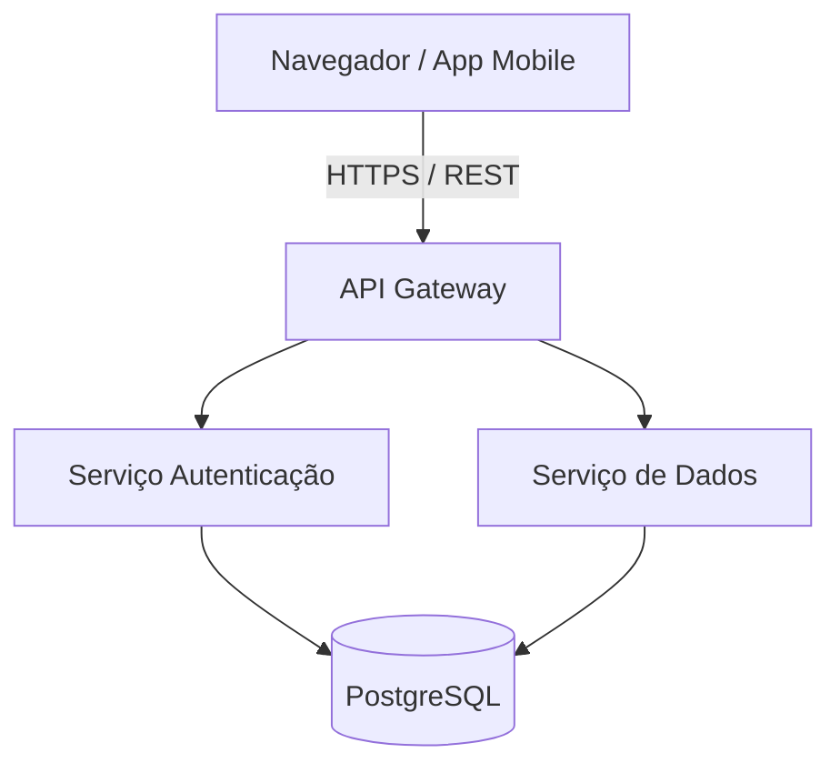

# Project Name

[](#)
[](#)
[](#)

A concise, clear, and objective description of what the project does, which problem it solves, and which main technologies it uses.

> [!NOTE]
> This project uses Node.js >= 18.0.0 and PostgreSQL 15.

---

## 🚀 Main Features

- **Feature A**: Brief description of feature A.
- **Feature B**: Brief description of feature B.
- **Real-Time Integration**: Bidirectional communication via WebSockets.

---

## 🛠️ Technologies Used

| Category | Technology | Version | Use |
| :--- | :--- | :---: | :--- |
| Language | TypeScript | ^5.0 | Static typing |
| Runtime | Node.js | >= 18 | Backend server |
| Database | PostgreSQL | 15 | Data persistence |

---

## 📦 Installation and Execution

### Prerequisites
- Node.js version 18 or higher.
- Docker and Docker Compose (optional for a local database).

### Step by Step

1. **Clone the repository**:
   ```bash
   git clone https://github.com/usuario/nome-do-projeto.git
   cd nome-do-projeto
   ```

2. **Install the dependencies**:
   ```bash
   npm install
   ```

3. **Configure the environment variables**:
   ```bash
   cp .env.example .env
   ```

4. **Run the application**:
   ```bash
   npm run dev
   ```

---

## 🏗️ System Architecture



---

## 📄 License

This project is under the MIT license. See the [LICENSE](../../../../LICENSE) file for more details.
