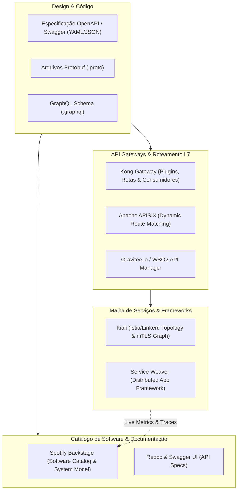

# 🔌 API & Service Mesh Discovery, Inventory, and Mapping

This skill guides the AI to act as an **API Contract, Developer Portal, and Service Mesh Mapping Specialist**, cataloging REST, GraphQL, and gRPC endpoints, gateway policies, inter-service dependencies, and enterprise API governance.

---

## 🌐 1. API Mapping Architecture and Centralized Catalog

Modern API governance centralizes service contracts in unified catalogs while monitoring runtime traffic in gateways and service meshes:



---

## 🛠️ 2. Specialist API Mapping Tools

### 1. Spotify Backstage (The Software Catalog and IDP Standard)
- **Concept**: An open platform developed by Spotify for building Internal Developer Platforms (IDPs). It maps software entities through YAML manifests (`catalog-info.yaml`), establishing `System`, `Domain`, `Component`, `API`, `Resource`, and `User/Group` relationships.
- **Example `catalog-info.yaml` Manifest for API and Dependency Mapping**:
```yaml
apiVersion: backstage.io/v1alpha1
kind: Component
metadata:
  name: order-service
  description: Serviço central de processamento de pedidos
  tags:
    - java
    - spring-boot
    - e-commerce
spec:
  type: service
  lifecycle: production
  owner: group:checkout-team
  system: ecommerce-core
  providesApis:
    - order-api-v1
  consumesApis:
    - payment-api-v2
    - inventory-api-v1
  dependsOn:
    - resource:order-postgres-db
    - resource:order-events-kafka-topic
---
apiVersion: backstage.io/v1alpha1
kind: API
metadata:
  name: order-api-v1
  description: API REST de gerenciamento de pedidos
spec:
  type: openapi
  lifecycle: production
  owner: group:checkout-team
  system: ecommerce-core
  definition:
    $text: ./openapi.yaml
```

### 2. OpenAPI / Swagger & Redoc
- **OpenAPI 3.1**: The industry-standard specification for describing HTTP/REST contracts, enabling client, server, and contract test generation.
- **Redoc**: A high-performance rendering engine for responsive static documentation generated from OpenAPI specifications.
```bash
# Gerar documentação HTML autônoma do OpenAPI
npx @redocly/cli build-docs openapi.yaml -o api-docs.html
```

### 3. API Gateways (Kong, Apache APISIX, Gravitee, WSO2)
- **Kong Gateway**: Maps upstream services, routes, authentication plugins (OAuth2, Key-Auth), rate limiting, and CORS through an administrative API or the declarative decK (`kong.yaml`) configuration.
- **Apache APISIX**: A cloud-native gateway built on Nginx/Lua and etcd, supporting dynamic routing and OpenTelemetry and Prometheus observability plugins.
- **Gravitee.io & WSO2 API Manager**: Full API lifecycle platforms covering monetization, plan/subscription-based access control, and developer traffic analytics.

### 4. Service Weaver (Google)
- **Concept**: A distributed framework for Go that lets you write applications as a modular monolith and deploy them transparently as multiple microservices, with discovery and optimized IPC communication handled by the framework runtime.

### 5. Kiali (Istio/Linkerd API Topology)
- **Concept**: Inspects the service mesh in real time, mapping API traffic routes between pods, HTTP error rates by service version, and inter-service mTLS authentication.

---

## 📊 3. C4 / Backstage Entity Model for APIs

When modeling API ecosystems, structure relationships according to the service catalog model:

| Entity | Definition | Relationships |
| :--- | :--- | :--- |
| **Domain** | Macro business domain (e.g., Sales, Logistics) | Contains multiple `Systems` |
| **System** | Cohesive set of services that deliver a capability | Groups `Components` and `Resources` |
| **Component** | Executable software unit (Microservice, Frontend, Lambda) | `providesApis`, `consumesApis`, `dependsOn` |
| **API** | Formal interface contract (OpenAPI, Protobuf, GraphQL) | Implemented by a `Component` |
| **Resource** | Persistent external infrastructure or messaging | Database, Kafka Topic, S3 Bucket |

---

## 🎯 4. API Governance Best Practices

- [ ] **Design-First with OpenAPI**: Write and validate the OpenAPI specification before implementing the source code to align consumers and producers.
- [ ] **Contract Testing**: Use contract tests (e.g., Pact) to ensure that changes to producer APIs do not break consumer microservices.
- [ ] **Automatic Inventory in CI/CD**: Validate and publish API specifications automatically to Backstage or the developer portal during the release pipeline.
