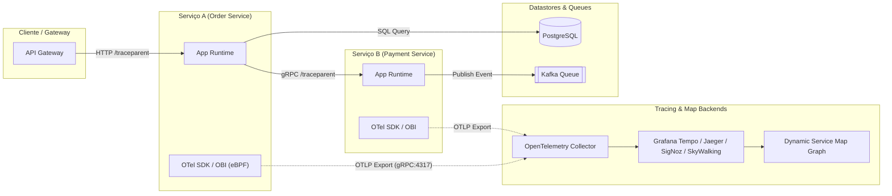

# 🛰️ Application Discovery, Service Maps, and Distributed Tracing (Distributed Tracing & eBPF)

This skill guides the AI to act as an **Application Discovery and Runtime Dependency Tracing Specialist**, enabling automated mapping of microservice interactions, latencies, HTTP/gRPC calls, asynchronous messages, and database queries with no or minimal manual instrumentation.

---

## 🏗️ 1. Discovery Architecture and Service Maps

Runtime discovery operates through two complementary approaches:
1. **eBPF Kernel Instrumentation (Zero-Code Instrumentation)**: Inspects system calls (`sys_enter_connect`, `sys_enter_write`, `sys_enter_read`, `tcp_v4_connect`) at the Linux kernel level to correlate processes, ports, sockets, and L7 payloads (HTTP, gRPC, MySQL, Postgres, Redis, Kafka) without modifying the application binary.
2. **Application Instrumentation via OpenTelemetry / W3C Trace Context**: Injects standardized headers (`traceparent`, `tracestate`, `baggage`) through language SDKs/agents (Java Bytecode Agent, Go eBPF, Node.js Hooks, Python OpenTelemetry Instrumentation) to reconstruct complete Span trees (DAG - Directed Acyclic Graph).



---

## 🛠️ 2. Specialist Discovery Tools

### 1. OpenTelemetry eBPF Instrumentation (OBI) / OpenTelemetry Operator
- **Concept**: Transparent OS-level instrumentation that captures network traffic and application protocols (HTTP/1.1, HTTP/2, gRPC, databases) by intercepting socket syscalls and SSL libraries (OpenSSL, Go Crypto, BoringSSL), decoding HTTPS traffic at runtime before encryption.
- **OpenTelemetry Collector Configuration (`otel-collector-config.yaml`)**:
```yaml
receivers:
  otlp:
    protocols:
      grpc:
        endpoint: 0.0.0.0:4317
      http:
        endpoint: 0.0.0.0:4318

processors:
  batch:
    timeout: 1s
    send_batch_size: 1024
  memory_limiter:
    check_interval: 1s
    limit_percentage: 75
    spike_limit_percentage: 20

exporters:
  otlp/tempo:
    endpoint: "tempo:4317"
    tls:
      insecure: true
  otlp/signoz:
    endpoint: "signoz-otel-collector:4317"
    tls:
      insecure: true
  logging:
    loglevel: debug

service:
  pipelines:
    traces:
      receivers: [otlp]
      processors: [memory_limiter, batch]
      exporters: [otlp/tempo, otlp/signoz, logging]
```

### 2. Caretta (eBPF Service Network Map)
- **Concept**: A lightweight eBPF-based utility that monitors real-time network connections in the Kubernetes cluster, resolving IPs to Pods, Services, and Namespaces and generating topology graphs and throughput/latency rates directly in Grafana.
- **Helm Installation**:
```bash
helm repo add groundcover https://helm.groundcover.com
helm repo update
helm install caretta groundcover/caretta --namespace caretta --create-namespace
```

### 3. Jaeger (CNCF Distributed Tracing)
- **Concept**: An end-to-end distributed tracing system that enables analysis of the critical path (*Critical Path Analysis*), correlation of p95/p99 latency, and visualization of direct dependency graphs between services.
- **Generating the Jaeger Dependency Graph**:
```bash
# Processar dependências históricas a partir do armazenamento (Elasticsearch/OpenSearch/Cassandra)
java -jar jaeger-spark-dependencies.jar
```

### 4. Zipkin
- **Concept**: A distributed tracing system based on Google's Dapper specification, offering trace aggregation via a REST API and dependency visualization through the Zipkin Dependencies Engine (Spark/Flink).

### 5. Apache SkyWalking
- **Concept**: An application performance management (APM) and service mesh observability platform capable of generating interactive topology maps (*Topology Engine*) that correlate golden metrics (Throughput, Latency, Errors) directly on the graph vertices.

### 6. SigNoz
- **Concept**: A unified ClickHouse-based observability platform that consumes traces, metrics, and logs through native OpenTelemetry, providing an automatic Service Map and anomaly detection on external and downstream calls.

### 7. Grafana Tempo & TraceQL
- **Concept**: A massively scalable trace backend with low storage cost (S3/GCS Object Storage) integrated with the Grafana Service Map and supporting advanced queries through **TraceQL**.
- **Example TraceQL Query to detect a degraded dependency**:
```traceql
{ .http.status_code >= 500 && duration > 2s } | select(.service.name, .http.target, .error)
```

---

## 📋 3. W3C Context Propagation Matrix (Trace Context)

When designing or auditing microservice systems, ensure consistent propagation of the following HTTP headers:

| Header | Format | Purpose |
| :--- | :--- | :--- |
| `traceparent` | `00-4bf92f3577b34da6a3ce929d0e0e4736-00f067aa0ba902b7-01` | Version (00), TraceID (16 bytes hex), ParentSpanID (8 bytes hex), TraceFlags (01=sampled) |
| `tracestate` | `rojo=1,congo=2` | Vendor-specific proprietary metadata for tracing vendors |
| `baggage` | `userId=alice,env=prod,region=us-east-1` | Business context propagation across all layers of the graph |

---

## 🎯 4. Best Practices and Validation Checklist

- [ ] **Zero-Code eBPF vs SDKs**: Use eBPF for instant topology discovery without restarting pods; use OpenTelemetry SDKs when you need to capture rich business attributes (e.g., `user_id`, `order_id`).
- [ ] **Sampling Rate**: In high-throughput environments, use *Head-based Sampling* (1% to 5%) or *Tail-based Sampling* in the OTel Collector to retain 100% of errors and slow requests.
- [ ] **Semantic Standardization**: Strictly follow the **OpenTelemetry Semantic Conventions** for span names (`HTTP GET /orders/{id}`, `SELECT FROM users`) and attributes (`db.system`, `net.peer.name`, `rpc.service`).
