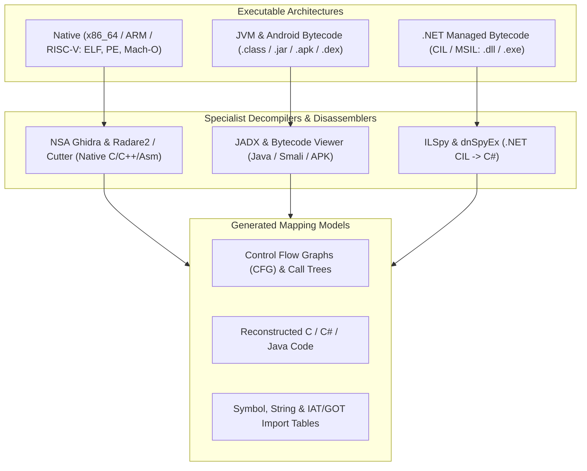

# 🔬 Binary Reverse Engineering, Decompilation, and Low-Level Analysis

This skill guides the AI to act as a **Binary and Compiled Application Reverse Engineering Specialist**, reconstructing closed-source logic, analyzing Control Flow Graphs (CFG), and identifying imported functions and APIs in native binaries (ELF, PE, Mach-O), JVM bytecode (.class/.apk/.jar), and .NET assemblies (.dll/.exe).

---

## ⚙️ 1. Reverse Engineering Pipeline by Binary Architecture

Reverse engineering adapts its techniques depending on the abstraction level of the compiled executable:



---

## 🛠️ 2. Specialist Decompilation Tools

### A. Native Binaries (C, C++, Rust, Go, Assembly)

#### 1. NSA Ghidra (Software Reverse Engineering Suite)
- **Concept**: An open-source reverse engineering framework developed by the National Security Agency (NSA). It features a state-of-the-art decompiler for C/C++, support for x86, ARM, MIPS, PowerPC, and SPARC processors, cross-reference (*Xrefs*) analysis, automatic inference of structure types, and Python/Java scripting.
- **Ghidra Headless Automation via CLI**:
```bash
# Run batch binary analysis without a graphical interface
analyzeHeadless /tmp/ghidra_projects BinaryProject \
  -import /path/to/target_binary \
  -postScript DecompileToFile.java /tmp/output_c_code.c
```

#### 2. Radare2 (r2) & Cutter
- **Radare2**: A suite of command-line tools for disassembly, debugging, memory forensics, and binary patching.
- **Cutter**: The official modern graphical interface (GUI) built on the Radare2 and Rizin engines.
- **Essential Radare2 Commands for Function Mapping**:
```bash
# Open binary in analysis mode
r2 -A /bin/ls

# Internal r2 commands:
# afl          -> List all discovered functions
# pdf @ main   -> Disassemble the main function (Print Disassembly Function)
# agf @ main   -> Generate a Control Flow Graph (ASCII/DOT)
# iz           -> List static strings from the data section (.rodata)
# ii           -> List symbols imported from dynamic libraries
```

---

### B. Java & Android Ecosystem (.class, .jar, .apk, .dex)

#### 1. JADX (Dex to Java Decompiler)
- **Concept**: The most efficient decompiler for Android applications (APK, DEX, AAR files) and Java JAR files. It converts Dalvik/Smali bytecode directly into readable Java source code with restoration of `AndroidManifest.xml` and associated resources.
- **CLI Usage**:
```bash
# Decompile APK with direct Java project generation
jadx -d /tmp/app_decompiled app-release.apk --show-bad-code
```

---

### C. .NET Ecosystem (C#, VB.NET, F#)

#### 1. ILSpy & dnSpyEx
- **ILSpy**: The standard open-source decompiler for .NET assemblies. It reconstructs complete C# projects from DLLs compiled for .NET Framework, .NET Core, and .NET 8+.
- **dnSpyEx**: A modern community fork of dnSpy, offering decompilation and **real-time dynamic debugging** of .NET assemblies without the original source code, allowing you to edit C# code directly in the executable and save the modified binary.
- **ILSpy CLI Usage**:
```bash
ilspycmd -p -o /tmp/decompiled_csharp /path/to/MyAssembly.dll
```

---

## 📊 3. Binary Surface Analysis Matrix

When mapping the structure of a closed executable, collect the following elements:

| Binary Element | Mapping Purpose | Risk / Attention Point |
| :--- | :--- | :--- |
| **Imports / IAT / GOT** | List of system calls and external libraries | Identification of sockets, file writes, cryptography |
| **Static Strings** | API URLs, endpoints, hardcoded keys and passwords | Exposure of credentials and C2 communication |
| **Control Flow Graphs (CFG)** | Branching flow and cyclomatic complexity | Obfuscated functions (*Control Flow Flattening*) |
| **Executable Sections** | Entropy of `.text`, `.data`, `.rsrc` | Detection of packers (*Packers* such as UPX, Themida) |

---

## 🎯 4. Best Practices

- [ ] **Isolated Environment (Sandbox)**: Always run unknown binaries inside virtual machines or isolated containers without unauthorized network connectivity.
- [ ] **Signature and Hash Verification**: Compute and record SHA256 and SSDEEP (Fuzzy Hashing) hashes before starting decompilation to guarantee integrity and traceability.
