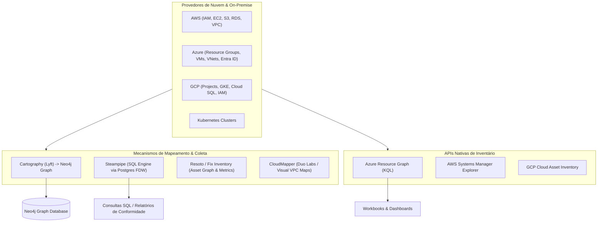

# ☁️ Cloud Topology Mapping, Hybrid Environments, and Multi-Cloud Asset Graphs

This skill guides the AI to act as a **Cloud Topology Mapping and Resource Governance Specialist**, integrating asset inventory data from AWS, Microsoft Azure, Google Cloud Platform (GCP), and on-premise environments into relational databases and graphs for security, cost, and infrastructure dependency analysis.

---

## 🛰️ 1. Cloud Resource Mapping Architecture

Modern cloud mapping consolidates APIs from multiple providers into unified query interfaces (SQL or Cypher graphs):



---

## 🛠️ 2. Specialist Cloud Mapping Tools

### 1. Cartography (Lyft)
- **Concept**: A Python-based resource audit and consolidation tool that scans cloud APIs (AWS, Azure, GCP, GitHub, Okta, Kubernetes) and builds a detailed relationship graph in **Neo4j**.
- **CLI Synchronization Run**:
```bash
cartography --neo4j-uri bolt://localhost:7687 --neo4j-user neo4j --neo4j-password-env-var NEO4J_PASSWORD
```
- **Example Cypher Query to identify EC2 instances directly exposed to the Internet with IAM administrator permissions**:
```cypher
MATCH (i:EC2Instance)-[:MEMBER_OF_EC2_SECURITY_GROUP]->(sg:EC2SecurityGroup)<-[:ALLOWS]-(rule:IpRule)
WHERE rule.fromport <= 22 AND rule.toport >= 22 AND rule.cidr = '0.0.0.0/0'
MATCH (i)-[:ATTACHED_IAM_ROLE]->(role:AWSPrincipal)-[:POLICY]->(p:AWSPolicy)
WHERE p.name = 'AdministratorAccess'
RETURN i.id, i.publicdnsname, sg.id, role.name
```

### 2. Steampipe (Zero-ETL SQL Engine for Cloud Assets)
- **Concept**: A CLI utility and SQL server that exposes cloud APIs and software tools as PostgreSQL relational tables through Foreign Data Wrappers (FDW). It lets you run direct SQL queries, joins across providers, and CIS compliance checks.
- **Multi-Cloud SQL Queries**:
```bash
# Iniciar console interativo
steampipe query
```
```sql
-- Identificar todos os buckets S3 públicos na AWS e containers Blob no Azure
SELECT
  'AWS' AS provider,
  name AS asset_name,
  region AS location,
  block_public_acls,
  block_public_policy
FROM
  aws_s3_bucket
WHERE
  block_public_acls = false OR block_public_policy = false

UNION ALL

SELECT
  'Azure' AS provider,
  name AS asset_name,
  location,
  false AS block_public_acls,
  false AS block_public_policy
FROM
  azure_storage_container
WHERE
  public_access <> 'None';
```

### 3. Resoto / Fix Inventory
- **Concept**: A graph-focused multi-cloud infrastructure inventory that enables cleanup of orphaned resources, tagging automation, and configuration drift monitoring across AWS, GCP, Azure, DigitalOcean, and Kubernetes.

### 4. CloudMapper (Duo Security)
- **Concept**: A utility focused on visual analysis of AWS network topologies (VPCs, Subnets, Gateways, Route Tables, and Security Groups). It generates interactive HTML reports and visual diagrams of network traffic and routing.
```bash
python cloudmapper.py collect --account my-aws-account
python cloudmapper.py prepare --account my-aws-account
python cloudmapper.py webserver --port 8000
```

### 5. Azure Resource Graph (ARG) & KQL
- **Concept**: An Azure management service that offers large-scale resource exploration across dozens of subscriptions using the **Kusto Query Language (KQL)** with sub-second response times.
- **Example KQL Query**:
```kusto
Resources
| where type == "microsoft.compute/virtualmachines"
| project name, resourceGroup, subscriptionId, location, properties.hardwareProfile.vmSize
| join kind=leftouter (
    ResourceContainers
    | where type == "microsoft.resources/subscriptions"
    | project subscriptionId, subscriptionName = name
) on subscriptionId
| project name, resourceGroup, subscriptionName, location, vmSize
```

### 6. AWS Systems Manager (SSM) Explorer & Inventory
- **Concept**: AWS's centralized dashboard and inventory collection mechanism that consolidates metadata for EC2 instances, installed operating systems, software packages, patches, and compliance status across multiple AWS accounts and regions.

### 7. GCP Cloud Asset Inventory
- **Concept**: Google Cloud's native inventory service that keeps a five-week history of resource metadata and IAM policies, enabling real-time searches and continuous export to BigQuery.
```bash
# Buscar todas as instâncias Compute Engine ativas em uma organização GCP
gcloud asset search-all-resources \
  --scope='organizations/123456789012' \
  --asset-types='compute.googleapis.com/Instance' \
  --format='table(name, location, state)'
```

---

## 📊 3. Cloud Mapping Integration Matrix

| Mapping Goal | Recommended Tool | Output / Query Format |
| :--- | :--- | :--- |
| **IAM + Network + Asset Relationship Graph** | **Cartography** | Neo4j Graph / Cypher Queries |
| **Multi-Cloud Audit and Joins via SQL** | **Steampipe** | PostgreSQL SQL / JSON / CSV |
| **AWS VPC Topology Visualization** | **CloudMapper** | Interactive Web Diagram / SVG |
| **Fast Inventory at Azure Scale** | **Azure Resource Graph** | KQL (Kusto) / Azure Portal |
| **Continuous GCP Audit & History** | **GCP Cloud Asset Inventory** | BigQuery Tables / PubSub Feeds |
| **Orphaned Resource / Cost Detection** | **Resoto (Fix Inventory)** | Resoto Shell / Python SDK |

---

## 🎯 4. Best Practices

- [ ] **Read-Only Least Privilege Access**: Create Service Principals, IAM Roles, and Service Accounts with read-only permissions (`SecurityAudit`, `Viewer`, `Reader`) for the mapping tools.
- [ ] **Periodic Snapshot Scheduling**: Run inventory synchronizations (via Cartography or Steampipe) on a schedule to capture history and infrastructure growth trends.
- [ ] **Alignment with Structured Tags**: Ensure every mapped resource carries mandatory tags (`Environment`, `Owner`, `CostCenter`, `Service`) to enable precise filtering in the graph.
