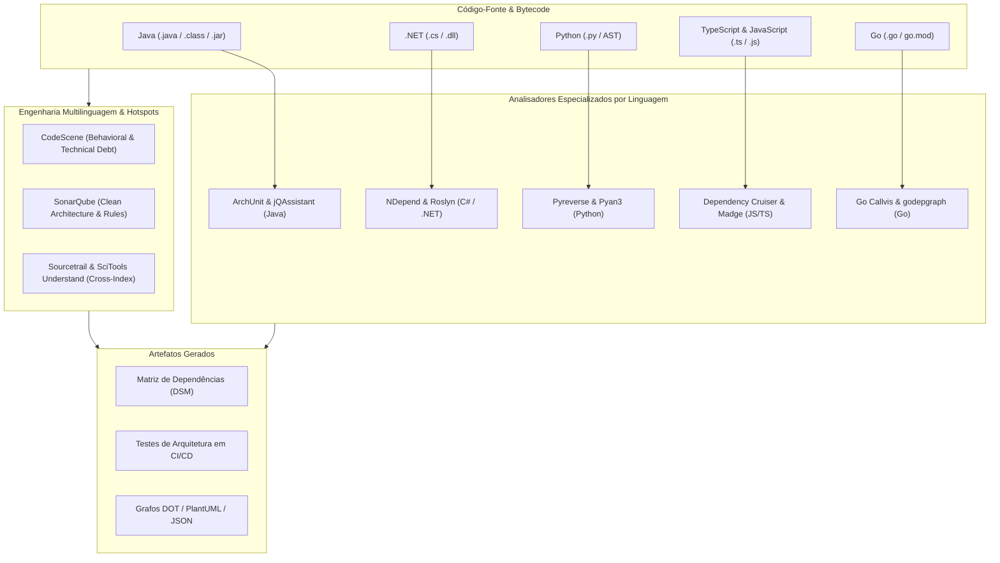

# 🧬 Source Code Mapping, Architecture, AST, and Class Dependencies

This skill guides the AI to act as a **Static and Architectural Source Code Mapping Specialist**, using AST (Abstract Syntax Tree) analyzers, automated architectural governance tests, Dependency Structure Matrices (*DSM*), and complexity and cohesion metrics across multiple languages.

---

## 🏛️ 1. Static Mapping Overview by Language

Code mapping extracts the relational model of types, functions, packages, and modules directly from source code or compiled bytecode:



---

## 🛠️ 2. Tools by Language Ecosystem

### A. Java & JVM
1. **ArchUnit**: A unit testing framework for asserting architectural rules (Onion, Hexagonal, Clean Architecture, dependency injection, and layering).
   - **Example Java Architecture Test**:
```java
@AnalyzeClasses(packages = "com.empresa.app")
public class ArchitectureTest {

    @ArchTest
    public static final ArchRule controllers_should_only_call_services =
        classes().that().resideInAPackage("..controller..")
            .should().onlyAccessClassesThat()
            .resideInAnyPackage("..service..", "..dto..", "java..");

    @ArchTest
    public static final ArchRule domain_should_not_depend_on_infrastructure =
        noClasses().that().resideInAPackage("..domain..")
            .should().dependOnClassesThat()
            .resideInAPackage("..infrastructure..");

    @ArchTest
    public static final ArchRule no_cycles_in_packages =
        slices().matching("com.empresa.app.(*)..").should().beFreeOfCycles();
}
```

2. **jQAssistant**: Transforms the Java code structure (classes, methods, annotations, JPA, Maven dependencies) into a **Neo4j** graph, allowing you to validate compliance rules through Cypher queries in the Maven/Gradle build.
3. **Structure101 & Sonargraph**: Advanced analyzers with a Dependency Structure Matrix (DSM), slice visualization, and detection of cyclic dependencies at the package and class level.
4. **JDepend & Classycle**: Utilities for measuring Robert C. Martin's metrics:
   - **Afferent Coupling ($C_a$)**: Number of external classes that depend on this package.
   - **Efferent Coupling ($C_e$)**: Number of external classes this package depends on.
   - **Instability ($I$)**: $I = \frac{C_e}{C_a + C_e}$ (0 = Fully stable, 1 = Fully unstable).
   - **Abstractness ($A$)**: Ratio of abstract classes and interfaces to total classes.
   - **Distance from Main Sequence ($D$)**: $D = |A + I - 1|$.

---

### B. C# & .NET
1. **NDepend**: A deep static analysis tool for the .NET ecosystem with support for the **CQLinq** (Code Query LINQ) query language.
   - **Example CQLinq Rule**:
```csharp
// Identificar métodos com alto acoplamento e complexidade ciclomática elevada
warnif count > 0 
from m in JustMyCode.Methods 
where m.CyclomaticComplexity > 15 && m.CouplingMethods > 20
select new { m, m.CyclomaticComplexity, m.CouplingMethods }
```
2. **Roslyn Analyzers**: Analyzers integrated into the C# compiler that validate design patterns at edit/compile time.
3. **ArchUnitNET**: A port of ArchUnit to C#, enabling fluent architecture assertions in xUnit/NUnit.

---

### C. Python
1. **Pyreverse**: A module integrated into `pylint` that parses the AST of Python projects and produces class and package diagrams in PlantUML and Graphviz DOT formats.
```bash
# Gerar diagrama de classes e pacotes do projeto
pyreverse -o png -p MeuProjeto ./src/meu_modulo
```
2. **Pyan3**: A Python 3 utility for AST analysis and generation of static Call Graphs of methods and functions.
```bash
pyan3 src/**/*.py --uses --defines --colored --grouped --annotated --dot > callgraph.dot
dot -Tsvg callgraph.dot -o callgraph.svg
```
3. **Snakefood & Code2Flow**: Fast generators of import graphs and function call flowcharts for Python and JavaScript.

---

### D. JavaScript & TypeScript
1. **Dependency Cruiser**: The industry standard for dependency validation in monorepos and Node.js/TypeScript projects.
```bash
# Validar regras arquiteturais definidas no arquivo .dependency-cruiser.js
npx depcruise --config .dependency-cruiser.js src

# Gerar diagrama visual SVG de dependências entre módulos
npx depcruise src --include-only "^src" --output-type dot | dot -Tsvg > dependency-graph.svg
```
2. **Madge**: Creates visual dependency graphs of CommonJS, AMD, and ES6 modules, listing files with circular dependencies.
```bash
# Encontrar ciclos de dependência
npx madge --circular ./src
```
3. **Nx Graph**: A native visualizer of project and library topology in NX monorepos.
4. **TypeScript Compiler API**: Lets you inspect AST nodes (`ts.createSourceFile`, `ts.forEachChild`) to build custom architectural linters.

---

### E. Go (Golang)
1. **Go Callvis**: An interactive utility that analyzes the type and pointer tree of Go projects (using `golang.org/x/tools/go/pointer`) to render the call graph of functions grouped by package.
```bash
go-callvis -group pkg,type -focus main ./...
```
2. **godepgraph & GoGraph**: Generators of Go package import diagrams in Graphviz DOT format.
```bash
godepgraph -s github.com/empresa/meu-repo | dot -Tpng -o godeps.png
```

---

### F. Multilingual and Behavioral Analysis
1. **CodeScene**: A behavioral code analysis platform that combines version control (Git) data with code metrics to identify **Hotspots** (code with high complexity + high commit churn), temporal coupling (*Temporal Coupling*), and team bottlenecks (*Knowledge Loss*).
2. **SonarQube**: A continuous code inspection platform covering security vulnerabilities (Security Hotspots), duplications, and technical debt.
3. **Sourcetrail**: Excellent for visual navigation. It indexes source code and creates interactive maps of classes, functions, and calls. It focuses on C, C++, Java, and Python. The project was discontinued commercially, but the code remains open on GitHub and fully functional for offline use on legacy codebases.
4. **SciTools Understand**: A static analysis and deep multilingual indexing tool that generates Butterfly Graphs, dependency matrices, and cyclomatic complexity metrics at the scale of millions of lines.

---

## 📊 3. Architectural Anti-Pattern Detection Matrix

| Architectural Anti-Pattern | Mapping Symptom | Detection Tool |
| :--- | :--- | :--- |
| **Circular Dependencies** | Cycles in graphs ($A \to B \to C \to A$) | `ArchUnit`, `depcruise --circular`, `madge` |
| **God Class / God Package** | Hundreds of inbound/outbound connections | `NDepend`, `Sonargraph`, `Pyreverse` |
| **Layer Leak** | Domain layer importing Framework/DB | `ArchUnit`, `jQAssistant`, `.dependency-cruiser.js` |
| **Temporal Coupling** | Files always modified together without imports | `CodeScene` |
| **Hidden Technical Debt** | High cyclomatic complexity in volatile files | `CodeScene`, `SonarQube` |

---

## 🎯 4. Best Practices

- [ ] **Architecture Lock in CI/CD**: Fail the build if new dependency cycles or layer violations are introduced in Pull Requests.
- [ ] **Martin's Metrics**: Keep the distance from the main sequence ($D$) below `0.2` for core business packages.
- [ ] **Monorepo Isolation**: Configure explicit boundary limits (isolation tags in Nx or package rules in Dependency Cruiser) to prevent internal libraries from importing private modules from other domains.
