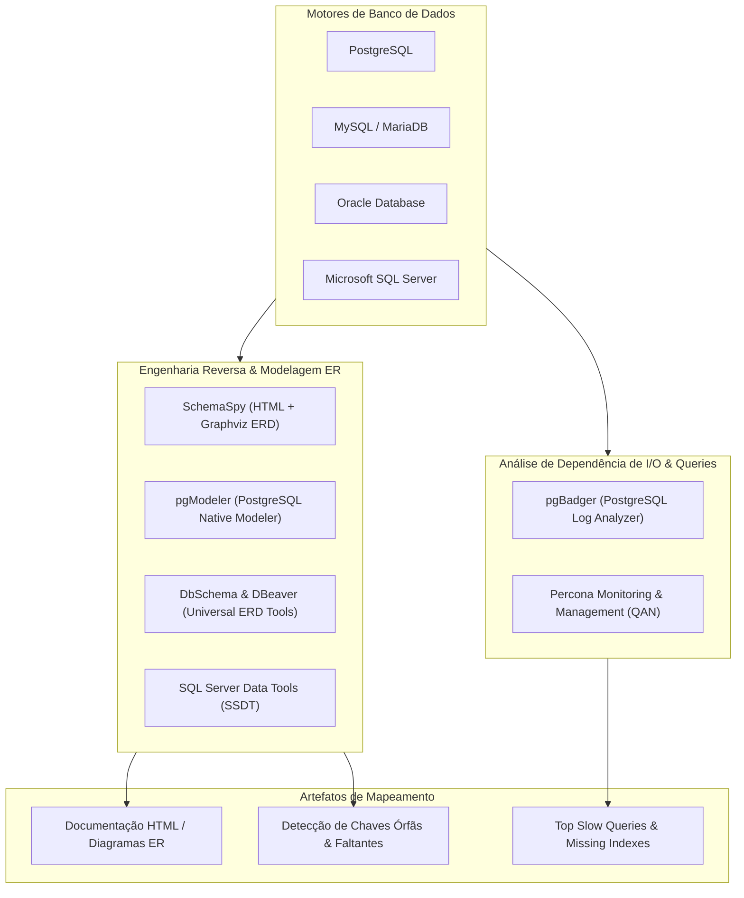

# 🗄️ Database Mapping, Schema Reverse Engineering, and I/O Dependencies

This skill guides the AI to act as a **Database Reverse Engineering and Schema Mapping Specialist**, generating entity-relationship diagrams (ERDs), inspecting dependencies between tables, visualizing implicit/explicit relationships, and diagnosing I/O bottlenecks through query log analysis.

---

## 🏛️ 1. Data Mapping and Reverse Engineering Cycle

Database mapping extracts the relational structure from the DBMS catalog and correlates the real usage of tables by production queries:



---

## 🛠️ 2. Specialist Database Mapping Tools

### 1. SchemaSpy
- **Concept**: A Java utility based on JDBC metadata that analyzes relational database schemas and generates interactive HTML documentation with ER diagrams via Graphviz, displaying primary keys, foreign keys, relationships inferred by naming convention, and tables with anomalies (*orphaned tables*).
- **SchemaSpy CLI Run**:
```bash
java -jar schemaspy-6.2.4.jar \
  -t pgsql \
  -dp /opt/drivers/postgresql-42.7.2.jar \
  -db meubanco \
  -host localhost \
  -port 5432 \
  -s public \
  -u postgres \
  -p secret123 \
  -o /var/www/html/db-docs \
  -vizjs
```

### 2. pgModeler (PostgreSQL Database Modeler)
- **Concept**: An open-source database modeling tool dedicated to PostgreSQL. It supports full reverse engineering of live instances into visual `.dbm` models, allowing graphical editing and export of DDL scripts with incremental synchronization.

### 3. DbSchema & DBeaver
- **DbSchema**: A universal database modeler (SQL and NoSQL) with support for interactive diagrams, responsive HTML5 documentation, offline schema design, and visual data queries.
- **DBeaver**: A universal database client with integrated ER diagram generation based on JDBC metadata for any active connection.

### 4. ERBuilder & SQL Power Architect
- **ERBuilder**: Visual software for reverse and forward engineering of relational schemas, documentation generation, and referential integrity rule validation.
- **SQL Power Architect**: A tool focused on data modeling and Data Warehousing, allowing you to compare schemas (*Diff*) and map data transformations in ETL pipelines.

### 5. pgBadger (PostgreSQL Query Log Analyzer)
- **Concept**: A high-performance log analyzer for PostgreSQL written in Perl. It processes query logs with `log_min_duration_statement` enabled and generates detailed HTML reports with charts of top queries by accumulated time, table locks, most frequent queries, and index creation recommendations.
- **CLI Usage**:
```bash
pgbadger -j 4 --prefix '%t [%p]: [%l-1] user=%u,db=%d,app=%a,client=%h ' \
  /var/log/postgresql/postgresql-16-main.log \
  -o report_pgbadger.html
```

### 6. Percona Monitoring and Management (PMM)
- **Concept**: An open-source database observability platform focused on MySQL, PostgreSQL, and MongoDB. It includes **Query Analytics (QAN)**, which maps in real time the I/O load imposed by each query pattern on the server hardware.

### 7. SQL Server Data Tools (SSDT) & Oracle SQL Developer Data Modeler
- **SSDT**: The Visual Studio tool for SQL Server database projects, allowing you to keep the complete schema under version control and perform declarative deployments via Dacpac.
- **Oracle Data Modeler**: A logical, relational, and physical modeling tool for large corporate Oracle databases and legacy systems.

---

## 📊 3. Schema Mapping Audit Checklist

When inspecting and documenting a relational database, assess:

| Assessment Criterion | Identified Problem | Impact |
| :--- | :--- | :--- |
| **Missing Foreign Keys** | Logical relationship in code without an FK constraint | Data inconsistency and compromised referential integrity |
| **Indexes on FK Columns** | FKs without an associated B-Tree index | Full table scan on `JOIN` and `DELETE CASCADE` operations |
| **Orphaned Tables (Isolated Tables)** | Tables with no relationship to other entities | Probable technical debt or abandoned temporary table |
| **Incompatible Data Types in Keys** | `VARCHAR` FK referencing an `INTEGER` PK | Implicit conversion failures and unusable indexes |
| **Hotspot Queries Without a Covering Index** | Frequent queries performing a Heap scan | Disk I/O overload and Buffer Pool saturation |

---

## 🎯 4. Best Practices

- [ ] **Automated Documentation in Pipelines**: Add SchemaSpy or pgModeler execution to the CI/CD pipeline to keep schema documentation always up to date in the documentation portal.
- [ ] **Use Logical Schemas to Separate Domains**: Group tables from different subdomains (e.g., `billing`, `inventory`, `users`) into separate database schemas instead of concentrating hundreds of tables in the `public` schema.
