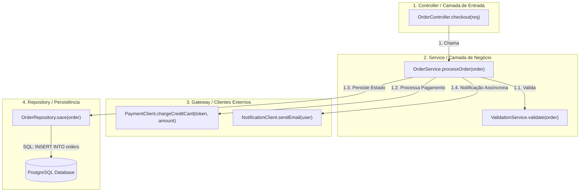

# 🔁 Execution Flow Analysis and Call Graphs (Call Maps)

This skill guides the AI to act as an **Execution Flow Analysis and Call Graph Specialist**, reconstructing the hierarchical chain of calls between methods, functions, services, and databases by combining static call analysis and dynamic runtime tracing.

---

## 🧭 1. Static vs Dynamic Flow Analysis

Reconstructing execution paths involves two synergistic approaches:
1. **Static Call Graph**: Analyzes source code, AST, and symbol tables to identify all possible function invocations, handling polymorphic calls through call-site analysis algorithms (Class Hierarchy Analysis - CHA, Rapid Type Analysis - RTA, Pointer Analysis).
2. **Dynamic Call Graph**: Inspects the actual calls executed at runtime through bytecode instrumentation, CPU profilers, or OpenTelemetry/Jaeger spans, capturing the exact order, execution counts, and time spent at each node.



---

## 🛠️ 2. Specialist Call Graph Generation Tools

### 1. Code2Flow
- **Concept**: A multilingual utility (Python, JavaScript, Ruby, PHP) that generates visual executable flowcharts from source code, mapping directly how functions interact with one another.
- **CLI Usage**:
```bash
# Gerar fluxograma de execução em SVG
code2flow src/main.py src/auth.py src/database.py -o execution_flow.svg
```

### 2. Go Callvis (Go / Golang)
- **Concept**: An interactive call graph generator for Go. It uses advanced static pointer analysis (`pointer analysis`) to resolve interfaces and dynamic dispatch, grouping functions by their origin package.
- **CLI Usage**:
```bash
# Focar no ponto de entrada main e ignorar bibliotecas padrão do Go
go-callvis -nostd -focus github.com/empresa/projeto/cmd/server .
```

### 3. Pyan3 (Python)
- **Concept**: A static analyzer for Python 3 that analyzes class, method, and call definitions through the `ast` module, generating detailed DOT files.
- **Command**:
```bash
pyan3 $(find ./app -name "*.py") --uses --defines --colored --grouped --nested-groups --dot > app_callgraph.dot
dot -Tpng app_callgraph.dot -o app_callgraph.png
```

### 4. Doxygen + Graphviz DOT (C, C++, Java, C#)
- **Concept**: Generates direct call diagrams (*Call Graph*) and reverse call diagrams (*Caller Graph*) for any function/method in the system.
- **Visualization**: Each function node displays hyperlinks to the corresponding source code and highlights whether the function is part of a public API or is internal.

### 5. SciTools Understand & Sourcetrail
- **SciTools Understand**: A leading platform for static analysis at the scale of millions of lines of code. It generates **Butterfly Graphs** (which simultaneously show who calls and who is called by a selected function), dependency trees, and cyclomatic complexity metrics.
- **Sourcetrail**: An open-source interactive code indexer that lets you graphically navigate code nodes (`Type`, `Function`, `Variable`) with real-time synchronization on the source code screen.

### 6. Dynamic Tracing with OpenTelemetry + Jaeger
- **Concept**: Lets you visualize the real call graph at runtime with time metrics distributed across microservices and local components.
- **Example Span DAG**:
```text
[Trace: 8a7f9b2c3d] Total: 250ms
 ├── HTTP POST /api/checkout (OrderController) [250ms]
 │    ├── OrderService.process [210ms]
 │    │    ├── PaymentClient.charge (HTTP POST api.stripe.com) [140ms]
 │    │    └── OrderRepository.save (SQL INSERT) [35ms]
 │    └── EventPublisher.emit [10ms]
```

---

## 📊 3. Types of Polymorphic Resolution in Call Graphs

When mapping object-oriented or functional code, the specialist must consider the dynamic dispatch resolution technique:

| Algorithm | Precision | Computational Cost | Description |
| :--- | :--- | :--- | :--- |
| **CHA (Class Hierarchy Analysis)** | Medium | Very Low | Connects the call to every subclass that implements the method. |
| **RTA (Rapid Type Analysis)** | High | Low | Filters only concrete classes that are effectively instantiated in the application. |
| **Pointer Analysis (Andersen/Steensgaard)** | Very High | High | Tracks the flow of pointers/references to identify the exact object being pointed to. |
| **Dynamic Execution (Tracing)** | Exact (100%) | Runtime overhead | Records only the real calls triggered during execution. |

---

## 🎯 4. Best Practices

- [ ] **Standard Library Filtering**: Always filter runtime utility libraries (`java.lang.*`, `fmt.Println`, `builtins`, `lodash`) to keep the Call Graph from becoming polluted and unreadable.
- [ ] **Identifying Critical Leaf Methods**: Locate methods at the end of the call chain that perform blocking I/O or heavy mathematical operations for performance optimization.
- [ ] **Dead Code Detection**: Private or internal functions with an in-degree of zero ($In\text{-}Degree = 0$) in the complete graph should be investigated for refactoring and removal.
