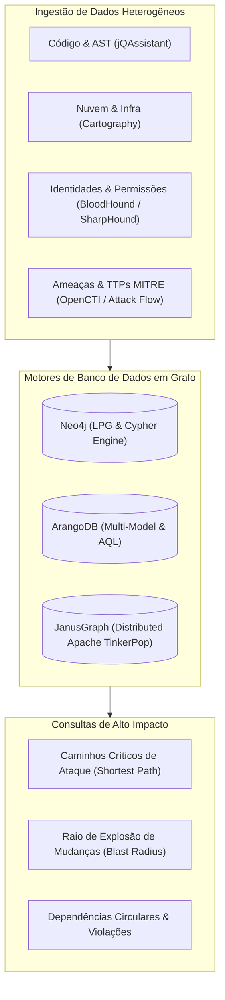

# 🕸️ Relationship Mapping, Knowledge Graphs, and Security

This skill guides the AI to act as a **Knowledge Graph and System/Security Relationship Analysis Specialist**, integrating heterogeneous data from code, cloud, identity (Active Directory / Entra ID), threats (Threat Intelligence), and infrastructure into directed Labeled Property Graphs (LPGs) for impact and attack path (*Attack Paths*) queries.

---

## 🌐 1. Unified Knowledge Graph Architecture

Graph modeling turns isolated information silos into a navigable relational mesh through declarative query languages (Cypher, AQL, Gremlin):



---

## 🛠️ 2. Specialist Graph and Model Tools

### 1. Neo4j & the Cypher Language
- **Concept**: The most widely used native graph-oriented database in the world. It models nodes (*Nodes*), labels (*Labels*), relationships (*Relationships*), and key-value properties (*Properties*).
- **Cypher Query: Blast Radius Mapping of a Domain Class**:
```cypher
// Identificar todos os métodos, classes e endpoints afetados pela alteração de UserEntity
MATCH path = (e:Entity {name: 'UserEntity'})<-[:DEPENDS_ON*1..4]-(caller)
RETURN path, count(caller) AS total_affected_nodes
ORDER BY length(path) ASC;
```

### 2. BloodHound (Active Directory & Azure/Entra ID Attack Paths)
- **Concept**: An audit tool that uses graph theory to map and visualize hidden control and privilege relationships in Active Directory and Azure AD. It identifies indirect privilege escalation paths to Domain Admin (*Shortest Path to High Value Targets*).
- **BloodHound Collection and Query**:
  - Collection via `SharpHound.exe` or `bloodhound-python`.
  - Ingestion into Neo4j and visualization of nodes (`User`, `Group`, `Computer`, `OU`, `GPO`, `Domain`) and edges (`MemberOf`, `AdminTo`, `HasSession`, `WriteDacl`, `GenericAll`, `AddMember`, `GetChangesAll`).

### 3. jQAssistant (Software Architecture Graph)
- **Concept**: An architectural quality control framework that analyzes Java, Maven, JPA, Git, and Docker projects, writing the complete structure into Neo4j and validating corporate rules via Cypher.
- **Example Cypher Rule in `jqassistant-rules.xml`**:
```cypher
// Bloquear acesso direto de Controllers aos Repositories
MATCH (c:Type)-[:DECLARES]->(m:Method)-[:CALLS]->(rMethod:Method)<-[:DECLARES]-(r:Type)
WHERE c:Controller AND r:Repository
CREATE (c)-[:VIOLATES_LAYER]->(r)
RETURN c.name AS ViolatingController, r.name AS TargetRepository;
```

### 4. ArangoDB & JanusGraph
- **ArangoDB**: A native multi-model database (Documents, Key-Value, and Graphs) with support for the AQL (ArangoDB Query Language) and distributed graph traversal algorithms.
- **JanusGraph**: A highly scalable distributed graph database (scalable on Apache Cassandra, HBase, or ScyllaDB) compatible with the **Apache TinkerPop / Gremlin** standard.

### 5. Attack Flow & OpenCTI (Security & Threat Intelligence)
- **Attack Flow (MITRE Center for Threat-Informed Defense)**: A declarative JSON language and format for mapping the temporal sequence of adversary actions and techniques based on MITRE ATT&CK.
- **OpenCTI**: An open cyber threat intelligence (CTI) management platform that structures relationships among vulnerabilities (CVE), threat actors, malware, and incidents in graphs interoperable with the STIX 2.1 standard.

---

## 📊 3. Essential Graph Algorithms for Mapping

When analyzing dependency and security graphs, the specialist should apply classic graph theory algorithms:

| Algorithm | Application in Mapping | Neo4j GDS / Python NetworkX Implementation |
| :--- | :--- | :--- |
| **Shortest Path (Dijkstra / BFS)** | Shortest path of privilege escalation or API call | `gds.shortestPath.dijkstra.stream` |
| **PageRank / Centrality** | Identification of the most critical components and classes in the system | `gds.pageRank.stream` |
| **Betweenness Centrality** | Bridge nodes (communication bottlenecks or Single Points of Failure) | `gds.betweenness.stream` |
| **Louvain / Leiden (Community Detection)**| Identification of cohesive code modules for microservice refactoring | `gds.louvain.stream` |
| **Cycle Detection (Tarjan / Johnson)** | Detection of dependency cycles forbidden by the architecture | `apoc.algo.cycles` |

---

## 🎯 4. Best Practices in Graph Modeling

- [ ] **Directed Edges with Clear Semantics**: Name relationships with expressive verbs (`[:CALLS]`, `[:IMPLEMENTS]`, `[:DEPENDS_ON]`, `[:COMMUNICATES_WITH]`, `[:ADMIN_TO]`).
- [ ] **Indexing of Search Properties**: Create unique indexes on node IDs and names (`CREATE CONSTRAINT FOR (n:Node) REQUIRE n.id IS UNIQUE`) to guarantee sub-second Cypher queries on graphs with millions of vertices.
- [ ] **Orphan Node Cleanup**: Run periodic maintenance routines to remove nodes without relationships left over from older code versions.
