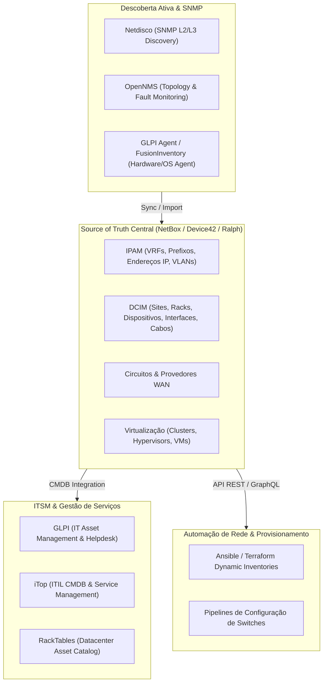

# 🏢 Infrastructure Inventory, IPAM, DCIM, and CMDB

This skill guides the AI to act as a **Physical, Logical, and Network Asset Infrastructure Mapping Specialist**, managing the Single Source of Truth for networks, servers, racks, cabling topologies, WAN circuits, and enterprise service configurations.

---

## 🏛️ 1. Infrastructure Data Model and Source of Truth

Modern infrastructure management relies on the concept of **Infrastructure as Code (IaC)** supported by a centralized Source of Truth:



---

## 🛠️ 2. Specialist Inventory and CMDB Tools

### 1. NetBox (The Network Source of Truth)
- **Concept**: An open reference platform for IPAM and DCIM. It was designed to document and model computer networks with relational rigor (Sites -> Racks -> Devices -> Interfaces -> Cables -> IP Addresses). It provides comprehensive REST and GraphQL APIs for network automation.
- **Automation via Python (pynetbox)**:
```python
import pynetbox

nb = pynetbox.api(
    url="https://netbox.corp.local",
    token="0123456789abcdef0123456789abcdef01234567"
)

# Criar prefixo de sub-rede e alocar primeiro IP disponível
prefix = nb.ipam.prefixes.get(prefix="10.20.0.0/24")
available_ips = prefix.available_ips.list()
print(f"Próximo IP livre: {available_ips[0]['address']}")

# Consultar topologia de interfaces conectadas a um switch
device = nb.dcim.devices.get(name="sw-core-01")
for interface in nb.dcim.interfaces.filter(device_id=device.id):
    if interface.cable:
        print(f"Interface {interface.name} conectada a {interface.connected_endpoint}")
```

### 2. OpenNMS (Enterprise-Grade Network Management)
- **Concept**: A high-scale enterprise network monitoring and discovery platform. It supports SNMP v1/v2c/v3, gRPC Telemetry, WMI, and OpenNMS Compass protocols for mapping L2/L3 topologies through LLDP, CDP, and Bridge-MIB.

### 3. Netdisco (Automatic Layer 2/3 Network Discovery)
- **Concept**: A Perl and SNMP-based utility that automatically discovers all interconnected network devices via CDP/LLDP, mapping which MAC and IP address is connected to each switch port in real time.
- **Netdisco CLI Queries**:
```bash
# Localizar porta e switch físico de um endereço MAC/IP específico
netdisco-do location -d 192.168.1.50
netdisco-do macsuck -d sw-access-floor2.corp.local
```

### 4. Ralph (Asset Management & DCIM)
- **Concept**: An IT asset management system (Hardware, Software Licenses, Rack Servers, Cloud) focused on accounting, asset lifecycle, and integration with physical data centers.

### 5. GLPI (IT Asset Management & Helpdesk)
- **Concept**: A complete open-source IT asset management (ITAM) and CMDB system compatible with ITIL. It automatically collects detailed inventories of hardware, operating systems, software packages, and peripherals through agents installed on endpoints (`glpi-agent`).
- **Manual agent inventory command**:
```bash
glpi-agent --server https://glpi.corp.local/front/inventory.php --force --debug
```

### 6. iTop (ITIL Service Management & CMDB)
- **Concept**: A relational CMDB with a change impact analysis engine (*Impact Analysis Engine*). It lets you model the dependency chain between physical components (servers, switches), virtual components (databases, instances), and business services (*Business Services*).

### 7. Device42
- **Concept**: An agentless automated discovery solution for data centers and hybrid clouds. It automatically maps network topologies, hardware inventory, application dependency maps (ADM - Application Dependency Mapping), and expired SSL certificates.

### 8. RackTables
- **Concept**: A classic tool for managing data center space, IP addressing, and rack unit (RU) allocation with mapping of patch panel connections and network ports.

---

## 📊 3. Comparative Matrix: IPAM vs DCIM vs CMDB vs ITAM

| Tool | Primary Focus | Collection Protocols | APIs and Integrations |
| :--- | :--- | :--- | :--- |
| **NetBox** | Network Source of Truth / IPAM / DCIM | Manual / GitOps / IaC Scripts | REST API, GraphQL, Webhooks |
| **Netdisco** | L2/L3 Switch / MAC Mapping | SNMP (v1/v2c/v3), LLDP, CDP | REST API, native PostgreSQL |
| **OpenNMS** | Discovery and Fault Monitoring | SNMP, ICMP, gRPC, JMX | REST API, Kafka Ingestion |
| **GLPI** | ITAM, CMDB, and Incident Management | Local Agent (WMI, DMI, lshw) | REST API, Plugins Marketplace |
| **iTop** | ITIL CMDB and Impact Analysis | REST / CSV / Sync Data Collectors | REST API, OQL (Object Query Lang) |
| **Device42** | Enterprise Auto-Discovery & ADM | SNMP, WMI, SSH, Cloud APIs | REST API, Jira, Confluence, ServiceNow |

---

## 🎯 4. Best Practices for Inventory Maintenance

- [ ] **Distinguish Source of Truth from Discovery**: Treat NetBox as the *intended design* (what should exist) and tools such as Netdisco/OpenNMS as the *observed state* (what is active), alerting on drift (*drift detection*).
- [ ] **Use Universal IDs and Serial Numbers**: Record serial numbers and MAC addresses as immutable unique identifiers to avoid asset duplication during migrations.
- [ ] **Dynamic Population of Ansible Inventories**: Replace static `hosts` files with the NetBox dynamic inventory plugin (`netbox.netbox.nb_inventory`).
