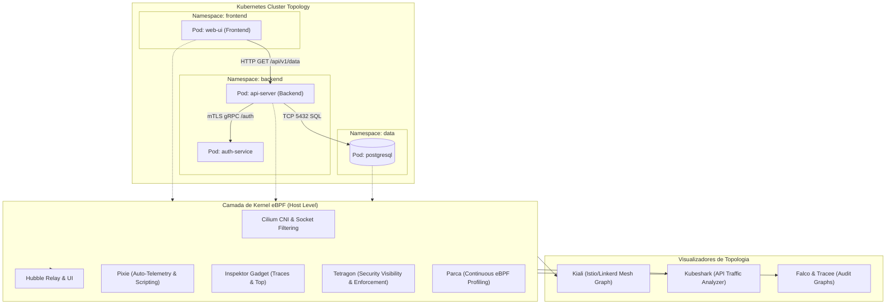

# ☸️ Topology, Traffic, and Security Mapping in Kubernetes & Containers (eBPF & Service Mesh)

This skill guides the AI to act as a **Kubernetes Cluster and Container Environment Mapping Specialist**, using kernel-level eBPF technologies, Service Meshes, and dynamic inspection tools to build communication maps between Pods, Services, Namespaces, network policies, and runtime security events.

---

## 🏛️ 1. Mapping Architecture in Kubernetes via eBPF & Service Mesh

Combining an eBPF-based CNI with a Service Mesh provides full visibility at the L3, L4, and L7 layers without the need for heavy sidecars:



---

## 🛠️ 2. Specialist Tools and Commands

### A. L3/L4/L7 Network and Topology Mapping

#### 1. Cilium & Hubble
- **Concept**: A high-performance eBPF-based CNI that replaces `kube-proxy` (via eBPF host routing) and **Hubble**, its observability layer that builds real-time service flow graphs, DNS, HTTP, and Network Policy drop monitoring.
- **CLI Inspection and Mapping Commands**:
```bash
# Observar fluxos L7 em tempo real filtrados por namespace e protocolo
hubble observe --namespace backend --protocol http --follow

# Inspecionar quedas de tráfego (Network Policy Drops)
hubble observe --verdict DROPPED --namespace backend

# Gerar mapa de fluxo entre serviços e endpoints
hubble observe --to-service backend/api-server -o jsonpb | jq '.flow | {src: .source.workload_names, dst: .destination.workload_names, l7: .l7}'
```

#### 2. Kiali (Service Mesh Topology)
- **Concept**: A management console and topology visualization for **Istio** and **Linkerd**. It renders directed call graphs, identifying request success rates, mTLS sidecar injection status, Canary/Blue-Green route versioning, and response times.

#### 3. Kubeshark (The API Traffic Analyzer for Kubernetes)
- **Concept**: An L7 traffic sniffer and analyzer for Kubernetes, capable of intercepting and decoding protocols such as HTTP/1.1, HTTP/2, gRPC, WebSocket, AMQP, Kafka, and Redis in real time, including channels encrypted via TLS through eBPF uretprobes.
- **CLI Usage**:
```bash
# Iniciar Kubeshark e abrir interface web local
kubeshark tap -n production
# Filtrar apenas chamadas com erro de status HTTP >= 400
kubeshark tap "response.status >= 400"
```

#### 4. Pixie (Open Source Kubernetes Observability via eBPF)
- **Concept**: A zero-code telemetry platform that automatically collects request traces, network metrics, CPU and memory usage per pod, and complete tables of HTTP/gRPC/SQL messages using **PxL** (Pixie Language) scripts.
- **PxL Query for database dependency mapping**:
```python
import px

# Mapear latência e queries SQL executadas por serviço
df = px.DataFrame(table='pgsql_events', start_time='-5m')
df.service = df.ctx['service']
df = df.groupby(['service', 'req']).agg(
    latency=('latency', px.mean),
    count=('latency', px.count)
)
px.display(df)
```

---

### B. Kernel Resource Mapping, Profiling, and Runtime Security

#### 1. Inspektor Gadget
- **Concept**: A collection of packaged tools and eBPF tools for debugging, process mapping, and container auditing in Kubernetes.
- **Essential Gadgets**:
```bash
# Rastrear novas conexões TCP abertas por pods em tempo real
kubectl gadget trace tcp --namespace production

# Mapear arquivos abertos e modificados por contêineres
kubectl gadget trace open -A

# Perfil de processos que mais consomem I/O de disco
kubectl gadget top block-io
```

#### 2. Parca (Continuous Profiling via eBPF)
- **Concept**: A continuous profiling system that captures CPU Flamegraphs, memory allocation, and native calls across the entire container fleet without overhead or code recompilation.

#### 3. Tetragon (eBPF-based Security Observability & Runtime Enforcement)
- **Concept**: The visibility and security enforcement mechanism of the Cilium project that maps process executions (`execve`), access to confidential files, network socket connections, and privilege escalation with synchronous blocking in the kernel.
- **Example TracingPolicy (`monitor-binaries.yaml`)**:
```yaml
apiVersion: cilium.io/v1alpha1
kind: TracingPolicy
metadata:
  name: "monitor-exec-sensitive"
spec:
  kprobes:
    - call: "sys_execve"
      syscall: true
      args:
        - index: 0
          type: "string"
      selectors:
        - matchArgs:
            - index: 0
              operator: "Prefix"
              values:
                - "/bin/bash"
                - "/bin/sh"
                - "/usr/bin/nc"
```

#### 4. Falco & Tracee
- **Falco (CNCF Graduated Runtime Security)**: Analyzes system call events through kernel drivers or eBPF to detect behavioral anomalies (shells in pods, writes to binary directories, modification of `/etc/passwd`).
- **Tracee (Aqua Security)**: An eBPF event forensic tracing mechanism specialized in detecting MITRE ATT&CK techniques for containers and Linux.

---

## 📊 3. Tool Selection Matrix by Use Case

| Mapping Need | Recommended Tool | Operating Layer |
| :--- | :--- | :--- |
| **Pod-to-Pod Topology and Network Policies** | **Cilium + Hubble** | eBPF Kernel / L3-L4-L7 |
| **Real-Time HTTP/gRPC Payload Inspection** | **Kubeshark** | eBPF uretprobes / L7 |
| **Istio/Linkerd Service Mesh Visualization** | **Kiali** | Sidecar Proxy / Control Plane |
| **SQL Query and Dependency Mapping** | **Pixie** | eBPF Kernel / Socket Data |
| **CPU/Memory Profiling (Flamegraphs)** | **Parca** | eBPF Perf Events |
| **Syscall and File Access Tracing** | **Inspektor Gadget** | eBPF Kprobes / Tracepoints |
| **Pod Security Anomaly Detection** | **Tetragon / Falco** | eBPF Kernel Hooks |

---

## 🎯 4. Best Practices and Recommendations

- [ ] **Disabling kube-proxy**: When adopting Cilium eBPF, enable `kubeProxyReplacement=true` to reduce iptables overhead and improve inter-service traffic routing.
- [ ] **L7 Latency Metrics with Hubble**: Enable `hubble.metrics.enabled="{dns,drop,tcp,flow,port-distribution,icmp,http}"` to export complete data to Prometheus.
- [ ] **Network Isolation Policies**: Use Hubble visualization to create least-privilege **CiliumNetworkPolicies** (Default Deny) based on real observed flows.
