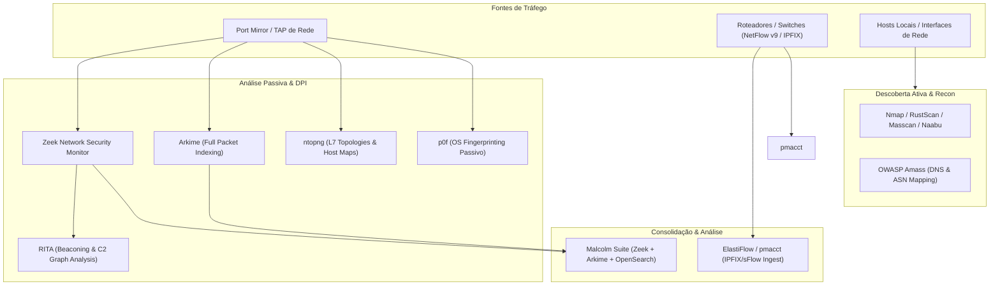

# 🌐 Network Flow Analysis, Deep Packet Inspection (DPI), and Active/Passive Discovery

This skill guides the AI to act as a **Network Flow Analysis and Communication Topology Discovery Specialist**, covering the mapping of L3/L4/L7 connections, passive inventory of operating systems and services, detection of hidden communication channels, and telemetry based on NetFlow/IPFIX/sFlow and PCAP.

---

## 🔍 1. Network and Flow Mapping Architecture

Network mapping combines statistical flow telemetry (NetFlow/IPFIX), real-time behavioral protocol analysis (Zeek/Arkime), and active port/service scanning:



---

## 🛠️ 2. Specialist Tools and Practical Commands

### A. Passive Traffic Analysis & DPI

#### 1. Zeek (formerly Bro)
- **Concept**: A security monitoring and application-layer protocol analysis engine (DNS, HTTP, SSL/TLS, SSH, SMB, DHCP, Modbus). It generates structured per-protocol logs and correlates connections through a unique connection identifier (`uid`).
- **PCAP analysis and log generation command**:
```bash
# Executar análise de captura e extrair metadados estruturados
zeek -r capture.pcap local "Site::local_nets += { 192.168.0.0/16, 10.0.0.0/8 }"

# Filtrar conexões HTTP de longa duração e serviços mapeados
zeek-cut id.orig_h id.orig_p id.resp_h id.resp_p service proto orig_bytes resp_bytes < conn.log
```

#### 2. ntopng
- **Concept**: A high-speed traffic monitor with nDPI (Deep Packet Inspection) support, categorizing flows by L7 application, identifying bandwidth anomalies, top talkers (*Top Talkers*), and local network maps.
- **CLI Execution / Monitoring**:
```bash
ntopng -i eth0 --local-networks "192.168.1.0/24,10.10.0.0/16" -F "es;flow;http://localhost:9200/_bulk;"
```

#### 3. Arkime (formerly Moloch)
- **Concept**: A session indexing and visualization system with full packet capture (PCAP). It offers visual search by network nodes, negotiated SSL certificates, and data transfer flows at terabyte/petabyte scale.

#### 4. Wireshark & TShark & tcpdump
- **tcpdump**: Lightweight command-line capture and filtering using BPF (Berkeley Packet Filters).
```bash
# Capturar tráfego SYN e RST entre sub-redes para mapeamento de conexões
tcpdump -nn -i eth0 'tcp[tcpflags] & (tcp-syn|tcp-rst) != 0' -w syn_flows.pcap
```
- **tshark**: The Wireshark CLI interface for dissecting and extracting structured fields.
```bash
# Mapear pares IP, portas e SNI TLS passivamente
tshark -r capture.pcap -Y "tls.handshake.extensions_server_name" -T fields -e ip.src -e ip.dst -e tls.handshake.extensions_server_name
```

#### 5. pmacct & ElastiFlow
- **pmacct**: An aggregation daemon for NetFlow v5/v9, IPFIX, sFlow, and BGP for enterprise routers and firewalls.
- **ElastiFlow**: A high-performance pipeline for enriching and visualizing flow data (Autonomous Systems, GeoIP, traffic types) in OpenSearch / Elastic Stack.

#### 6. p0f & NetworkMiner
- **p0f (Passive OS Fingerprinting)**: Identifies operating systems, MTU, uptime, and the presence of NAT or firewalls without sending a single packet to the target network.
```bash
p0f -i eth0 -o /tmp/p0f_fingerprints.log
```
- **NetworkMiner**: A passive network forensic analyzer that organizes traffic by host, extracting transferred files, credentials, certificates, and images in a structured way.

#### 7. RITA & Malcolm
- **RITA (Real Intelligence Threat Analytics)**: A Zeek log analysis framework for identifying periodic communication patterns (Beacons), DNS tunnels, and persistent C2 connections.
```bash
rita import --logs /path/to/zeek_logs/ dataset_prod
rita show-beacons dataset_prod
```
- **Malcolm**: A unified network traffic analysis suite combining Zeek, Arkime, Suricata, File Extraction, and ready-made dashboards in OpenSearch Dashboards.

---

### B. Active Asset Discovery and Port Mapping

#### 1. Nmap (Network Mapper)
- **Fast scanning of services, versions, and network topology**:
```bash
# Mapear sub-rede com resolução de serviços, scripts NSE seguros e traceroute
nmap -sS -sV -O --traceroute -p- --min-rate 1000 -T4 192.168.1.0/24 -oA network_map_subnet
```

#### 2. RustScan & Masscan & Naabu
- **RustScan**: An ultra-fast Rust port scanner integrated with Nmap for near-instant discovery of open ports across large CIDR blocks.
```bash
rustscan -a 192.168.1.0/24 --ulimit 5000 -b 2000 -- -sV -sC -oN rustscan_out.txt
```
- **Masscan**: An asynchronous scanner capable of scanning the entire Internet in minutes using a custom network driver.
```bash
masscan -p1-65535 10.0.0.0/8 --rate=10000 --exclude 255.255.255.255 -oJ masscan_corp.json
```
- **Naabu**: A lightweight, highly concurrent port scanner from ProjectDiscovery focused on automated recon pipelines and JSON integration.
```bash
naabu -list targets.txt -c 50 -rate 1000 -json -o open_ports.json
```

#### 3. OWASP Amass
- **Attack Surface and DNS/ASN Topology Mapping**: Maps relationships among domains, IP addresses, ASN blocks, SSL certificates, and WHOIS using open sources and active DNS enumeration techniques.
```bash
amass enum -d empresa.com -active -brute -asn 12345 -json amass_topology.json
amass viz -d3 -json amass_topology.json
```

---

## 📊 3. L4/L7 Flow Correlation Matrix

| Protocol | Default Port | Recommended Analyzer | Extracted Mapping Metadata |
| :--- | :--- | :--- | :--- |
| **HTTP/HTTPS** | 80, 443, 8080 | Zeek (`http.log`, `ssl.log`), ntopng | Host Header, TLS SNI, User-Agent, URIs, Methods |
| **DNS** | 53 (UDP/TCP), 853 | Zeek (`dns.log`), Wireshark | Query Names (FQDN), Responses, Authoritative DNS Servers |
| **Databases** | 5432, 3306, 1433, 27017 | TShark, Zeek Plugins | Client-server IP/Port pair, query volume, errors |
| **Messaging** | 9092 (Kafka), 5672 (AMQP) | Arkime, ntopng | Topics, message rate, cluster nodes |
| **SSH / RDP** | 22, 3389 | p0f, Zeek (`ssh.log`, `rdp.log`) | Supported ciphers, client versions, anomalous connections |

---

## 🎯 4. Best Practices and Recommendations

- [ ] **Lossless Packet Capture**: When using SPAN/Mirror ports, configure adequate ring buffers in `tcpdump`/`dumpcap` to avoid packet drops during traffic spikes.
- [ ] **Privacy Preservation**: When collecting PCAP in environments with sensitive data (PII, PCI-DSS), use truncation rules (`snaplen`) to capture only IP/TCP/UDP headers (e.g., `-s 96`).
- [ ] **Bidirectional Correlation**: Ensure correlation of outbound and inbound flows through the `(src_ip, src_port, dst_ip, dst_port, protocol)` tuple and compute traffic asymmetry metrics.
