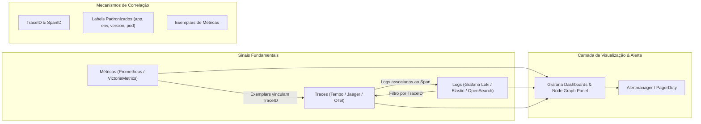

# 📈 Observability, Telemetry Correlation, and Dependency Dashboards

This skill guides the AI to act as an **Observability and Telemetry Data Correlation Specialist**, connecting time-series metrics (Prometheus/VictoriaMetrics), structured logs (Loki/Elastic/OpenSearch), and distributed traces to build unified health and system dependency dashboards.

---

## 🔗 1. The Observability Triad and Multidimensional Correlation

Effective correlation between observability signals lets the engineer move fluidly from a metric alert to the corresponding logs and the exact trace of the failing request:



---

## 🛠️ 2. Specialist Tools and Query Languages

### 1. Grafana & Node Graph Panel
- **Concept**: An analytics visualization and dashboard platform. It offers the **Node Graph Panel**, capable of rendering graphs of nodes and directed edges representing the microservice topology, with metrics for request rate (*Requests per second*), error rate (%), and average latency at each node.
- **Correlated Datasource Configuration**: It lets you configure *Data links* so that clicking an error bar in a Prometheus graph automatically redirects the user to Loki filtered by the same time range and `service_name`.

### 2. Prometheus & PromQL
- **Concept**: A pull-based time-series database and the de facto standard in the Cloud Native Computing Foundation (CNCF).
- **PromQL Queries for Dependency and Latency Mapping**:
```promql
# Taxa de requisições HTTP entre serviços nos últimos 5 minutos
sum by (service, endpoint, status_code) (rate(http_requests_total[5m]))

# Latência p99 de comunicação inter-serviços
histogram_quantile(0.99, sum by (le, service) (rate(http_request_duration_seconds_bucket[5m])))

# Taxa de erros 5xx que afetam SLAs
sum(rate(http_requests_total{status_code=~"5.."}[5m])) 
  / 
sum(rate(http_requests_total[5m])) * 100
```

### 3. VictoriaMetrics (High-Performance Time Series Database)
- **Concept**: A fast time-series database with high RAM/disk compression efficiency and full compatibility with PromQL and the Prometheus API (MetricsQL). Ideal for long-term metric retention in enterprise environments.

### 4. Grafana Loki & LogQL
- **Concept**: A log aggregation system inspired by Prometheus that indexes only metadata (labels) instead of the full text, resulting in lower storage consumption and native support for correlation with metrics.
- **Example LogQL Query correlating TraceID**:
```logql
{app="payment-service", env="production"} 
  |= "error" 
  | json 
  | trace_id != "" 
  | line_format "{{.timestamp}} [TraceID: {{.trace_id}}] - {{.message}}"
```

### 5. Elastic Stack (ELK: Elasticsearch, Logstash, Kibana) & OpenSearch
- **Concept**: Distributed search and analysis engines oriented to JSON documents at petabyte scale.
- **ECS Mapping (Elastic Common Schema)**: Standardization of field names (`service.name`, `client.ip`, `http.response.status_code`, `trace.id`) to enable universal correlations among infrastructure, proxy, firewall, and application logs.
- **OpenSearch Dashboards & Trace Analytics**: An integrated module for generating service graphs based on OpenTelemetry data.

---

## 📊 3. Label Standard for Universal Correlation

To enable transparent data cross-referencing between metrics, logs, and traces in Grafana, all applications and collectors should emit the following unified tags/labels:

| Label | Description | Example |
| :--- | :--- | :--- |
| `service.name` or `app` | Canonical service name | `order-service` |
| `service.version` | Commit version or release tag | `v2.4.1` |
| `deployment.environment` | Execution environment | `production`, `staging` |
| `k8s.namespace.name` | Kubernetes namespace | `ecommerce-backend` |
| `k8s.pod.name` | Pod instance name | `order-service-7f8d9b-x2k9l` |
| `trace.id` | Unique W3C trace identifier | `4bf92f3577b34da6a3ce929d0e0e4736` |

---

## 🎯 4. Observability Best Practices

- [ ] **Align the Four Golden Signals (Google SRE)**: Ensure every dependency map displays **Latency**, **Traffic**, **Errors**, and **Saturation** (CPU/RAM/Connections).
- [ ] **Enable Exemplars in Prometheus/Grafana**: Allows isolated high-latency points in metric graphs to contain the `traceID` for instant debugging in Tempo/Jaeger.
- [ ] **JSON Structuring in Logs**: Abandon plain-text prints in logs; always use structured JSON format with the `trace_id` key injected by the thread context.
