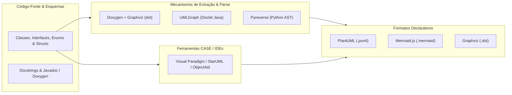
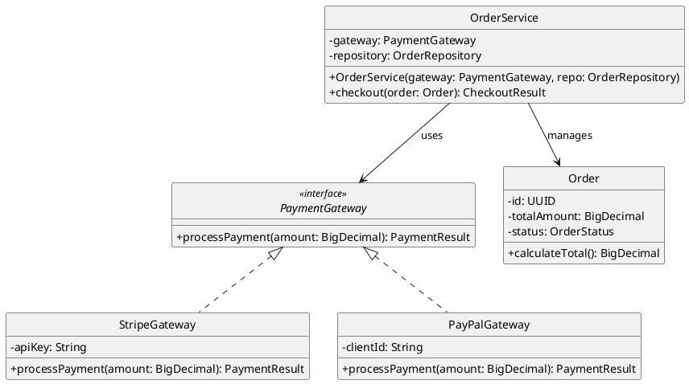
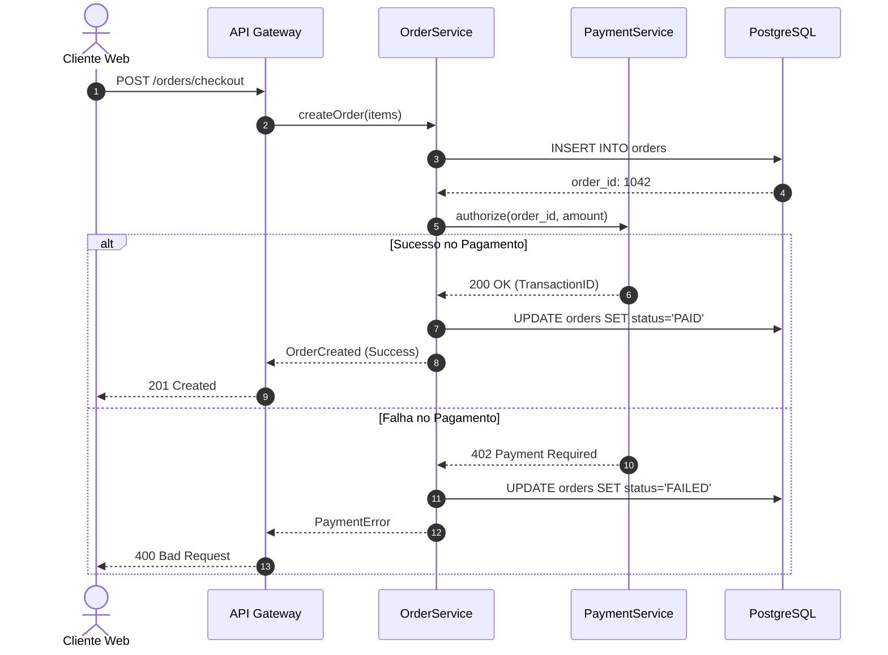

# 📐 UML Diagram Generation, Topologies, and Visual Modeling from Code

This skill guides the AI to act as a **Reverse Engineering and Automated UML and Structural Diagram Generation Specialist**, translating source code and architectural schemas into class, sequence, component, package, and state flow diagrams.

---

## 🎨 1. Modeling as Code Ecosystem (Diagrams as Code)

Declarative text-based modeling enables versioning in Git, continuous integration, and automatic rendering in documentation pipelines:



---

## 🛠️ 2. Specialist Diagram Generation Tools

### 1. PlantUML
- **Concept**: An open-source text-based component for UML modeling. It does not read code directly on its own, but it can be combined perfectly with free tools (such as `pyreverse` for Python or Java doclets) to extract classes and generate diagrams fully automatically. It supports Class, Sequence, Component, Activity, State, Use Case, and C4 Model diagrams.
- **Example Reverse Engineering for a Class Diagram with Dependency Injection**:


### 2. Doxygen + Graphviz (dot)
- **Concept**: One of the most traditional tools on the market for technical documentation and reverse engineering in C, C++, C#, Java, and Python. It generates inheritance, collaboration, and function dependency diagrams using the open-source **Graphviz** engine to render the graphs automatically from source code.
- **Essential configuration in `Doxyfile`**:
```text
PROJECT_NAME           = "CoreArchitecture"
EXTRACT_ALL            = YES
EXTRACT_PRIVATE        = YES
HAVE_DOT               = YES
CLASS_GRAPH            = YES
COLLABORATION_GRAPH    = YES
GROUP_GRAPHS           = YES
UML_LOOK               = YES
CALL_GRAPH             = YES
CALLER_GRAPH           = YES
DOT_IMAGE_FORMAT       = svg
GENERATE_LATEX         = NO
GENERATE_HTML          = YES
```

### 3. UMLGraph
- **Concept**: A doclet for the `javadoc` compiler that analyzes Java source code and `@opt`, `@hidden`, `@depend` annotations to generate Graphviz specifications and render class diagrams with surgical precision without external tools.

### 4. Mermaid.js
- **Concept**: A declarative diagramming syntax natively integrated into GitHub, GitLab, Notion, and modern IDEs.
- **Example Checkout Sequence Diagram**:


### 5. StarUML & Visual Paradigm & ObjectAid
- **StarUML**: A UML 2.x modeler with reverse engineering support for Java, C++, C# and generation of models in XMI and JSON formats.
- **Visual Paradigm**: A corporate software engineering suite with support for C4, SysML, BPMN, and ERD modeling and bidirectional code synchronization (*Round-trip Engineering*).
- **ObjectAid UML Explorer**: An Eclipse IDE plugin that draws class and sequence diagrams in real time via drag-and-drop of `.java` files.

### 6. Markmap (Interactive Markdown Mindmaps)
- **Concept**: An open-source visualization component that renders Markdown hierarchical trees as interactive vector mind maps (SVG/D3.js). Excellent for documenting the topology and architecture of folders, packages, and system flows in a dynamic, navigable way.
- **CLI Usage**:
```bash
npx markmap-cli architecture.md -o architecture-mindmap.html --open
```

---

## 📊 3. Diagram Types and Recommended Use Cases

| UML Diagram | Mapping Focus | Recommended Notation |
| :--- | :--- | :--- |
| **Class Diagram** | Type structure, inheritance, interfaces, attributes, and methods | PlantUML / Mermaid `classDiagram` |
| **Sequence Diagram** | Temporal order of message exchange between objects and services | Mermaid `sequenceDiagram` / PlantUML |
| **Component Diagram** | Organization of libraries, APIs, and execution subsystems | PlantUML / C4 Model Component |
| **State Diagram (FSM)** | Entity lifecycle and transitions (e.g., Order, Payment) | PlantUML `stateDiagram-v2` |
| **Call Graph / Include** | Function call tree and header dependencies | Doxygen + Graphviz DOT |

---

## 🎯 4. Best Practices in Diagram Generation

- [ ] **Appropriate Abstraction**: In high-level class diagrams, omit getters/setters and private utility attributes to focus on the domain and essential interactions.
- [ ] **Consistent Use of Colors and Styles**: Standardize interfaces with colors distinct from concrete classes and use clear stereotypes (`<<entity>>`, `<<value object>>`, `<<aggregate root>>`).
- [ ] **Living Documentation in the Repository**: Keep `.puml` and `.mermaid` sources in the same repository as the code to enable review in Pull Requests.
