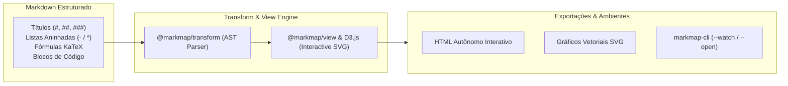

# 🧠 Interactive Mind-Map Visualization with Markmap (Markdown to Mindmap)

This skill guides the artificial intelligence to act as a **Markmap Specialist**, generating interactive, vector (SVG/D3.js), responsive mind maps directly from hierarchical Markdown structures, integrating math formulas (KaTeX), code blocks, icons, and visual customizations.

---

## 🗺️ 1. Markmap Architecture and Operating Principles

**Markmap** parses the Markdown Abstract Syntax Tree (AST) produced by CommonMark/GFM-compatible parsers and builds an interactive tree graph rendered through D3.js:



---

## 🛠️ 2. Installation and Command-Line Usage (CLI)

The `markmap-cli` package turns Markdown files into interactive presentations instantly:

```bash
# Gerar mapa mental HTML interativo autônomo
npx markmap-cli mindmap.md -o mindmap.html

# Abrir automaticamente no navegador com servidor de desenvolvimento local
npx markmap-cli mindmap.md --open

# Modo Live-Reload durante a edição da documentação
npx markmap-cli mindmap.md --watch
```

---

## 📝 3. Markmap Syntax and Advanced Features

### A. Configuration via YAML Frontmatter
The frontmatter header controls rendering behavior, expansion levels, and colors:

```markdown
---
markmap:
  colorFreezeLevel: 2
  initialExpandLevel: 2
  duration: 500
  maxWidth: 300
  zoom: true
  pan: true
---

# Sistema de Pagamentos Corporativo

## Arquitetura de Microsserviços
- **Order Service**
  - REST API `POST /orders`
  - Event Publisher (Kafka)
- **Payment Service**
  - Gateway Integration (Stripe / Pix)
  - Idempotency Controller
- **Notification Service**
  - Webhooks
  - Templates de E-mail

## Banco de Dados & Armazenamento
- PostgreSQL
  - *Read Replicas*
  - Conexões via PgBouncer
- Redis Cache
  - Rate Limiting
  - Session Tokens

## Segurança & Conformidade
- PCI-DSS v4.0
- Tokenização de Dados de Cartão
- TLS 1.3 End-to-End
```

### B. Integration with Math Formulas (KaTeX / LaTeX)
Markmap supports inline and block math equations:
```markdown
# Algoritmos de Machine Learning
## Regressão Linear
- Função de Custo: $J(\theta) = \frac{1}{2m} \sum_{i=1}^m (h_\theta(x^{(i)}) - y^{(i)})^2$
- Gradiente Descendente: $\theta_j := \theta_j - \alpha \frac{\partial}{\partial \theta_j} J(\theta)$
```

### C. Styling Nodes with HTML and Badges
Rich visual formatting can be embedded in individual nodes:
```markdown
# 🚀 Roadmap de Engenharia
## Backend <span class="badge" style="background:#28a745;color:#fff;padding:2px 6px;border-radius:4px;">Q1</span>
- Migração para Go 1.24
- Adoção de gRPC para comunicação interna
## Frontend <span class="badge" style="background:#007bff;color:#fff;padding:2px 6px;border-radius:4px;">Q2</span>
- Upgrade para React 19
- Otimização de Core Web Vitals
```

---

## 🎯 4. Best Practices for Creating Markmaps

1. **Depth Balance**: Keep between 3 and 5 nesting levels to guarantee fluid navigability and avoid visual overload.
2. **Concise Phrases**: Use objective topics, keywords, and backtick-wrapped code instead of long paragraphs.
3. **Using `colorFreezeLevel`**: Freeze the color level at `2` or `3` so that all child nodes share the color of their parent module, making visual semantic grouping easier.
