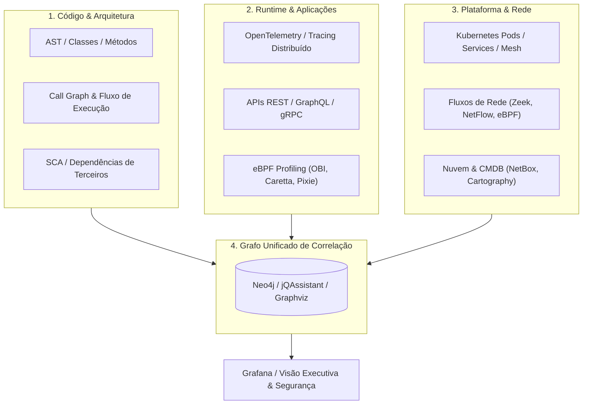

# 🗺️ AI Skill: Code & System Mapping Specialist

This skill empowers the artificial intelligence to act as a **Specialist in Complete Mapping of Software Systems and Infrastructure**, integrating static analysis of source code (AST, Call Graphs, Architecture), distributed runtime tracing (eBPF, OpenTelemetry), observability in Kubernetes clusters, network traffic discovery, cloud topology, reverse engineering of databases/binaries, and knowledge-graph modeling.

---

## 🧭 1. Overview and the Mapping Pyramid

Modern mapping goes beyond simple static analysis of directories. It unifies the structural view of the code with dynamic runtime behavior and the underlying infrastructure:

---

## 🛠️ 2. Mapping Domains and Specialization Matrix

The specialist orchestrates 13 fundamental mapping areas:

| Domain | Specialized Sub-Skill | Key Tools |
| :--- | :--- | :--- |
| **Code Mapping & C4 Model** | [`autodoc-code-explorer`](../../mapping/autodoc-code-explorer/SKILL.md) | AutoDoc MCP, Tree-Sitter AST, Rayon, Mermaid C4, Structurizr DSL, Taint Analysis |
| **App Discovery & Tracing** | [`app-dependency-discovery`](../../mapping/app-dependency-discovery/SKILL.md) | OpenTelemetry eBPF (OBI), Caretta, Jaeger, Zipkin, SkyWalking, SigNoz, Grafana Tempo |
| **Network Flow Analysis** | [`network-flow-discovery`](../../mapping/network-flow-discovery/SKILL.md) | Zeek, ntopng, Arkime, Wireshark, tcpdump, pmacct, ElastiFlow, NetworkMiner, p0f, RITA, Nmap |
| **Kubernetes, Containers & eBPF** | [`k8s-container-mapping`](../../mapping/k8s-container-mapping/SKILL.md) | Cilium, Hubble, Kiali, Kubeshark, Pixie, Inspektor Gadget, Parca, Tetragon, Falco, Tracee |
| **Infrastructure Inventory & CMDB** | [`infra-inventory-cmdb`](../../mapping/infra-inventory-cmdb/SKILL.md) | NetBox, OpenNMS, Netdisco, Ralph, GLPI, iTop, Device42, RackTables |
| **Cloud Topology & Hybrid Environments** | [`cloud-topology-mapping`](../../mapping/cloud-topology-mapping/SKILL.md) | Cartography, CloudMapper, Resoto, Steampipe, Azure Resource Graph, AWS SSM, GCP Asset |
| **Observability & Correlation** | [`observability-correlation`](../../mapping/observability-correlation/SKILL.md) | Grafana, Prometheus, Loki, OpenSearch, Elastic Stack (ELK), VictoriaMetrics |
| **Code Architecture & AST** | [`code-architecture-mapping`](../../mapping/code-architecture-mapping/SKILL.md) | ArchUnit, jQAssistant, Sonargraph, NDepend, Dependency Cruiser, Pyreverse, Sourcetrail, CodeScene |
| **Diagram & UML Generation** | [`uml-diagram-generation`](../../mapping/uml-diagram-generation/SKILL.md) | PlantUML, UMLGraph, ObjectAid, Visual Paradigm, StarUML, Doxygen, Graphviz, Mermaid |
| **Execution Flow & Call Graph** | [`execution-flow-callgraph`](../../mapping/execution-flow-callgraph/SKILL.md) | Go Callvis, Pyan3, Code2Flow, Doxygen, CodeScene, NDepend, Sourcetrail, Understand |
| **APIs & Service Mesh** | [`api-service-mesh-mapping`](../../mapping/api-service-mesh-mapping/SKILL.md) | OpenAPI/Swagger, Redoc, Backstage, Kong, APISIX, Gravitee, WSO2, Service Weaver, Kiali |
| **Databases & Schemas** | [`db-schema-reverse-mapping`](../../mapping/db-schema-reverse-mapping/SKILL.md) | SchemaSpy, DbSchema, DBeaver, ERBuilder, pgModeler, pgBadger, Percona PMM, SSDT |
| **Binary Reverse Engineering** | [`binary-app-reverse-mapping`](../../mapping/binary-app-reverse-mapping/SKILL.md) | Ghidra, Radare2, Cutter, JADX, ILSpy, dnSpyEx, Doxygen, Understand |
| **Relationship Graphs & Security** | [`graph-relationship-mapping`](../../mapping/graph-relationship-mapping/SKILL.md) | Neo4j, Cartography, BloodHound, jQAssistant, ArangoDB, JanusGraph, Attack Flow, OpenCTI |

---

## 📋 3. Five-Step Mapping Methodology

When called to map a repository, legacy system, or corporate ecosystem, the specialist must follow this workflow:

### Step 1: Structural Static Discovery
1. **Stack Identification**: Locate build manifests (`pom.xml`, `build.gradle`, `package.json`, `go.mod`, `pyproject.toml`, `Cargo.toml`, `*.csproj`).
2. **Dependency Extraction**: Run AST parsers and package graph generators (e.g., `dependency-cruiser --output-type dot`, `pyreverse -o png`, `godepgraph`).
3. **Entry Point Mapping**: Identify REST controllers, gRPC routes, messaging consumers (Kafka, RabbitMQ, SQS), and CLI commands.

### Step 2: Domain and Logical Layer Mapping
1. **Architecture Rules**: Validate conformance with Onion, Hexagonal, or Clean Architecture using automated architecture tests (e.g., ArchUnit / ArchUnitNET).
2. **Class and Component Diagrams**: Generate PlantUML / Mermaid specifications reflecting main entities, aggregates, and interfaces.

### Step 3: Persistence and Data Mapping
1. **Database Modeling**: Inspect migrations (Flyway, Liquibase, Prisma, Alembic) or live databases with `SchemaSpy` / `pgModeler` to produce relational ER diagrams.
2. **I/O Dependency Analysis**: Map tables accessed per service to avoid unwanted shared databases (the Shared Database Anti-Pattern).

### Step 4: Dynamic Runtime and Network Mapping
1. **eBPF / OpenTelemetry Tracing**: Capture execution spans across microservices, database latencies, and inter-pod traffic in Kubernetes with Cilium/Hubble or Pixie.
2. **Network Flows & Protocols**: Consolidate L4/L7 communication maps through Zeek and NetBox.

### Step 5: Graph Synthesis and Executive Report
1. **Graph Ingestion (Neo4j / jQAssistant)**: Relate `(Developer)-[:COMMITTED]->(File)-[:CONTAINS]->(Class)-[:CALLS]->(Method)-[:QUERIES]->(Table)`.
2. **Impact and Risk Matrix**: Present areas of high coupling, circular dependencies, technical debt, and exposed attack surface.

---

## 🛡️ 4. Engineering Best Practices and Guidelines

1. **Continuous Automation**: Integrate architectural dependency checks (`ArchUnit`, `dependency-cruiser --fail-on-violation`) into the CI/CD pipeline.
2. **Visibility Without Performance Impact**: Prefer eBPF-based telemetry and tracing that requires no source-code changes (*zero-code instrumentation*) in production.
3. **Visual Standardization**: Use C4 Model conventions (Context, Container, Component, Code) and consistent Mermaid/PlantUML diagrams for living documentation.
