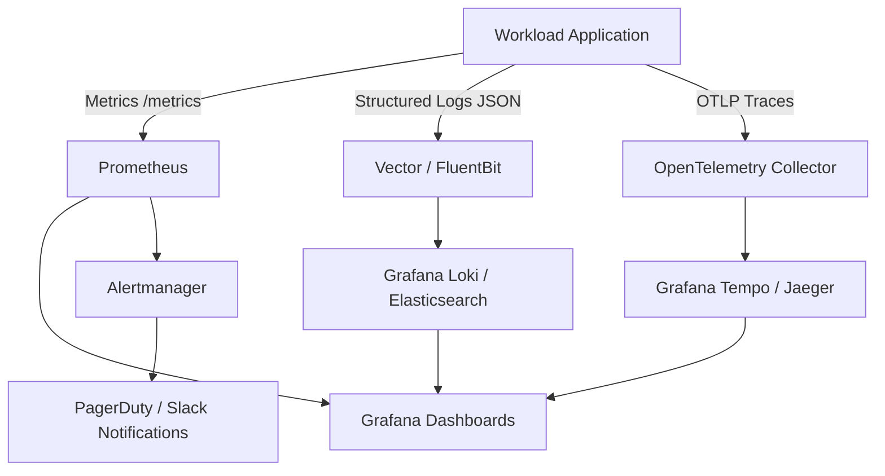

# 🚀 DevOps & Platform Engineering

The role of the **DevOps & Platform Engineer** has evolved from simple automation of deployment scripts into building robust, scalable, and resilient platforms that enable the *self-service* model for software development teams.

This guide consolidates architecture standards, essential tools, production code, and best practices for designing, implementing, and operating modern cloud-oriented infrastructure and hybrid environments.

---

## 🏗️ 1. Infrastructure as Code (IaC) with Terraform

Terraform is the industry-standard tool for declarative provisioning of multi-cloud infrastructure. Code design must prioritize modularity, immutability, and state isolation.

### 📁 Module Directory Structure
A professional architecture separates reusable modules from environment definitions (*live/environments*):

```text
terraform-architecture/
├── modules/
│   └── vpc/
│       ├── main.tf
│       ├── variables.tf
│       ├── outputs.tf
│       └── versions.tf
└── environments/
    ├── dev/
    │   ├── backend.tf
    │   ├── main.tf
    │   ├── terraform.tfvars
    │   └── variables.tf
    └── prod/
        ├── backend.tf
        ├── main.tf
        ├── terraform.tfvars
        └── variables.tf
```

### 🔒 Remote State with S3 and DynamoDB (AWS)
Remote state storage guarantees safe collaboration with concurrent *state locking*.

```hcl
# environments/prod/backend.tf
terraform {
  required_version = ">= 1.7.0"

  required_providers {
    aws = {
      source  = "hashicorp/aws"
      version = "~> 5.40.0"
    }
  }

  backend "s3" {
    bucket         = "company-terraform-state-prod"
    key            = "core-infra/vpc/terraform.tfstate"
    region         = "us-east-1"
    encrypt        = true
    dynamodb_table = "company-terraform-locks-prod"
  }
}
```

### 📦 Reusable VPC Module Example

```hcl
# modules/vpc/variables.tf
variable "vpc_cidr" {
  description = "The CIDR block for the VPC"
  type        = string
  default     = "10.0.0.0/16"

  validation {
    condition     = can(cidrnetmask(var.vpc_cidr))
    error_message = "The vpc_cidr must be a valid CIDR block."
  }
}

variable "environment" {
  description = "Deployment environment name"
  type        = string
}

variable "public_subnet_cidrs" {
  description = "List of public subnet CIDR blocks"
  type        = list(string)
}

variable "private_subnet_cidrs" {
  description = "List of private subnet CIDR blocks"
  type        = list(string)
}

variable "availability_zones" {
  description = "List of availability zones to distribute subnets"
  type        = list(string)
}
```

```hcl
# modules/vpc/main.tf
resource "aws_vpc" "main" {
  cidr_block           = var.vpc_cidr
  enable_dns_hostnames = true
  enable_dns_support   = true

  tags = {
    Name        = "vpc-${var.environment}"
    Environment = var.environment
    ManagedBy   = "Terraform"
  }
}

resource "aws_internet_gateway" "gw" {
  vpc_id = aws_vpc.main.id

  tags = {
    Name        = "igw-${var.environment}"
    Environment = var.environment
  }
}

resource "aws_subnet" "public" {
  count                   = length(var.public_subnet_cidrs)
  vpc_id                  = aws_vpc.main.id
  cidr_block              = var.public_subnet_cidrs[count.index]
  availability_zone       = var.availability_zones[count.index]
  map_public_ip_on_launch = true

  tags = {
    Name        = "subnet-${var.environment}-public-${count.index + 1}"
    Environment = var.environment
    Type        = "Public"
  }
}

resource "aws_subnet" "private" {
  count             = length(var.private_subnet_cidrs)
  vpc_id            = aws_vpc.main.id
  cidr_block        = var.private_subnet_cidrs[count.index]
  availability_zone = var.availability_zones[count.index]

  tags = {
    Name        = "subnet-${var.environment}-private-${count.index + 1}"
    Environment = var.environment
    Type        = "Private"
  }
}
```

```hcl
# modules/vpc/outputs.tf
output "vpc_id" {
  description = "Identifier of the created VPC"
  value       = aws_vpc.main.id
}

output "public_subnet_ids" {
  description = "List of IDs for public subnets"
  value       = aws_subnet.public[*].id
}

output "private_subnet_ids" {
  description = "List of IDs for private subnets"
  value       = aws_subnet.private[*].id
}
```

### 🔄 Lifecycle and Drift Detection
1. **Validation and Formatting**:
   ```bash
   terraform fmt -recursive
   terraform validate
   ```
2. **Safe Execution in CI**:
   ```bash
   terraform plan -out=tfplan.binary
   terraform apply tfplan.binary
   ```
3. **Drift Detection on a Cron Schedule**:
   ```bash
   # Exit code 2 indicates a drift occurred
   terraform plan -detailed-exitcode -no-color
   ```

---

## ⚙️ 2. Configuration Management & Automation with Ansible

Ansible provides *agentless* automation over SSH/WinRM, guaranteeing **idempotency** in configuring operating systems and applications.

### 📐 Directory Structure and Roles

```text
ansible-project/
├── ansible.cfg
├── inventory/
│   ├── production/
│   │   ├── hosts.yml
│   │   └── group_vars/
│   │       ├── all.yml
│   │       └── webservers.yml
│   └── staging/
│       └── hosts.yml
├── roles/
│   └── webserver/
│       ├── defaults/main.yml
│       ├── tasks/main.yml
│       ├── handlers/main.yml
│       ├── templates/nginx.conf.j2
│       └── vars/main.yml
└── site.yml
```

### 🏷️ Variable Precedence and Ansible Vault
Ansible's precedence order ranges from role defaults (lowest priority) to command-line arguments (`-e`, highest priority).

To encrypt secrets:
```bash
# Encrypt a secret variable
ansible-vault encrypt_string --vault-password-file .vault_pass 'supersecretpassword' --name 'db_password'

# Run playbook with vault file
ansible-playbook -i inventory/production/hosts.yml site.yml --vault-password-file .vault_pass
```

### 📄 Idempotent Playbook and Role Example

```yaml
# inventory/production/hosts.yml
all:
  children:
    webservers:
      hosts:
        web-node-01.internal:
          ansible_host: 10.0.10.21
        web-node-02.internal:
          ansible_host: 10.0.10.22
      vars:
        http_port: 80
        server_name: api.production.internal
```

```yaml
# roles/webserver/tasks/main.yml
---
# Install and configure NGINX web server
- name: Ensure NGINX package is installed
  ansible.builtin.package:
    name: nginx
    state: present

- name: Deploy NGINX configuration from template
  ansible.builtin.template:
    src: nginx.conf.j2
    dest: /etc/nginx/nginx.conf
    owner: root
    group: root
    mode: '0644'
  notify: Restart NGINX service

- name: Ensure NGINX service is enabled and running
  ansible.builtin.service:
    name: nginx
    state: started
    enabled: true

- name: Deploy web root content
  ansible.builtin.copy:
    content: "OK - Managed by Ansible\n"
    dest: /var/www/html/healthz
    owner: www-data
    group: www-data
    mode: '0644'
```

```yaml
# roles/webserver/handlers/main.yml
---
- name: Restart NGINX service
  ansible.builtin.service:
    name: nginx
    state: restarted
```

```yaml
# site.yml
---
- name: Configure Production Web Fleet
  hosts: webservers
  become: true
  roles:
    - role: webserver
```

---

## 💻 3. Local Development Environments with Vagrant

Vagrant lets you provision reproducible, portable development environments locally, integrating with hypervisors (VirtualBox, VMware, Libvirt, Hyper-V).

### ⚙️ Multi-Machine Vagrantfile with Shell and Ansible Provisioning

```ruby
# -*- mode: ruby -*-
# vi: set ft=ruby :

Vagrant.configure("2") do |config|
  config.vm.box = "ubuntu/jammy64"
  config.vm.box_check_update = true

  # Global synced folder
  config.vm.synced_folder "./app", "/var/www/app", type: "nfs", mount_options: ["actimeo=1"]

  # Global VM provider configuration
  config.vm.provider "virtualbox" do |vb|
    vb.gui = false
    vb.linked_clone = true
  end

  # Node 1: Web Application Server
  config.vm.define "app-node" do |app|
    app.vm.hostname = "app-node.local"
    app.vm.network "private_network", ip: "192.168.56.10"
    app.vm.network "forwarded_port", guest: 80, host: 8080, auto_correct: true

    app.vm.provider "virtualbox" do |vb|
      vb.memory = "2048"
      vb.cpus = 2
    end

    # Bootstrap with shell provisioner
    app.vm.provision "shell", inline: <<-SHELL
      export DEBIAN_FRONTEND=noninteractive
      apt-get update && apt-get install -y curl ufw git
      ufw allow 80/tcp
    SHELL

    # Configure using Ansible Local provisioner
    app.vm.provision "ansible_local" do |ansible|
      ansible.playbook = "ansible/site.yml"
      ansible.install_mode = "pip"
    end
  end

  # Node 2: Database Server
  config.vm.define "db-node" do |db|
    db.vm.hostname = "db-node.local"
    db.vm.network "private_network", ip: "192.168.56.11"

    db.vm.provider "virtualbox" do |vb|
      vb.memory = "1024"
      vb.cpus = 1
    end

    db.vm.provision "shell", inline: <<-SHELL
      apt-get update && apt-get install -y postgresql postgresql-contrib
      systemctl enable --now postgresql
    SHELL
  end
end
```

---

## ☸️ 4. Kubernetes Orchestration and Operations

Kubernetes is the execution engine for modern microservices. Corporate configurations demand resilience with **HPA**, **PDB**, and **Resource Quotas**, plus continuous delivery via **GitOps**.

### 📜 Production Application Manifest

```yaml
apiVersion: apps/v1
kind: Deployment
metadata:
  name: order-service
  namespace: production
  labels:
    app.kubernetes.io/name: order-service
    app.kubernetes.io/part-of: ecommerce
spec:
  replicas: 3
  revisionHistoryLimit: 5
  strategy:
    type: RollingUpdate
    rollingUpdate:
      maxSurge: 25%
      maxUnavailable: 0
  selector:
    matchLabels:
      app: order-service
  template:
    metadata:
      labels:
        app: order-service
    spec:
      containers:
        - name: app
          image: ghcr.io/company/order-service:v2.4.1
          imagePullPolicy: IfNotPresent
          ports:
            - containerPort: 8080
              name: http
          env:
            - name: DATABASE_URL
              valueFrom:
                secretKeyRef:
                  name: order-service-secret
                  key: database-url
            - name: LOG_LEVEL
              valueFrom:
                configMapKeyRef:
                  name: order-service-config
                  key: log-level
          resources:
            requests:
              cpu: "250m"
              memory: "256Mi"
            limits:
              cpu: "1000m"
              memory: "512Mi"
          readinessProbe:
            httpGet:
              path: /healthz/ready
              port: http
            initialDelaySeconds: 5
            periodSeconds: 10
          livenessProbe:
            httpGet:
              path: /healthz/live
              port: http
            initialDelaySeconds: 15
            periodSeconds: 20
---
apiVersion: v1
kind: Service
metadata:
  name: order-service
  namespace: production
spec:
  type: ClusterIP
  selector:
    app: order-service
  ports:
    - name: http
      port: 80
      targetPort: http
---
apiVersion: networking.k8s.io/v1
kind: Ingress
metadata:
  name: order-service-ingress
  namespace: production
  annotations:
    kubernetes.io/ingress.class: "nginx"
    cert-manager.io/cluster-issuer: "letsencrypt-production"
    nginx.ingress.kubernetes.io/ssl-redirect: "true"
spec:
  tls:
    - hosts:
        - orders.company.com
      secretName: order-service-tls
  rules:
    - host: orders.company.com
      http:
        paths:
          - path: /
            pathType: Prefix
            backend:
              service:
                name: order-service
                port:
                  name: http
```

### 📈 High Availability: HPA and PDB

```yaml
apiVersion: autoscaling/v2
kind: HorizontalPodAutoscaler
metadata:
  name: order-service-hpa
  namespace: production
spec:
  scaleTargetRef:
    apiVersion: apps/v1
    kind: Deployment
    name: order-service
  minReplicas: 3
  maxReplicas: 20
  metrics:
    - type: Resource
      resource:
        name: cpu
        target:
          type: Utilization
          averageUtilization: 70
    - type: Resource
      resource:
        name: memory
        target:
          type: Utilization
          averageUtilization: 80
---
apiVersion: policy/v1
kind: PodDisruptionBudget
metadata:
  name: order-service-pdb
  namespace: production
spec:
  minAvailable: 2
  selector:
    matchLabels:
      app: order-service
```

### 🐙 GitOps with an ArgoCD Application

```yaml
apiVersion: argoproj.io/v1alpha1
kind: Application
metadata:
  name: order-service-prod
  namespace: argocd
  finalizers:
    - resources-finalizer.argocd.argoproj.io
spec:
  project: default
  source:
    repoURL: 'https://github.com/company/gitops-manifests.git'
    targetRevision: main
    path: overlays/production/order-service
  destination:
    server: 'https://kubernetes.default.svc'
    namespace: production
  syncPolicy:
    automated:
      prune: true
      selfHeal: true
    syncOptions:
      - CreateNamespace=true
```

---

## 🖥️ 5. Virtual Machine Management & Golden Images

Although containers dominate ephemeral workloads, **Virtual Machines (VMs)** are the foundation for hypervisors, bare-metal databases, Kubernetes clusters (control plane / worker nodes), and workloads requiring strict kernel isolation.

### 📊 Comparison: Virtual Machines vs Containers

| Characteristic | Virtual Machines (VMs) | Containers (Docker / Podman) |
| :--- | :--- | :--- |
| **Isolation** | Hypervisor (Hardware-level / Type 1 or 2) | Namespaces and cgroups (OS-level) |
| **Kernel** | Own independent kernel per VM | Shared with the Host OS |
| **Boot Time** | Seconds to minutes | Milliseconds to seconds |
| **Overhead / Footprint** | GBs of storage and dedicated RAM | MBs to GBs, sharing layers |
| **Use Cases** | Kubernetes host, legacy DBs, strict multi-tenant | Microservices, CI jobs, stateless APIs |

### 🍞 Image Baking with HashiCorp Packer (HCL2)

```hcl
# ubuntu-golden-image.pkr.hcl
packer {
  required_plugins {
    amazon = {
      version = ">= 1.2.8"
      source  = "github.com/hashicorp/amazon"
    }
  }
}

source "amazon-ebs" "ubuntu_golden" {
  ami_name      = "golden-ubuntu-2204-base-{{timestamp}}"
  instance_type = "t3.medium"
  region        = "us-east-1"

  source_ami_filter {
    filters = {
      name                = "ubuntu/images/hvm-ssd/ubuntu-jammy-22.04-amd64-server-*"
      root-device-type    = "ebs"
      virtualization-type = "hvm"
    }
    most_recent = true
    owners      = ["099720109477"] # Canonical
  }

  ssh_username = "ubuntu"
  tags = {
    OS          = "Ubuntu 22.04"
    BaseAMI     = "GoldenImage"
    ManagedBy   = "Packer"
    Environment = "Core"
  }
}

build {
  name    = "build-golden-ami"
  sources = ["source.amazon-ebs.ubuntu_golden"]

  provisioner "shell" {
    inline = [
      "export DEBIAN_FRONTEND=noninteractive",
      "sudo apt-get update && sudo apt-get upgrade -y",
      "sudo apt-get install -y fail2ban auditd awscli jq curl unattended-upgrades",
      "sudo systemctl enable fail2ban auditd"
    ]
  }

  provisioner "ansible" {
    playbook_file = "./ansible/hardening-playbook.yml"
    user          = "ubuntu"
  }
}
```

### ☁️ Initial Customization via Cloud-Init

```yaml
#cloud-config
package_upgrade: true
packages:
  - curl
  - jq
  - htop
  - docker.io

users:
  - name: devops
    groups: sudo, docker
    shell: /bin/bash
    sudo: ['ALL=(ALL) NOPASSWD:ALL']
    ssh_authorized_keys:
      - ssh-ed25519 AAAAC3NzaC1lZDI1NTE5AAAAIExampleKeyDevOpsEngineer123456

write_files:
  - path: /etc/docker/daemon.json
    content: |
      {
        "log-driver": "json-file",
        "log-opts": {
          "max-size": "100m",
          "max-file": "3"
        }
      }
    permissions: '0644'

runcmd:
  - systemctl restart docker
  - ufw default deny incoming
  - ufw default allow outgoing
  - ufw allow 22/tcp
  - ufw enable
```

---

## 🏛️ 6. Internal Developer Platform (IDP) with Backstage

**Backstage** (developed by Spotify and maintained by the CNCF) serves as the central developer portal (IDP), aggregating a **Software Catalog**, **Software Templates (Scaffolder)**, **TechDocs**, and operational metrics.

### 📑 Software Catalog: `catalog-info.yaml`

```yaml
apiVersion: backstage.io/v1alpha1
kind: Component
metadata:
  name: payment-gateway-api
  description: Core microservice responsible for processing credit card and pix transactions.
  annotations:
    github.com/project-slug: company/payment-gateway-api
    backstage.io/techdocs-ref: dir:.
    argocd/app-name: payment-gateway-api-prod
    datadog/service-name: payment-gateway
    sonarqube.org/project-key: company_payment-gateway-api
  tags:
    - java
    - spring-boot
    - fintech
    - pci-dss
spec:
  type: service
  lifecycle: production
  owner: group:payments-team
  system: payment-system
  providesApis:
    - payment-v2-api
  dependsOn:
    - resource:payment-aurora-db
    - component:fraud-detection-service
```

### 🧩 Software Template (Scaffolder): `template.yaml`

```yaml
apiVersion: scaffolder.backstage.io/v1beta3
kind: Template
metadata:
  name: springboot-microservice-template
  title: Production-Ready Spring Boot Service
  description: Scaffolds a complete Spring Boot 3 service with CI/CD, Helm chart, Dockerfile and SonarQube.
spec:
  owner: group:platform-team
  type: service
  parameters:
    - title: Service Configuration
      required:
        - component_id
        - owner
      properties:
        component_id:
          title: Service Identifier
          type: string
          description: Unique kebab-case name for the repo and deployment
        owner:
          title: Owning Team
          type: string
          ui:field: OwnerPicker
          ui:options:
            allowedKinds:
              - Group

  steps:
    - id: template
      name: Fetch Skeleton Template
      action: fetch:template
      input:
        url: ./skeleton
        values:
          component_id: ${{ parameters.component_id }}
          owner: ${{ parameters.owner }}

    - id: publish
      name: Publish to GitHub
      action: publish:github
      input:
        allowedHosts: ['github.com']
        description: Service created via Backstage IDP
        repoUrl: github.com?owner=company&repo=${{ parameters.component_id }}
        defaultBranch: main

    - id: register
      name: Register in Software Catalog
      action: catalog:register
      input:
        repoContentsUrl: ${{ steps.publish.output.repoContentsUrl }}
        catalogInfoPath: '/catalog-info.yaml'

  output:
    links:
      - title: Open GitHub Repository
        url: ${{ steps.publish.output.remoteUrl }}
```

---

## 🔄 7. Modern CI/CD Pipelines

Software integrity is ensured by deterministic pipelines with code validation, continuous security (SAST/SCA/Container Scan), and automated deployment and rollback strategies.


### 🛠️ Production Pipeline (GitHub Actions)

```yaml
# .github/workflows/ci-cd-pipeline.yml
name: Continuous Integration & Deployment

on:
  push:
    branches: [main]
  pull_request:
    branches: [main]

permissions:
  contents: read
  packages: write
  id-token: write

env:
  REGISTRY: ghcr.io
  IMAGE_NAME: ${{ github.repository }}

jobs:
  validate:
    name: Lint, Test & SAST
    runs-on: ubuntu-latest
    steps:
      - name: Checkout Code
        uses: actions/checkout@v4

      - name: Setup Node.js Environment
        uses: actions/setup-node@v4
        with:
          node-version: 20
          cache: 'npm'

      - name: Install Dependencies & Run Tests
        run: |
          npm ci
          npm run lint
          npm test -- --coverage

      - name: Run Trivy Vulnerability Scanner (Filesystem)
        uses: aquasecurity/trivy-action@master
        with:
          scan-type: 'fs'
          ignore-unfixed: true
          severity: 'CRITICAL,HIGH'
          exit-code: '1'

  build-and-push:
    name: Build & Push OCI Image
    needs: [validate]
    if: github.ref == 'refs/heads/main'
    runs-on: ubuntu-latest
    outputs:
      image_tag: ${{ steps.meta.outputs.version }}
    steps:
      - name: Checkout Code
        uses: actions/checkout@v4

      - name: Set up Docker Buildx
        uses: docker/setup-buildx-action@v3

      - name: Log in to Container Registry
        uses: docker/login-action@v3
        with:
          registry: ${{ env.REGISTRY }}
          username: ${{ github.actor }}
          password: ${{ secrets.GITHUB_TOKEN }}

      - name: Extract Docker metadata
        id: meta
        uses: docker/metadata-action@v5
        with:
          images: ${{ env.REGISTRY }}/${{ env.IMAGE_NAME }}
          tags: |
            type=sha,format=short,prefix=
            type=raw,value=latest

      - name: Build and push Docker image
        uses: docker/build-push-action@v5
        with:
          context: .
          push: true
          tags: ${{ steps.meta.outputs.tags }}
          labels: ${{ steps.meta.outputs.labels }}
          cache-from: type=gha
          cache-to: type=gha,mode=max

  gitops-promote:
    name: Trigger GitOps Promotion
    needs: [build-and-push]
    runs-on: ubuntu-latest
    steps:
      - name: Update Target Image Tag in GitOps Repo
        uses: actions/github-script@v7
        with:
          github-token: ${{ secrets.GITOPS_REPO_PAT }}
          script: |
            // Trigger repository_dispatch or direct commit to GitOps repository
            console.log("Promoting image tag ${{ needs.build-and-push.outputs.image_tag }} to production");
```

### 🎯 Deployment and Rollback Strategies

| Strategy | Description | Pros | Cons | Rollback Mechanism |
| :--- | :--- | :--- | :--- | :--- |
| **Rolling Update** | Updates pods incrementally, batch by batch | Zero downtime, no extra infra cost | Mixed versions running simultaneously | `kubectl rollout undo deployment/<name>` |
| **Blue/Green** | Identical mirrored environment (Green) provisioned in parallel | Instant traffic switch, isolation | Double the infrastructure cost | Immediate traffic redirection in the Ingress/LoadBalancer |
| **Canary** | Sends a gradual percentage of traffic (e.g., 5% -> 25% -> 100%) | Early anomaly detection with telemetry | Requires a service mesh or advanced ingress controller | Automatic reversal upon detecting a rise in HTTP 5xx error rate |

---

## 📊 8. Observability and Reliability Engineering (SRE)

Observability is not just passive monitoring; it is the ability to infer the system's internal state from its external outputs: **Metrics**, **Logs**, and **Traces**.



### 🚨 SLO/SLI-Based Alerts (Prometheus Operator)

```yaml
apiVersion: monitoring.coreos.com/v1
kind: PrometheusRule
metadata:
  name: order-service-slo-alerts
  namespace: production
  labels:
    role: alert-rules
spec:
  groups:
    - name: order-service-slo
      rules:
        # Calculate HTTP 5xx error rate over 5 minutes
        - record: job:http_requests_error_ratio:rate5m
          expr: |
            sum(rate(http_requests_total{job="order-service",status=~"5.."}[5m]))
            /
            sum(rate(http_requests_total{job="order-service"}[5m]))

        # Alert if burn rate exceeds 1% error budget rapidly
        - alert: HighHttpErrorRateSLOBurn
          expr: job:http_requests_error_ratio:rate5m > 0.01
          for: 2m
          labels:
            severity: critical
            team: payments
          annotations:
            summary: "Critical error budget burn rate on order-service"
            description: "High error rate detected: {{ $value | humanizePercentage }} of requests are failing with 5xx status."
            runbook_url: "https://wiki.company.com/ops/runbooks/order-service-5xx"
```

---

## 🛠️ 9. Platform Engineering & Developer Experience (DX)

The transition from traditional DevOps to **Platform Engineering** replaces the infrastructure ticket queue (*ticket-ops*) with the delivery of a **Platform as a Product**:

```text
[ Desenvolvedores de Produto ]
             │
             ▼  (Self-Service / APIs / Golden Paths)
┌─────────────────────────────────────────────────────────┐
│        INTERNAL DEVELOPER PLATFORM (IDP)                │
│  ├── Backstage (Software Catalog & Templates)           │
│  ├── GitOps Engine (ArgoCD / Flux)                      │
│  ├── IaC Modules (Terraform Registry / Crossplane)      │
│  └── Telemetry Stack (OpenTelemetry / Grafana / O11y)   │
└─────────────────────────────────────────────────────────┘
             │
             ▼  (Provisionamento Declarativo e Seguro)
[ Multi-Cloud & Bare-Metal Infrastructure ]
```

### 🛣️ Golden Path Principles
1. **Paved Roads**: Offer opinionated standards where security, observability, and CI/CD are already integrated by default.
2. **Frictionless Autonomy**: Developers must be able to provision databases, messaging topics, and services without waiting for manual approvals for test and validation environments.
3. **DORA Metrics as a Compass**:
   - **Deployment Frequency**: Frequency of successful deployments to production.
   - **Lead Time for Changes**: Time between the code commit and running in production.
   - **Change Failure Rate**: Percentage of deployments that cause production incidents.
   - **Failed Deployment Recovery Time (MTTR)**: Average time to restore the service in case of degradation.

---

## 🔗 Related Skills

- [devsecops-engineer](../../security/operations/devsecops-engineer/SKILL.md)
- [software-architect](../software-architect/SKILL.md)
- [program-github](../../platforms/program-github-actions/SKILL.md)
- [github-actions](../../platforms/program-github-actions/SKILL.md)
- [containers](../../infrastructure/program-containers/SKILL.md)
