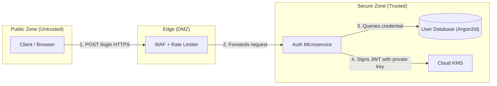

# Practical Threat Modeling Example (STRIDE)

Modeling example for an authentication and token-issuance microservice.

## 1. Data Flow Diagram (Logical DFD)

## 2. Table of Identified Threats

| ID | Element | Category | Attack Scenario Description | Severity | Proposed Mitigation (ASVS) |
| :--- | :--- | :--- | :--- | :--- | :--- |
| **TM-01** | `POST /login` | **Denial of Service** | Attacker fires 50k login requests/s, causing exhaustion of database connections | HIGH | Rate limiting at the WAF (max 10 req/min per IP) + progressive CAPTCHA |
| **TM-02** | `AuthService` | **Spoofing** | Attacker forces the `none` algorithm in the JWT header | CRITICAL | Strict RS256 algorithm validation in the backend, explicitly rejecting `none` or symmetric keys |
| **TM-03** | `UserDB` | **Information Disclosure** | Database backup containing passwords leaked to the internet | CRITICAL | Password hashing via Argon2id + encryption of backups at rest with a managed KMS key |
