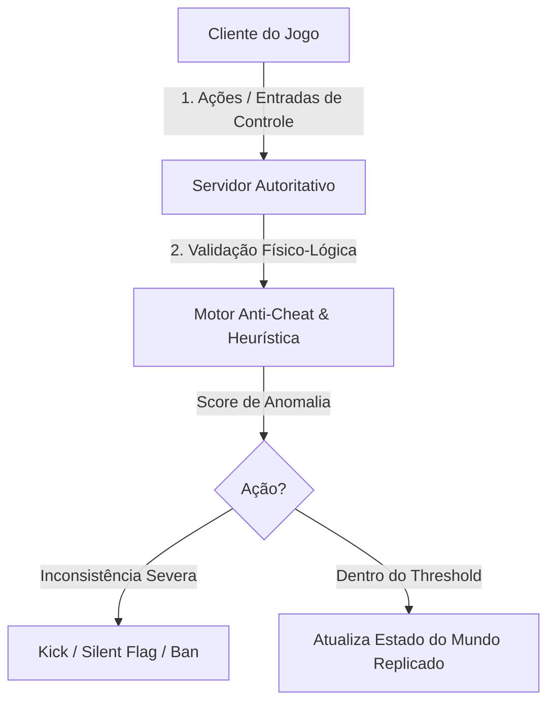

# Security, Reverse Engineering, and Hardening in Game Engines (Unity, Unreal, Godot)

This skill provides comprehensive guidelines for offensive auditing, security testing, reverse engineering, and the implementation of defenses and anti-cheat in modern game engines: **Unity Engine**, **Unreal Engine**, and **Godot Engine**.

---

## 🎮 1. Comparative Matrix of Attack Vectors by Engine

| Engine | Code Format | Asset Package | Critical Attack Vectors | Typical Reverse Engineering Tools |
| :--- | :--- | :--- | :--- | :--- |
| **Unity** | C# (Mono IL) or native C++ (IL2CPP) | `.assets`, AssetBundles, Addressables | Dumping `global-metadata.dat`, decompiling `Assembly-CSharp.dll`, hooking with BepInEx/Frida | `dnSpy`, `ILSpy`, `Il2CppDumper`, `Il2CppInspector`, `AssetRipper` |
| **Unreal Engine** | Native compiled C++ or Blueprints | `.pak`, IoStore (`.utoc`/`.ucas`) | Unpacking `.pak`, injection into non-authoritative RPCs, console commands (`EnableCheats`) | `FModel`, `UModel`, `UnrealPak`, `Cheat Engine`, `Ghidra` |
| **Godot** | GDScript (`.gdc` bytecode), C# or C++ (GDExtension) | `.pck`, `.zip` | Extracting `.pck` through GDRETools, extracting the AES key from RAM, bytecode bypass | `GDRETools`, `gdsdecomp`, `x64dbg`, `IDA Pro`, `Cheat Engine` |

---

## 🛡️ 2. Hardening and Protections in Unity Engine

### 2.1 IL2CPP Compilation and Metadata Protection

- **Mandatory IL2CPP**: In *Project Settings > Player*, set *Scripting Backend* to `IL2CPP`. The C# code is converted to native C++ and compiled to machine code.
- **Obfuscation and Metadata Obfuscation**:
  - Remove or obfuscate strings in `global-metadata.dat` (class and method names) using tools such as *BeeByte Obfuscator* or *Obfuscar*.
  - Apply custom encryption when loading `global-metadata.dat` before the Unity runtime starts.

### 2.2 Protection Against Memory Editing

- Use obfuscated types for critical variables (health, coins, score):

```csharp
public struct ObfuscatedInt
{
    private int _cryptoKey;
    private int _hiddenValue;

    public ObfuscatedInt(int value)
    {
        _cryptoKey = UnityEngine.Random.Range(1000, 99999);
        _hiddenValue = value ^ _cryptoKey;
    }

    public int GetValue() => _hiddenValue ^ _cryptoKey;
    public void SetValue(int value) => _hiddenValue = value ^ _cryptoKey;
}
```

---

## 🛡️ 3. Hardening and Protections in Unreal Engine

### 3.1 `.pak` and IoStore File Encryption

- Enable AES-256 encryption in *Project Settings > Crypto* (256-bit key).
- In production builds (*Shipping*), make sure `bDisableDebugConsole=true` and cheat console flags (`EnableCheats`, `ToggleDebugCamera`) are disabled through the C++ preprocessor `#if !UE_BUILD_SHIPPING`.

### 3.2 Network Security and Server Authority

- **Server-Authoritative Physics & Movement**: The client sends input commands (`MoveForward`, `FireWeapon`), and the server computes positions and hits, replicating state through `ReplicatedUsing`.
- **Strict RPC Validation**:

```cpp
// Validação server-side obrigatória em RPCs
bool AGameCharacter::ServerFireWeapon_Validate(FVector AimDirection)
{
    // Rejeitar se a direção for NaN ou além do campo de visão possível
    return !AimDirection.ContainsNaN() && FVector::DotProduct(GetActorForwardVector(), AimDirection) > -0.2f;
}
```

---

## 🛡️ 4. Hardening and Protections in Godot Engine

### 4.1 Custom Export Templates and `.pck` Encryption

- Build export templates from the Godot source using SCons with an embedded AES key:
  ```bash
  scons platform=windows target=template_release script_encryption_key="MINHA_CHAVE_HEX_256_BITS"
  ```
- Change the magic bytes and header structure of the package file in `core/io/file_access_pack.cpp` to neutralize automated unpacking tools such as GDRETools.

### 4.2 Critical Logic in GDExtension C++

- Move anti-fraud logic, combat rule validation, and proprietary algorithms from GDScript into native compiled C++ modules (`GDExtension`).

---

## 🔒 5. Integrated Anti-Cheat Architecture


