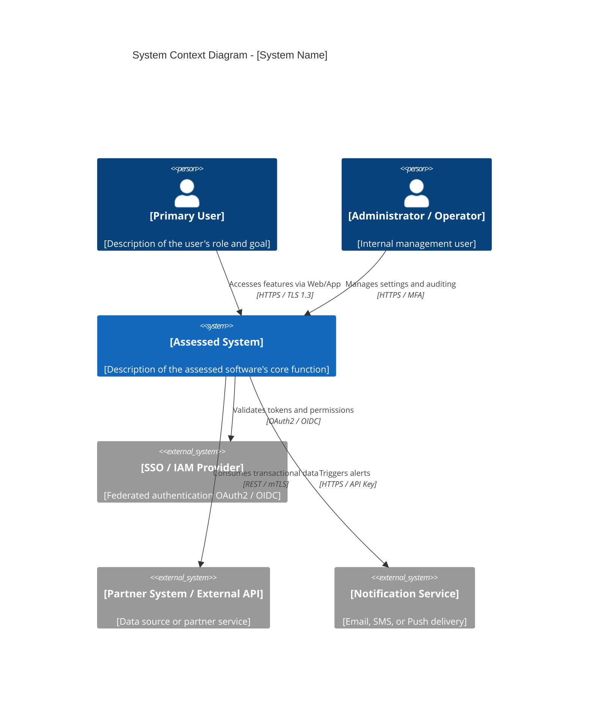
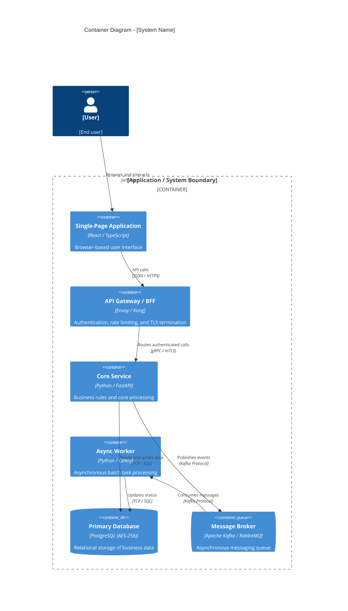
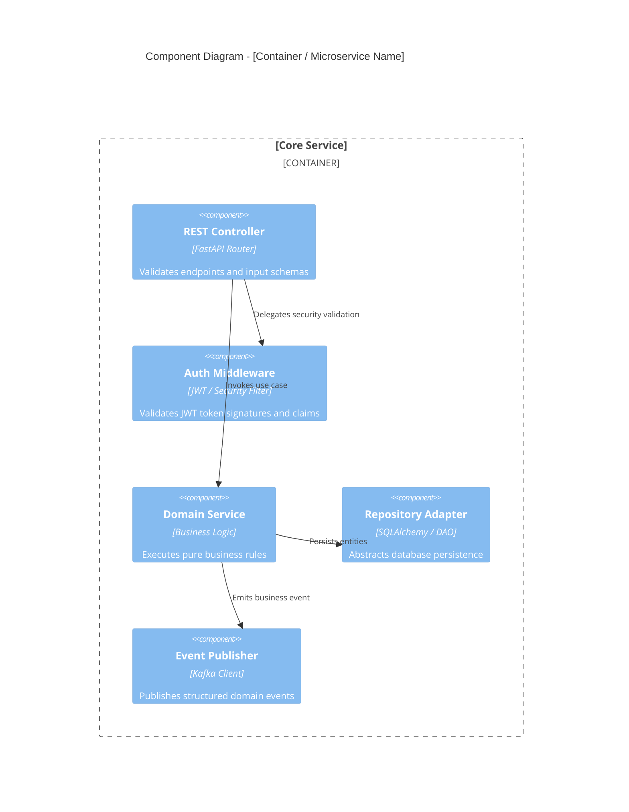
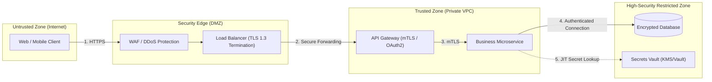

# C4 Model Visual Modeling Template with Mermaid.js

This template provides ready-made structures for the four C4 Model levels in Mermaid.js syntax.

---

## 1. Level 1: System Context Diagram (System Context)

---

## 2. Level 2: Container Diagram (Containers)

---

## 3. Level 3: Component Diagram (Components)

---

## 4. Trust and Security Zone Diagram (Trust Boundaries)

