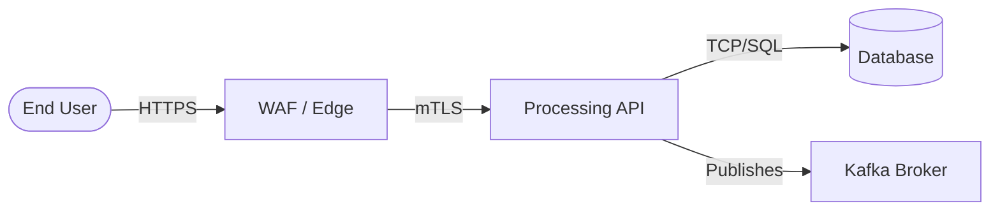

# Threat Modeling Template (Threat Modeling Report)

**Project / System:** `[System Name]`  
**Date:** `[MM/DD/YYYY]`  
**Methodology:** `[STRIDE | PASTA | LINDDUN | DREAD]`  
**Assessor:** `[Information Security Architect]`  

---

## 1. Scope and Data Flow Diagram (DFD)

### DFD Elements
* **Actors / External Interactors**: `[User, Partner API]`
* **Processes**: `[API Gateway, Microservice A, Worker B]`
* **Data Stores**: `[PostgreSQL, Redis Cache, S3 Bucket]`
* **Data Flows**: `[HTTPS TLS 1.3, gRPC mTLS, Kafka Topic]`
* **Trust Boundaries**: `[Internet <-> DMZ <-> Private VPC]`

### DFD Diagram

---

## 2. Mapped Threats Matrix

| ID | Component / Flow | Category (STRIDE) | Attack Vector Description | Inherent Severity (1-25) | Required Mitigating Controls (OWASP ASVS) | Residual Severity |
| :--- | :--- | :--- | :--- | :---: | :--- | :---: |
| **TM-01** | `[Endpoint]` | `Spoofing` | `[Identity spoofing scenario]` | 🔴 **P0 (Score: 20)** | `[Require RS256 JWT with mandatory claims - ASVS V2/V9]` | 🟢 **P3 (Score: 4)** |
| **TM-02** | `[Data Flow]` | `Tampering` | `[Payload tampering in transit]` | 🟠 **P1 (Score: 16)** | `[Enforce mTLS and digital signature - ASVS V9]` | 🟢 **P3 (Score: 3)** |
| **TM-03** | `[Database]` | `Info. Disclosure`| `[Unauthorized access to data at rest]` | 🔴 **P0 (Score: 25)** | `[AES-256 encryption + KMS + key rotation - ASVS V6]` | 🟡 **P2 (Score: 6)** |
| **TM-04** | `[API Service]` | `Denial of Service`| `[Connection exhaustion via massive requests]` | 🟠 **P1 (Score: 12)** | `[Rate limiting at the WAF and circuit breaker - ASVS V13]` | 🟢 **P3 (Score: 4)** |
| **TM-05** | `[Controller]` | `Elevation of Priv.`| `[Endpoint ID manipulation (BOLA/IDOR)]` | 🔴 **P0 (Score: 20)** | `[Backend object ownership validation - ASVS V4]` | 🟢 **P3 (Score: 3)** |

---

## 3. Priority Remediation Plan

- [ ] **Immediate Action (Within 7 days / P0 Blockers)**: `[Remediate TM-01, TM-03, and TM-05]`
- [ ] **Priority Action (Within 30 days / P1 Items)**: `[Remediate TM-02 and TM-04]`
